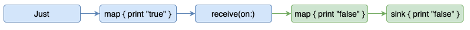

# Combine

> Combine 프레임워크는 시간이 지남에 따라 값을 처리하기 위한 선언적 스위프트 API를 제공한다.
이러한 값은 여러 종류의 비동기 이벤트를 나타낼 수 있다. Publisher를 결합하여 시간이 지남에 따라 
변경될 수 있는 값을 노출 시키고, Subscriber는 Publisher로부터 해당 값을 수신한다.

<br />

- __Publisher__ 프로토콜은 시간이 지남에 따라 일련의 값을 전달할 수 있는 타입을 선언한다.
Publisher는 upstream publisher로부터 받은 값에 따라 행동하고 그것들을 republish하는 
operator를 가지고 있다.

- Publisher의 체인 끝에서 **Subscriber**는 요소를 받을 때 요소에 대해 작업한다. Publisher는
Subscriber가 명시적으로 요청했을 때만 값을 방출한다. 이렇게 하면 subscriber 코드가 연결된 
publisher로부터 이벤트를 수신하는 속도를 제어할 수 있다.

Timer, NotificationCenter 및 URLSession을 비롯한 여러 Foundation 타입은 publisher를 통해 해당 functionality(기능)을 노출한다. Combine은 또한 키 벨류 관찰을 준수하는 모든 속성에 대한 기본 제공 publisher를 제공한다.

여러 publisher의 출력을 결합하여 상호 작용을 조정할 수 있다. 예를 들어 텍스트 필드의 publisher에서 업데이트를 구독하고 텍스트를 사용하여 URL 요청을 수행할 수 있다. 그런 다음 다른 publisher를 사용하여 응답을 처리하고 앱을 업데이트하는 데 사용할 수 있다.

Combine을 채택하면 이벤트 처리 코드를 중앙 집중화하고 중첩된 클로저와 콜백과 같은 번거로운 기술을 제거하여 코드를 읽고 유지하기 쉬워진다.

<br />

 

### Receiving and Handling Events with Combine

비동기 소스에서 이벤트를 커스터마이즈하고 받을 수 있다.

---

#### Overview

Combine 프레임워크는 앱이 이벤트를 처리하는 방법에 대한 선언적 접근 방식을 제공한다. 여러 delegate 콜백 또는 컴플리션 핸들러 클로저를 잠재적으로 구현하는 대신 이벤트 소스에 대한 단일 처리 체인을 만들 수 있다. 체인의 각 부분은 이전 단계에서 수신한 요소에 대해 고유한 작업을 수행하는 Combine 연산자이다.

텍스트 필드의 내용을 기준으로 테이블 뷰 또는 컬렉션 뷰를 필터링해야 하는 앱을 고려해봐라. AppKit에서 텍스트필드에 각 키를 누르면 Combine으로 구독할 수 있는 Notification(알림)이 생성된다. 알림을 받은 후 연산자를 사용하여 이벤트 전달 타이밍과 콘텐츠를 변경하고 최종 결과를 사용하여 앱의 UI를 업데이트할 수 있다.

<br />

#### Connect a Publisher to a Subscriber

```swift
let pub = NotificationCenter.default
			.publisher(for: NSControl.textDidChangeNotificaiton, object: filterField)
```

Combine을 사용하여 텍스트 필드의 알림을 받으려면 NotificationCenter의 기본 인스턴스에 접근하고 해당 publisher(for:object:) 메서드를 호출한다. 이 호출은 알림을 받을 알림 이름과 원본 객체를 가져와서 알림 요소를 생성하는 publisher를 반환한다.

Subscriber를 사용하여 publisher로부터 요소를 받을 수 있다. Subscriber는 associated type, Input을 정의하여 수신 타입을 선언한다. 또한 publisher는 타입, 출력을 정의하여 생산하는 것을 선언한다. publisher와 subscriber는 모두 error 유형을 정의하여 생성하거나 수신하는 에러의 종류를 나타낸다. subscriber를 publisher에 연결하려면 출력이 입력과 일치해야 하며 실패 타입도 일치해야 한다.

Combine은 연결된 publisher의 출력 및 실패 타입과 자동으로 일치하는 두 개의 기본 제공 subscriber를 제공한다.

- __sink(receiveCompletion:receiveValue:)__ 는 두개의 클로저를 수행한다. 첫 번째 클로저는 publisher가 정상적으로 완료되었는지, 에러와 함께 실패했는지 여부를 나타내는 열거형인 Subscribers.Completion을 받을 때 실행된다. 두 번쨰 클로저는 publisher로부터 요소를 받을 때 수행된다.

- **assign(to:on:)**은 key path를 사용하여 속성을 나타내는 지정된 객체의 속성에 수신하는 모든 요소를 즉시 할당한다.

예를 들어, sink subscriber를 사용하여 publisher가 완료될 때, 그리고 요소를 수신할 때마다 로그를 남길 수 있다.

```swift
let sub = NotificationCenter.default
			.publisher(for: NSControl.textDidChangeNotificaiton, object: filterField)
			.sink(receiveCompletion: { print($0) },
						receiveValue: { print($0) })
```

**sink(receiveCompletion:receiveValue:)와 assign(to:on:)** 두 구독자는 publisher에게 무제한의 요소를 요청한다. 요소를 수신하는 속도를 제어하려면 subscriber 프로토콜을 구현하여 자신의 subscriber를 만든다.

<br />

#### Change the Output Type with Operators

이전 섹션의 sink 구독자는 receiveValue 클로저에서 모든 작업을 수행한다. 수신된 요소에 대해 많은 커스텀 작업을 수행하거나 호출 사이에 상태를 유지해야 할 경우 이 작업이 부담스러울 수 있다. Combine의 장점은 연산자를 결합하여 이벤트 전달을 커스터마이징할 수있다는 것이다. 

예를 들어 NotificationCenter.Publisher.Output은 텍스트 필드의 문자열 값만 필요할 때 콜백에서 수신할 수 있는 편리한 타입은 아니다. Publisher의 출력은 본질적으로 시간 경과에 따른 요소의 순서이므로 Combine은 map, flatMap, reduce와 같은 sequence-modifying 연산자를 제공한다. 이러한 연산자의 동작은 Swift 표준 라이브러리의 해당 연산자와 유사하다.

publisher의 출력 타입을 변경하려면 closure가 다른 타입을 반환하는 map 연산자를 추가한다. 이 경우 notification의 객체를 NSTextField로 가져온 다음 필드의 stringValue를 가져올 수 있다.

```swift
let sub = NotificationCenter.default
			.publisher(for: NSControl.textDidChangeNotification, object: filterField)
			.map( { $0.object as! NSTextField).stringValue } )
			.sink(receiveCompletion: { print($0) },
						receiveValue: { print($0) })
```

publisher 체인이 원하는 타입을 생성한 후, sink 구독자를 assign으로 변경하면, custom view model 객체의 filterString에 publisher로부터 받은 문자열을 할당할 수 있다.

```swift
let sub = NotificationCenter.default
			.publisher(for: NSControl.textDidChangeNotification, object: filterField)
			.map( { $0.object as! NSTextField).stringValue } )
			.assign(to:\MyViewModel.filterString, on: myViewModel)
```

<br />

#### Customize Publishers with Operators

수동으로 코딩해야 하는 작업을 수행하는 연산자를 사용하여 publisher 인스턴스를 확장할 수 있다. 연산자를 사용하여 이벤트 처리 체인을 개선할 수 있는 세 가지 방법은 다음과 같다.

- 텍스트 필드에 입력된 문자열로 View Model을 업데이트하는 대신 filter 연산자를 사용하여 특정 길이 이하의 입력을 무시하거나 영숫자가 아닌 문자를 거부할 수 있다.

- 필터링 작업이 무거운 경우(ex) 대용량 데이터베이스를 쿼리하는 경우) 유저가 입력을 중지할 때까지 기다릴 수 있다. 이를 위해 debounce(for:scheduler:options:) 연산자를 사용하면 publisher가 이벤트를 방출하기 전에 경과해야 하는 최소 기간을 설정할 수 있다. RunLoop 클래스는 시간 지연을 초 또는 밀리초 단위로 지정할 수 있는 편의성을 제공한다.

결과 publisher 선언은 다음과 같다.

```swift
let sub = NotificationCenter.default
			.publisher(for: NSControl.textDidChangeNotification, object: filterField)
			.map( { $0.object as! NSTextField).stringValue } )
			.filter( { $0.unicodeScalars.allSatisfy({CharacterSet.alphanumerics.contains($0)}) } )
			.debounce(for: .milliseconds(500), scheduler: RunLoop.main)
			.receive(on: RunLoop.main)
			.assign(to: \MyViewModel.filterString, on: myViewModel)
```


#### Cancel Publishing when Desired

Publisher는 정상적으로 완료되거나 실패할 때까지 요소를 계속 방출한다. publisher에게 더 이상 구독하지 않으려면 구독을 취소할 수 있다. sink와 assign에서 만든 구독자 타입은 모두 Cancellable 프로토콜을 구현하며 cancel 메서드를 제공한다.

```swift
sub?.cancel()
```

커스텀 Subscriber를 만드는 경우, 처음 구독할 때 구독 객체를 보낸다. 이 객체를 저장한 후 publishing을 취소하려면 cancel 메서드를 호출하면 된다. 커스텀 subscriber를 만들 때 Cancellable 프로토콜을 구현하고 cancel() 구현을 통해 저장된 subscription으로 호출을 전달해야 한다.

<br />

<br />

### Publisher

시간 경과에 따라 일련의 값을 전송할 수 있는 타입을 선언한다.

---

#### Declaration

```swift
protocol Publisher
```

<br />

#### Overview

publisher가 요소를 하나 이상의 구독자 인스턴스에 전달한다. 구독자의 입력과 실패 연관 타입은 publisher에서 선언된 출력과 실패 타입과 일치해야 한다. publisher는 구독자를 수락하는 receive(subscriber:)메서드를 구현한다.

이후에, publisher는 subscriber에서 다음 메서드를 호출할 수 있다.

- receive(subscription:)은 구독 요청을 승인하고 subscription 인스턴스를 반환한다. 구독자는 subscription을 사용하여 publisher로부터 요소를 요청하고, publishing을 취소할 수 있다.

- receive(_:)는 publisher에서 subscrier로 하나의 요소를 전달한다.

- receive(completion:)은 subscriber에게 publishing이 정상적으로 종료되었거나 에러가 발생했음을 알린다.

<br />

downstream subscriber가 올바르게 작동하려면 모든 publisher가 이 계약을 준수해야 한다.

Publisher의 extension은 정교한 이벤트 처리 체인을 만들기 위해 작성하는 다양한 연산자를 정의한다. 각 연산자는 publisher 프로토콜을 구현하는 타입을 반환한다. 이러한 타입의 대부분은 publisher 열거형에 확장으로 존재한다. 예를 들어, map 연산자는 Publishers.Map의 인스턴스를 반환한다.

<br />

#### Creating your Own Publishers

publisher 프로토콜을 직접 구현하는 대신 Combine 프레임워크에서 제공하는 여러 타입을 사용하여 publisher를 생성할 수 있다.

- PassthroughSubject와 같은 Subject의 구체적인 하위 클래스를 사용해 send 메서드를 호출하여 값을 publish할 수 있다.

- subject의 기본 값을 업데이트할 때마다 publish 하기 위해 CurrentValueSubject를 이용할 수 있다.

- 사용자 타입 중 하나의 속성에 @Published 어노테이션을 추가하면 프로퍼티는 프로퍼티의 값이 바뀔 때마다 이벤트를 방출하는 publisher를 얻을 수 있다.

<br />

### Subscriber

Publisher로부터 입력을 받을 수 있는 타입을 정의하는 프로토콜

---

#### Delaration

```swift
protocol Subscriber: CustomCombineIdentifierConvertible
```

<br />

#### Overview

Subscriber 인스턴스는 publisher로부터 관계에 대한 변경 사항을 설명하는 수명 주기 이벤트와 함께 요소의 스트림을 수신한다. Subscriber의 Input과 Failure 연관 타입은 구독한 Publisher의 Output, Failure 타입과 일치해야 한다.

Publisher의 subscribe(_:) 메소드를 호출해 subscriber를 publisher에 연결한다. 이후 publisher는 subscriber의 receive(sbscription:) 메소드를 호출한다. 이렇게 하면 publisher에게 요소를 요구하고 선택적으로 구독을 취소하는 데 사용되는 subscription 인스턴스를 subscriber에게 제공한다. subscriber가 초기 요구를 한 후에 publisher는 새로 publish된 요소를 전송하기 위해 receive(_:) 메소드를 호출한다. publisher가 publishing을 중지하면 정상 종료인지, 에러인지 알려주는 Subscribers.Completion 타입의 매개 변수를 사용해 receive(completion:) 메소드를 호출한다. \

Combine은 Publisher 타입의 연산자로 아래의 subscriber들을 제공한다.

- sink(receiveCompletion:receiveValue:) : 완료 신호를 수신할 때 그리고 새 요소를 수신할 때마다 클로저를 실행한다.

- assign(to:on:) : 새로 수신된 각 값을 지정된 인스턴스의 키경로로 식별되는 속성에 저장한다.

<br />

### Scheduler

<br />

#### Defining a Scheduler

스케줄러는 Combine 프레임워크의 동기화 메커니즘으로, 작입어 수행되는 장소와 시기에 대한 컨텍스트를 정의하는 프로토콜

> Combine은 스레드와 직접 동작하지 않습니다. 대신 Publisher가 특정 스케줄러에서 동작할 수 있다.

장소는 현재 run llop, 디스패치 큐, 또는 오퍼레이션 큐를 의미한다.

시간은 스케줄러 clock에 따른 가상 시간을 의미한다. 스케줄러가 실행하는 작업은 스케줄러의 clock에만 준수하므로 시스템의 실시간과 일치하지 않을 수 있다.

<br />

#### Combine Scheduler Types

Combine 프레임워크는 스케줄러 프로토콜을 준수하는 여러 종류의 스케줄러를 제공한다.

- DispatchQueue : Serial, Concurrent, main, global과 같은 특정 디스패치 큐에서 작업을 수행한다. 일반적으로 백그라운드 작업에는 serial, global 큐를 사용하고 UI 관련 작업에는 main 큐를 사용한다. 

- OperationQueue : 특정 Operation Queue에서 작업을 수해행한다. 디스패치 큐와 마찬가지로 UI 작업에는 OperationQueue.main을 사용하고 백그라운드 작업에는 다른 큐를 사용한다. Swift 포럼에 따르면 maxConcurrentOperations가 1보다 큰 오퍼레이션 큐는 사용하지 않는 것이 좋다.

- RunLoop : 특정 run loop에서 작업을 수행한다.

- ImmediateScheduler : 동기 작업을 즉시 수행한다. 이 스케줄러로 지연된 작업을 실행하려고 하면 fatal error와 함께 앱이 종료된다.

> UI 관련 작업을 수행하기 위해서는 RunLoop.main, DispatchQueue,main, OperationQueue.main을 사용한다. 이들 사이에는 차이가 없다.

ImmediateScheduler 외에도 Combine은 새로운 스캐줄러 타입을 도입하지 않는다. 대신 기존 Swift 멀티스레딩 API를 확장하여 스케줄러가 된다. 이러한 API를 Combine 프레임 워크 없이 사용할 수 있으므로 진입 장벅이 낮아진다.

<br />

### Processing Published Elements with Subscribers

publisher가 요소를 생성할 때 정확하게 제어하려면 back pressure를 적용해야 한다.

---

<br />

#### Overview

Combine에서 Publisher는 요소를 생산하고 Subscriber는 받는 요소에 대해 작업을 수행한다. 그러나 publisher는 subscriber가 붙고 요소를 요청할 때까지 요소를 내보낼 수 없다. 또한 Subscriber는 얼마나 많이 요소를 받을 수 있는 지 나타내는 Subscribers.Demand 타입을 사용해 publisher가 요소를 내보내는 속도를 제어한다. subscriber는 두 가지 방법으로 요구를 나타낼 수 있다.

- subscriber가 처음 구독했을 때 publisher가 제공한 Subscription 인스턴스의 request(_:) 메소드를 호출함으로써

- Publisher가 요소를 전달하기 위해 subscriber의 receive(_:) 메소드를 호출할 때 새 요구를 반환함으로써

요구는 부가적이다. subscriber가 두 가지 요소를 요구한 다음 Subscribers.Demand(.max(3))를 요청한다면 publisher의 불만족스러운 요구는 5개의 요소가 된다. publisher가 요소를 하나 보내면 불만족스러운 요구는 4개로 줄어든다. 요소를 퍼블리싱하는 것은 불만족스러운 요구를 줄이는 유일한 방법이다. subscriber는 음수의 요구를 요청할 수 없다.

많은 앱은 편리한 subscriber 타입(Subscribers.Sink, Subscribers.Assign)을 만들기 위해 sink(receiveVlaue:), assign(to:on:) 메소드를 사용한다. 이 두 subscriber는 처음 publisher에 붙을 때 무제한의 요구를 제기한다. 일단 publisher가 무제한의 수요를 갖게 되면 publisher와 subscriber 간의 수요 협상은 더 이상 없을 것이다.

<br />

#### Consume Elements as the Publisher Produces Them

publisher가 많은 양 또는 무한의 수요를 갖고 있으면 subscriber가 처리할 수 있는 속도보다 빠르게 요소를 보낼 수 있다. 이 시나리오는 처리 대기 중에 요소가 버퍼를 채울 떄 요소가 삭제되거나 메모리 압력이 급격히 증가할 수 있다.

이 시나리오는 convenience subscriber를 사용하면 발생할 수 있다.(convenience subscriber는 무제한의 요소를 요구하기 때문에) sink(receiveValue:)에 제공하는 클로저와 assign(to:on:)의 부작용이 다음과 같은 특성을 준수하는지 확인해야 한다.

- publisher를 block하지 않아야 한다.

- 요소를 버퍼링하여 과도한 메모리를 소비하지 않아야 한다.

- 요소를 처리하는데 실패하거나 압도되지 않아야 한다.

다행히, UI와 관련된 publisher와 같이 일반적으로 사용되는 많은 publisher는 관리 가능한 속도로 publish한다. URL 로딩 시스템의 URLSession.DataTaskPublisher와 같은 다른 일반적인 publisher는 단일 요소만 생선한다. 이러한 publisher와 sink, assign subscriber를 사용하는 것은 완벽하게 안전하다.

<br />

#### Apply Back Pressure with a Custom Subscriber

publisher가 subscriber에게 요소를 보내는 속도를 제어하려면 Subscriber 프로토콜을 만족하도록 직접 구현해야 한다. 직접 구현해 subscriber가 따라잡을 수 있는 요구를 지정한다. subscriber는 요소를 받을 때 receive(_:) 메소드에 새 요구 값을 반환하거나 subscription의 request(_:) 메소드를 호출함으로써  

<br />

<br />

#### Default Scheduler

스케줄러를 지정하지 않더라도 Combine은 기본 스케줄러를 제공한다. 스케줄러는 요소가 생성된 곳의 동일한 스레드를 사용한다. 예를 들어 요소를 백그라운드 스레드에서 보내면 동일한 백그라운드 스레드에서 요소를 수신한다.

```swift
let subject = PassthroughSubject<Int, Never>()
// 1
let token = subject.sink(receiveValue: { _ in
		print(Thread.isMainThread)
})

// 2
subject.send(1)

// 3
DispatchQueue.global().async {
		subject.send(2)
}
```

1. 값이 메인 스레드에서 받아졌으면 true를 출력하고 아니면 false를 출력한다.

1. 메인 스레드에서 1을 보냄

1. 백그라운드 스레드에서 2를 보냄

<br />

출력은 다음과 같을 것이다.

```swift
true
false
```

예상대로, 값은 다른 스레드에 의해 받아진다.

<br />

#### Switching Schedulers

리소스를 많이 소모하는 작업은 일반적으로 백그라운드에서 처리되므로 UI가 멈추지 않는다. 그리고 결과는 메인 스레드에서 처리된다. Combine은 이를 스케줄러를 전환함으로써 수행한다. subscribe(on:)과 receive(on:) 메소드를 사용하여 수행할 수 있다.

<br />

__receive(on:)__

이 메소드는 이후의 모든 publisher에 대한 스케줄러를 변경한다.

```swift
Just(1)
		.map { _ in print(Thread.isMainThread) }
		.receive(on: DispatchQueue.global())
		.map { print(Thread.isMainThread) }
		.sink { print(Thread.isMainThread) }
```

```swift
true
false
false
```

이 과정을 시각화하면 다음과 같다.



receive(on:)의 모든 우측 연산자들은 global dispatch queue에서 요소를 전달한다.

<br />

__subscribe(on:)__

subscribe(on:) 메소드는 구독, 취소, 요청 작업을 수행하는 데 사용되는 스케줄러를 변경한다. receive(on:) 메소드가 어딘가에 지정되지 않는 경우 체인은 다운스트림 내내 해당 스케줄러에 유지된다.

```swift
Just(1)
		.subscribe(on: DispatchQueue.global())
		.map { _ in print(Thread.isMainThread) }
		.sink { print(Thread.isMainThread) }
```

```swift
false
false
```

이 과정을 시각화하면 다음과 같다.


모든 작업은 global 디스패치 큐의 스케줄러에서 발생한다.

subscribe(on:) 메소드는 구독 시간에 영향을 미치기 때문에 메소드의 위치는 중요하지 않다. 아래 스니펫은 이전과 같다.

```swift
Just(1)
		.map{ _ in print(Thread.isMainThread) }
		.subscribe(on: DispatchQueue.global())
		.sink { print(Thread.isMainThread) }
		
```

subscribe(on:)메소드의 위치에도 불구하고 모든 이벤트와 값들은 글로벌 디스패치 큐 스케줄러에서 받아진다.

<br />

subscribe(on:)은 값을 받는 스케줄러에 대해 아무런 관련이 없다. publisher가 다른 스레드에서 값을 방출하는 경우 해당 스레드에서 값을 수신한다.

```swift
URLSession.shared.dataTaskPublisher(for: 
				URL(string: "https://www.vadimbulavin.com)!)
		.subscribe(on: DispatchQueue.main)
		.sink(receiveCompletion: { _ in },
					receiveValue: { _ in
							print(Thread.isMainThread)
		})
```

이 코드는 false를 출력되어 publisher가 백그라운드 스레드에서 값을 방출한다는 것을 나타낸다. 이러한 경우 receive(on:) 메소드를 사용하여 스케줄러를 지정해야 한다.

<br />

#### Performing Asynchronous Work with Combine

subscribe(on:)과 receive(on:)을 결합해 스케줄러를 전환하는 방법을 살펴본다.

<br />

아래와 같이 긴 작업을 하는 Publisher가 있다고 가정해보자.

```swift
struct BusyPublisher: Publisher {
    typealias Output = Int
    typealias Failure = Never
    
    func receive<S>(subscriber: S) where S : Subscriber, Never == S.Failure, Int == S.Input {
        sleep(5)
        subscriber.receive(subscription: Subscriptions.empty)
        _ = subscriber.receive(1)
        subscriber.receive(completion: .finished)
    }
}
```

UI 스레드에서 호출되면 앱은 5초 동안 멈추게 된다. Combine은 요소가 발생되는 스케줄러와 동일한 스케줄러를 갖는다.

```swift
BusyPublisher()
    .sink { _ in print("Recevied value") }

print("Hello")
```

따라서 위 코드는 Hello가 값이 받아진 이후에 출력된다.

```swift
Received value
Hello
```

Combine을 사용해 비동기 작업을 하는 일반적인 패턴은 백그라운드 스케줄러에서 구독하고 UI 스케줄러에서 이벤트를 수신하는 것이다.

```swift
BusyPublisher()
    .subscribe(on: DispatchQueue.global())
    .receive(on: DispatchQueue.main)
    .sink { _ in print("Recevied value") }

print("Hello")
```

```swift
Hello
Received value
```

이번에는 Hello가 먼저 출력된다. 이는 publisher가 메인 스레드를 블락함으로써 앱을 멈추지 않는다는 것을 의미한다.

