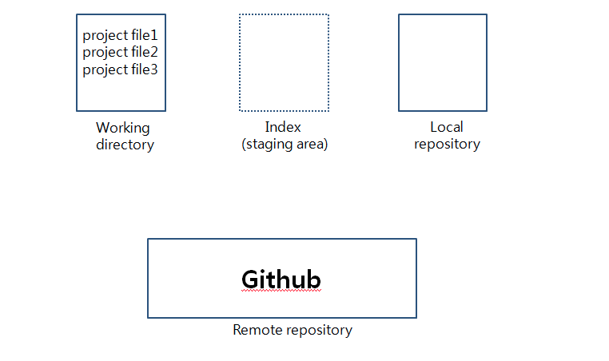
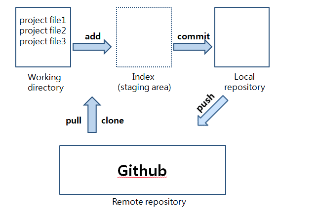
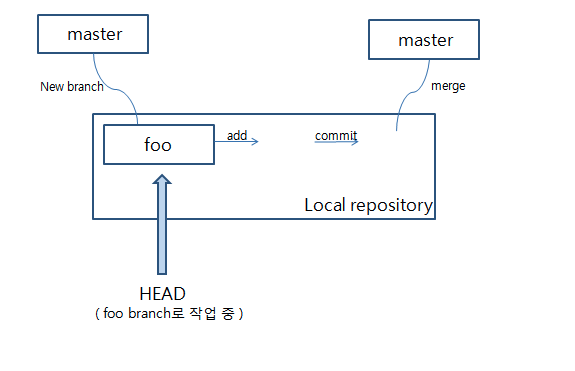

# Git

 

### Git Repository (저장소)

- 파일이나 폴더를 저장해 두는 곳

- 파일이 변경 이력 별로 구분되어 저장됨

- 저장소 종류

   - 원격 저장소(Remote Repository) : 파일이 원격 저장소 전용 서버에서 관리되며 여러 사람이 함께 공유하기 위한 저장소

   - 로컬 저장소(Local Repository) : 내 PC에 파일이 저장되는 개인 전용 저장소

- 저장소 만들기

   - 아예 새로운 저장소를 만드는 것

   - 이미 만들어져 있는 원격 저장소를 로컬 저장소로 복사해 오는 것

### Commit

- 파일 및 폴더의 추가/변경 사항을 저장소에 기록하는 것

- 각 커밋에는 영문/숫자로 이루어진 40자리 고유한 이름이 붙음

- Tip : 버그 수정, 기능 추가 등 특별한 의미가 있는 업데이트를 작업 별로 구분해서 각각 커밋하면, 이력을 보고 특정 내역을 찾기 쉬워짐

- 이력을 남기는 중요한 작업이기 때문에 커밋 메시지를 필수로 입력

   - Git에서 권장하는 메시지 형식

      - 1번째 줄 : 커밋 내의 변경 내용 요약

      - 2번째 줄 : 빈 칸

      - 3번째 줄 : 변경한 이유

### 작업 트리(Working Tree)와 인덱스(Index)

- 작업 트리 : 흔히 말하는 폴더

- 인덱스 : 커밋을 실행하기 전의 저장소와 작업 트리 사이에 존재하는 공간

- 커밋 작업은 '작업 트리'에 있는 변경 내용을 저장소에 바로 기록하는 것이 아니라 그 사이 공간인 '인덱스'에 파일 상태를 기록(stage 또는 스테이징)하게 되어 있다. 

- 따라서 저장소에 변경 사항을 기록하기 위해선, 기록하고자 하는 모든 변경 사항이 '인덱스'에 존재해야 한다.

### Push

- 웹 상의 원격 저장소로 변경된 파일을 업로드하는 것

- push를 실행하면, 원격 저장소에 내 변경 이력이 업로드되어, 원격 저장소와 로컬 저장소가 동일한 상태가 된다.

### Clone

- 원격 저장소의 내용을 통째로 다운로드하는 것

- 변경 이력도 함께 로컬 저장소에 복제되어 오기 때문에 원래 원격 저장소와 똑같은 이력을 참조하고 커밋을 진행할 수 있다.

### Pull

- 다른 사람이 원격 저장소에 올려놓은(Pull)  변경 내용을 내 로컬 저장소에 적용하는 것

### Merge

- 다른 사람의 업데이트 이력을 내 저장소에도 갱신하는 것, 병합

- 변경한 부분을 자동으로 통합해주는 기능

- 내가 pull을 실행한 후 다른 사람이 push를 해 원격 저장소를 업데이트한 경우 내 push 요청이 거부됨

- 이런 경우 병합(Merge)

### Conflict

- 원격 저장소와 로컬 저장소 양쪽에서 파일의 동일한 부분을 변경한 경우 충돌이 발생

- 사용자가 직접 수정해주어야 함

- 모든 충돌 부분을 수정한 후에 다시 커밋을 수행

### Branch

- 독립적으로 작업을 진행하기 위한 개념

- master 브랜치 : 저장소를 처음 만들면 생기는 브랜치

- 통합 브랜치 : 언제든지 배포할 수 있는 버전을 만들 수 있어야 하는 브랜치, 일반적으로 저장소를 처음 만들었을 때 생기는 'master' 브랜치를 통합 브랜치로 사용

- 토픽 브랜치 : 기능 추가나 버그 수정과 같은 단위 작업을 위한 브랜치

### Checkout

- 브랜치를 전환할 수 있는 명령어

- 체크아웃을 실행하면, 우선 브랜치 안에 있는 마지막 커밋 내용이 작업 트리에 펼쳐진다.

- 브랜치가 전환되었으므로 이후에 실행한 커밋은 전환한 브랜치에 추가된다.

- HEAD : 현재 사용 중인 브랜치의 선두 부분을 나타내는 이름

   - ~ 와 ^를 이용해 현재 커밋으로부터 특정 커밋의 위치를 가리킬 수 있다. 이 때 자주 사용하는 것이 HEAD ex) HEAD~1 or HEAD^ (HEAD 바로 이전 커밋)

#### stash 

- 커밋 가능한 변경 내용 중 전환된 브랜치에서도 한 차례 변경이 되어 있는 경우에는 체크아웃에 실패할 수 있다. 이 경우 이전 브랜치에서 변경 내용을 커밋하거나, stash를 이용해 일시적으로 변경 내용을 다른 곳에 저장하여 충돌을 피하게 한 뒤 체크아웃을 해야 한다.

- 파일의 변경 내용을 일시적으로 기록해두는 영역

 

### 브랜치 통합

- merge : merge를 사용해 여러 개의 브랜치를 하나로 모음, 변경 내용의 이력이 모두 그대로 남기 때문에 이력이 복잡해짐

   - fast-forward 병합 : 병합하고자 하는 브랜치(branch)가 병합되는 브랜치(master)의 이력을 모두 포함하는 경우 이동하기만 해도 브랜치의 내용을 적용할 수 있음

   - non fast-forward 병합 : 브랜치가 그대로 남는 병합

- rebase : 이력은 단순해지지만, 원래의 커밋 이력이 변경되는 병합

 

1. Git : 버전관리를 위한 프로그램

1. Git 주요 용여 및 구성

   1. 영역

      - working directory

         - 현재 작업하고 있는 공간

         - Git이 관리하고 있지만 아직 추적하지 않는 상태

      - index

         - stage 또는 staging area라고 하며, 준비 공간을 말함

         - Git이 추적하고 있으며, 버전으로 등록되기 전 상태

      - repository

         - 저장소를 의미

            - 본인 PC에 존재하는 저장소인 local repository

            - Github, Gitlab 같은 원격 저장소인 remote repository가 있다.

               

       

   1. Flow

      - git init

         - .git 폴더를 생성

         - .git 폴더가 있어야 추적 가능하며, Git과 관련된 작업 가능

      - git add

         - working directory의 변경된 작업 파일을 staging area로 추가

      - git commit

         - staging area의 내용을 local repository에 확정

      - git push

         - local repository의 내용을 remote repository로 업로드

      - git pull

         - remote reopsitory의 내용을 local repository로 가져옴

      - git clone

         - .git을 포함한 remote repository의 파일들을 local repository에 복사

         - 깃헙에서 zip파일로 받으면 .git 폴더가 없다는 것이 명령어와의 차이점

            

   1. 협업 - 병합

      - git branch

         - 독립된 working directory를 의미

         - 브랜치를 통해 프로젝트 참여자마다 브랜치를 가져서 독립된 작업 공간을 갖는다.

         - 테스트 및 백업 등의 용도로도 사용 가능

      - head

         - 포인터를 의미하며, 지금 작업하고 있는 branch를 가리킨다.

      - merge

         - 2개의 branch에서 작업한 다른 내용을 하나로 합치는 것, 현재 브랜치를 기준으로 병합

         - 만약 두 branch가 같은 파일의 같은 곳을 수정했다면, 충돌이 발생해서 이를 해결해야 함

    

   

 

 

### git 명령어 - init, add, commit, status

 

- git init : 여러 파일을 추적하는 .git 폴더 생성

- git add : Git이 추적하고 있는 수정된 파일이 working directory에서 staging area에 저장

   - --update : 추적하고 있는 파일만 add

- git commit : staging area에 저장됐던 파일이 local repository로 확정, 작업을 마무리했다라는 버전 등록을 의미

   - -m : 간단한 커밋 메시지 작성

   - --amend : 마지막 커밋 메시지 수정

- git status : 상태 확인

- git rm : 제거 관련 명령어

   - --cached : add된 파일 제거 (해당 파일을 working directory 상태로 되돌림)

- git checkout

   - --{file} : working directory에서 작업한 내용을 버림

    

### git 명령어 - remote, push, clone, pull, fetch

- git remote 

   - add : 원격 저장소 등록

   - show : 원격 저장소 정보

- git push

   - --delete : 원격 저장소 브랜치 삭제

- git pull

   - --rebase : 기본 방식인 merge가 아니라 rebase 방식으로 pull 수행

- git fetch : local repository에서 remote repository의 내용들을 업데이트

 

### git branch

- branch : 큰 줄기(master)에서 뻗어 나간 가지(branch) : 독립적인 작업 공간을 생성하는 중요한 개념

- master 브랜치 

   - git init할 때 자동으로 생성해주는 기본 브랜치

   - 동료들의 작업 내용을 하나로 합칠 때 사용하는 뼈대 브랜치로 사용할 수 있다.

      - 배포용 브랜치로도 사용 가능 (브랜치 전략은 회바회 팀바팀)

    

- git branch : local repostiory 브랜치 목록 확인

   - 브랜치명 : 브랜치 생성

      - {원격저장소}/{브랜치} : 원격 저장소의 특정 브랜치로부터 새로운 브랜치 생성

   - -r : remote repository 브랜치 목록 확인

   - -a : local / remote repository 모두의 브랜치 목록 확인

   - -D : local repository 브랜치 삭제

- git checkout : 브랜치 변경

   - -b : 브랜치 생성 후 그 브랜치로 이동

 

### git merge, conflicts

 

- git merge

   - {대상브랜치} : 현재 브랜치에서 대상 브랜치를 병합시킴

   - --squash : 대상 브랜치를 병합할 때, 커밋 이력을 모두 제거하고 작업된 내용만 병합

   - --no-ff : fast-forward 방식으로 병합할 때, 병합된 것임을 알리는 커밋 메시지 생성

 

### git reset, revert

- git reset : 특정 커밋으로 되돌아갈 수 있는데, 되돌린 버전 이후의 버전들은 히스토리에서 삭제

-  git revert : reset처럼 특정 커밋으로 되돌아갈 수 있지만 되돌린 버전 이후의 버전들의 이력은 남아있음

 

- git checkout

   - . : working directory에서 수정한 모든 파일(git add 이전)을 현재 버전으로 되돌리기

   - --{file} : working directory에서 수정한 특정 파일(git add 이전)을 현재 버전으로 되돌리기

- git reset

   - . : 현재 버전으로 되돌리기 (add 무효화)

   - {commit 번호} : 특정 버전으로 되돌리지만, 커밋 이력 삭제

    

