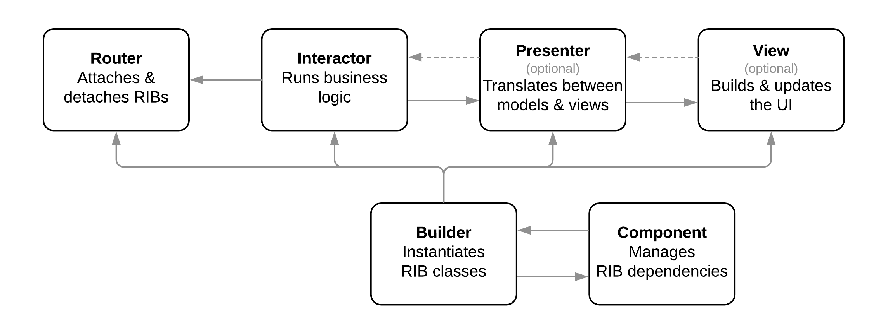
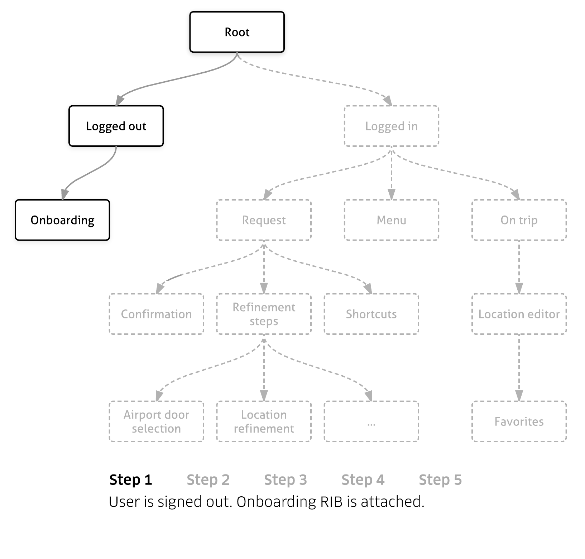
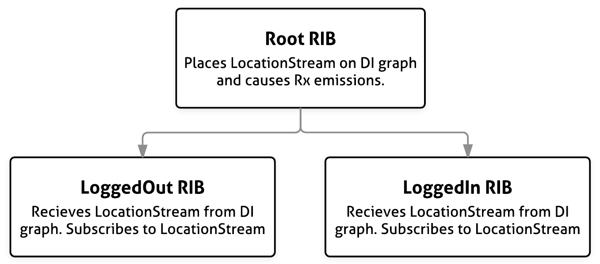
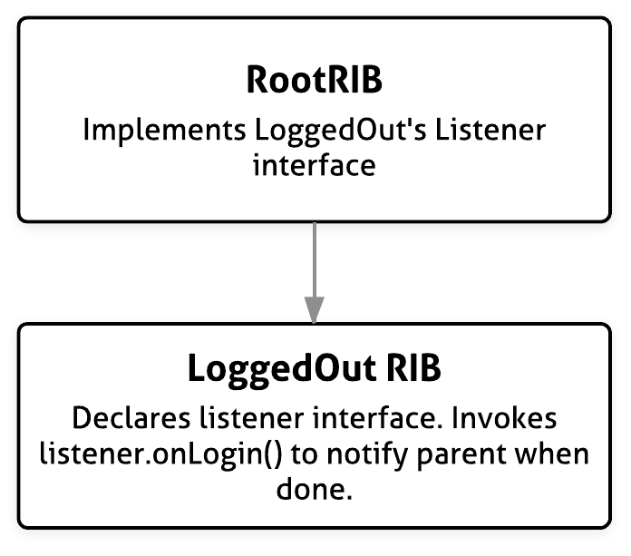
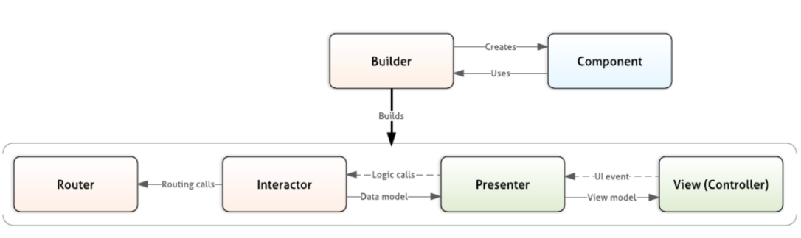
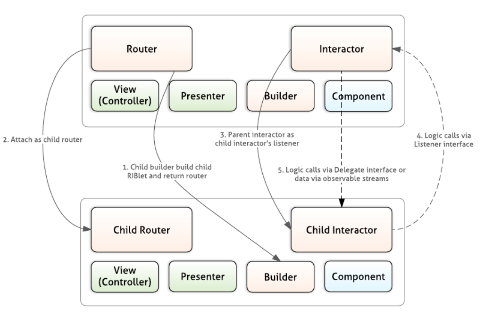
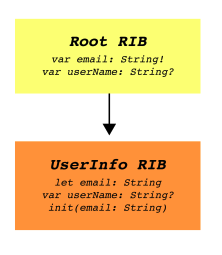

# RIBs

#### RIBs 튜토리얼

[RIBs Tutorial 1](ribs-tutorial-1/index.md)

[RIBs Tutorial 2](ribs-tutorial-2/index.md)

[RIBs Tutorial 3](ribs-tutorial-3/index.md)

 

## RIBs Wiki 번역

 

 이 위키는 RIBs가 어떻게 디자인되었는 지 개요를 제공한다. 만약 RIBs의 상세를 알고 싶다면 튜토리얼을 진행해라.

### RIBs란 무엇인가?

RIBs는 우버에서 개발한 크로스 플랫폼 아키텍처 프레임워크이다. 이 프레임워크는 많은 종속된 상태를 포함하는 거대한 모바일 앱을 위해 설계되었다. 

우버에서 이 프레임워크를 설계할 때, 아래의 원칙들에 기반하였다.

- __크로스 플랫폼 협업 독려__ : 우리의 앱의 대다수의 복잡한 부분들은 iOS나 안드로이드가 결국 비슷하다. RBIs는 AOS와 iOS에게 비슷한 개발 패턴을 제공한다. RIBs를 씀으로써, iOS, AOS 개발자들은 특징들을 위해 아키텍처를 공유할 수 있다.

- __글로벌한 상태와 결정들을 최소화__ : 글로벌한 상태 변화는 예상치 못한 행동을 야기할 수 있고, 그것들의 변화의 임팩트에 대해 완전히 이해하지 못하게 될 수도 있다. RIBs는 잘 독립된 개별 RIBs의 계층 구조 내에서 상태들을 캡슐화하게 독려하여 글로벌 상태 이슈를 방지한다.

- __테스트 용이성 및 독립__ : 클래스들은 유닛 테스트하기 쉬워야 하고 추론하기 쉬워야 한다. 개별 RIB 클래스들은 별개의 책임이 있다. (ex) 라우팅, 비즈니스 로직, 뷰 로직, 다른 RIB 클래스들의 생성). 또한 부모 RIB의 로직은 대부분 하위 RIB 로직과 분리된다. 따라서 RIB 클래스는 독립적으로 쉽게 테스트하고 추론할 수 있다.

- __개발자의 생산성을 위한 도구__ : 중대한 아키텍처 패턴을 채택하는 것은 강력한 도구 없이는 소규모 앱 이상으로 확장할 수 없다. RIBs는 코드 생성, 정적 분석, 런타임 통합과 관련된 IDE 툴을 제공한다. 이 모든 것들은 대규모 팀과 소규모 팀의 개발자 생산성을 향상시킨다.

- __개방 폐쇄 원칙__ : 가능하면 개발자는 기존 코드를 수정하지 않고도 새로운 기능을 추가할 수 있어야 한다. 이것은 RIBs를 사용할 때 몇 군데에서 볼 수 있다. 예를 들어, 상위 RIB을 거의 변경하지 않고 상위 RIB의 종속성이 필요한 복합 하위 RIB을 연결하거나 빌드할 수 있다.

- __비즈니스 로직을 중심으로 구성__ : 앱의 비즈니스 로직 구조가 UI의 구조를 엄격하게 반영할 필요는 없다. 예를 들어, 애니메이션과 뷰 성능을 좋게 하기 위해 뷰 계층을 RIB 계층보다 낮게 설정할 수 있다. 또는 단일 기능 RIB이 서로 다른 위치에 있는 여러 UI의 뷰의 모양을 제어할 수 있다.

- 명시적 계약 : 요구사항은 컴파일 타임 때 안전하게 선언되어야 한다. 클래스의 종속성과 순서 종속성이 총족되지 않으면 클래스는 컴파일 되지 않아야 한다. Rx를 사용하여 순서 종속성을 표현하고 클래스 종속성을 표현하기 위한 타입 안전 의존성 주입 시스템과 많은 DI 스코프들은 데이터 불변의 생성을 장려한다.

### RIBs의 구조

#### Interactor

Interactors는 비즈니스 로직을 포함한다. 여기서 Rx 구독을 수행하고, 상태 변경 결정을 내리고, 데이터를 저장할 위치를 결정하고, 자식으로 attached 될 다른 RIB을 결정한다.

 

Interactor에 의해 수행되는 모든 동작은 Interactor의 생명 주기에 제한되어야 한다. Interactor가 active 상태일 때 비즈니스 로직이 실행되는 것을 보장하도록 tooling(도구)를 구축했다. 이로써 Interactor가 비활성화됐을 때, 구독이 계속 실행되어 비즈니스 로직 또는 UI 상태에 원치 않는 업데이트가 발생되는 시나리오를 방지할 수 있다.

 

#### Router

Router는 Interactor를 수신하고 출력(Output)을 자식 RIB 연결 및 분리로 변환한다. Router는 다음과 같은 3가지 이유로 존재한다.

- Router는 자식 Interactor의 존재 여부와 mock 객체의 필요 없이 복잡한 Interactor의 로직을 보다 쉽게 테스트할 수 있도록 Humble object 역할을 한다.

- Router는 부모 Interactor와 자식 Interactor의 사이에 추상화 계층을 만든다. 이로 인해 Interactor 간 동기 통신이 약간 더 어려워지고 RIB 간 직접 결합하는 대신 반응형(Reactive) 통신을 채택하도록 장려한다.

- Router는 Interactor에 의해 구현될 수 있는 단순하고 반복적인 라우팅 논리를 포함한다. 이 표준 코드를 분류하면 Interactor를 작게 유지하고 RIB이 제공하는 핵심 비즈니스 로직에 집중할 수 있도록 해준다.

#### Builder

Builder의 책임은 모든 RIB의 구성 계층과 RIB의 자식들을 위한 Builder를 인스턴스화하는 것이다.

Builder의 클래스 생성 논리를 분리하여 iOS에서 모의 실행을 지원하며 나머지 RIB 코드는 DI 구현의 세부 사항과 무관하게 된다.프로젝트에 사용되는 DI 시스템을 알아야 하는 부분은 RIB에서 Builder 뿐이다. 다른 Builder를 구현하여 프로젝트의 다른 DI(의존성 주입) 메카니즘을 사용하고 있는 나머지 RIB들을 재사용할 수 있게 해준다.

#### Presenter

Presenter는 비즈니스 모델을 뷰 모델로 변환하거나 그 반대로 변환하는 stateless 클래스이다. 뷰 모델 변환 테스트를 용이하게 하는 데 사용할 수 있다. 그러나 종종 이 변환은 너무 하찮아서 전용 Presenter 클래스를 만드는 것을 보장할 수 없다. Presenter가 생략된 경우 뷰 모델 변환 작업은 View 또는 Interactor가 담당한다.

#### View(Controller)

View는 UI를 구축하고 업데이트한다. 여기에는 UI 구성 요소 인스턴스화 및 레이 아웃, 사용자 상호 작용 처리, UI 구성 요소의 데이터 채우기 및 애니메이션 작업이 포함되어 있다. View는 가능한 한 "멍청하도록" 설계되었다. View는 단지 정보를 표시할 뿐이다. 일반적으로 유닛 테스트에 필요한 코드를 포함하지 않는다.

#### Component

Component는 RIB 종속성을 관리하는 데 사용된다. 이것은 Builder가 RIB을 구성하는 다른 유닛들을 인스턴스화하는 것을 돕는다. Component는 RIB을 구축하는 데 필요한 외부 종속성에 대한 액세스를 제공하고 RIB 자체에서 생성된 종속성을 소유하고 다른 RIB에서 해당 종속성에 대한 접근을 제어한다. 부모 RIB의 Component는 일반적으로 자식 RIB의 종속성에 대한 하위 액세스 권한을 부여하기 위해 자식 RIB의 Builder에 주입된다.

 

### State Management(상태 관리)

앱의 상태는 RIB tree에 현재 attached 된 RIB에 의해 관리되고 표현된다. 예를 들어, 사용자가 단순한 교통 공유 앱에서 서로 다른 상태를 진행하면서 앱은 다음과 같이 RIB을 연결 및 분리한다.

 

RIBs는 자신의 Scope 내에서만 상태 결정을 내린다. 예를 들어 Logged in RIB은 Request와 On Trip과 같은 상태 간 전환에 대한 상태 결정만 수행한다. 그것은 Ontrip 화면에 있을 때 어떻게 동작해야 하는지 결정하지 않는다.

 

모든 상태가 RIB을 추가하거나 제거하여 저장할 수 있는 것은 아니다. 예를 들어, 사용자가 프로필 설정을 변경할 때 RIB이 연결되거나 분리되지 않는다. 일반적을으로 이 상태를 세부 정보가 변경될 때 값을 다시 내보내는 불변 모델의 스트림에 저장한다. 예를 들어, 사용자 이름은 LoggedIn의 Scope 내에서 ProfileDataStream에 저장될 수 있다. 네트워크 응답만 이 스트림에 대한 쓰기 권한을 가진다. 이러한 스트림에 대한 읽기 권한을 제공하는 인터페이스를 DI 그래프 아래로 전달한다.

 

RIB 내부에는 RIB 상태에 대한 단일 원천 자료를 강제하는 것이 없다. 이는 React와 같은 보다 확고한 프레임워크가 이미 즉시 제겅하는 것과는 대조적이다. 각 RIB의 context 내에서 단방향 데이터 흐름을 촉진하는 패턴을 채택하거나, 효율적인 플랫폼 애니메이션 프레임워크를 활용하기 위해 비즈니스 상태와 뷰 상태를 일시적으로 분산되도록 허용할 수 있다.

 

#### Communication Between RIBs (RIB 간 통신)

Interactor가 비즈니스 로직 결정을 내릴 때 completion과 같은 이벤트를 다른 RIB에 알리고 데이터를 전송해야 할 수 있다. RIB 프레임워크에는 RIB 간에 데이터를 전달하는 단일 방법이 포함되어 있지 않다. 그럼에도 불구하고 그것은 공통적인 패턴을 용이하게 하기 위해 만들어졌다.

 

일반적으로 통신이 자식 RIB으로 하향되는 경우 이 정보를 Rx 스트림에 전달할 수 있다. 또는 데이터가 하위 RIB의 build() 메서드의 매개 변수로 포함될 수 있으며 이 경우 이 매개 변수는 자식 수명 동안 불변량이 된다.

ex) 하향 통신

 

통신이 부모 RIB의 Interactor로 향하는 경우 부모 RIB이 자식보다 오래 살 수 있으므로 listener 인터페이스를 통해 통신이 수행된다.부모 RIB 또는 DI 그래프의 일부 개체는 listener 인터페이스를 구현하고 하위 RIB 이 호출할 수 있도록 인터페이스를 DI 그래프에 배치한다. 부모가 자녀의 Rx 스트림에 직접 가입하는 대신 이 패턴을 사용하여 데이터를 위로 전달하는 것은 몇 가지 이점이 있다.

- 메모리 누출 방지

- 어떤 자식이 부착되었는지 모르게 쓰기, 테스트 및 유지

- 자식 RIB 부착 / 분리 시 필요한 ceremoney 양을 줄여준다

- 자식 RIB을 이런 방식으로 연결할 때 Rx 스트림 또는 listener를 등록 취소 / 재등록할 필요가 없다.

 ex) listener 인터페이스를 활용한 상향 통신

> RIBs는 Router, Interactor, Builder의 약자로
하나의 RIB은 Router, Interactor 및 Builder가 필수적으로 구성되고, 
필요에 따라 Presenter와 View로 구성된다.

- Builder 

   - RIBs의 모든 구성요소 class와 자식 RIB Builder를 생성(인스턴스화)하고 DI를 정의한다. 

   - Router, Interactor, View, Component를 모두 생성하는 역할

   - Builder에서 class 생성 논리를 분리하면 iOS에서 Mockability를 지원한다. 그래도 나머지 RIB 코드는 DI 구현 세부사항에는 영향이 없다.

   - 프로젝트에 사용된 DI 시스템을 인식하는 유일한 부분

- Component 

   - RIB dependency를 관리

   - RIB을 구성하는 다른 unit들을 설치하는 것들과 함께 Builder를 돕는다.

   - 부모 RIB의 컴포넌트는 자식 RIB의 Builder에 주입된다. 자식 RIB이 부모 RIB의 dependency에 접근할 수 있도록 한다.

- Router 

   - Interactor를 듣고 자식 RIB으로 연결하거나 분리하는 것으로 결과값을 변환시킨다.

   - 자식 RIB을 attach, detach하여 RIBS 논리적 트리 구조 형성

   - Child Interactor의 mock도 다른 것들을 신경 쓰지 않아도 되는 Humble Object(겸손한 개체) 역할을 한다.

   - 상위 Interactor와 하위 Interactor 사이의 추상화된 레이어를 생성한다.

- Interactor 

   - 비즈니스 로직 수행

   - Rx 구독 수행, 상태 변경, 저장할 데이터 결정

   - 하위 항목으로 연결할 다른 RIB을 결정

   - Interactor에 의해 수행되는 모든 작업은 해당 생명 주기로 제한되어야 한다.

- View 

   - UI 화면 생성 및 구성

   - UI 이벤트를 Presenter로 전달하거나 View model을 받아서 UI를 업데이트

   - UI는 가능한 한 보여주기만 할 줄 아는 바보로 만들어야 한다. (테스트가 필요한 코드는 없어야 한다.)

- Presenter 

   - Interactor와 View 간의 통신 담당

   - Business model을 View model로 변환하는 역할로 상태를 갖고 있지 않은 클래스

   - Presenter를 생략할 경우 View model의 변환은 View 또는 Interactor가 되어야 한다.

- '__필요에 따라 Presenter와 View가 구성된다__'라는 의미는 VIPER 패턴과 달리 View가 포함되지 않고 비즈니스 로직으로만 구성된 Viewless RIB의 생성이 가능하다는 의미 

 

#### RIBs Tree

RIBs는 논리적 트리 구조를 형성하여, 부모 RIB과 자식 RIB 간 통신을 한다.

RIBs간 통신은 Interactor가 담당

부모에서 자식으로의 통신은 Observable stream을 넘겨줘서 데이터 전달

자식에서 부모로의 통신은 자식 Interactor에서 LIstener 인터페이스를 통해 부모 Interactor로 접근

 

 

#### Dependency

- RIB이 부모 RIB에서 만들어질 때, 필요한 Dependency(종속성)로 구성된 프로토콜

#### Component

- Dependency protocl을 구현하는 클래스

- RIB Builder에서 부모 RIB의 dependency를 제공하고, RIB이 본인과 본인의 자식 RIB을 만드는 Dependency를 가져야 한다.

 

### Dynamic dependencies VS Static Dependency

 

> 그림설명
1. 처음 앱이 실행되고 RootRIB이 생성되고 존재하는 유저 정보로 UserInfoRIB을 생성
2. UserInfo RIB에서 email은 필수 정보, userName은 옵셔널
3. 전혀 다른 RIB에서 userName이 업데이트되면 Root RIB을 통해 UserInfo RIB의 userName이 업데이트 된다.

__Dynamic Depedencies, 동적 종속성__

- 위의 그림에서 userName

- 동적으로 사용자의 동작으로 다른 RIB에 영향을 주는 것

- RIB의 init, deinit과는 상관 없다.

- 초기화 값이 지정되지 않으므로 새로운 값에서 nil이 발생할 경우를 대비하는 것이 좋다.

__Static Dependencies, 정적 종속성__

- 위의 그림에서 email

- RIB의 init 때 주입되는 것

 

