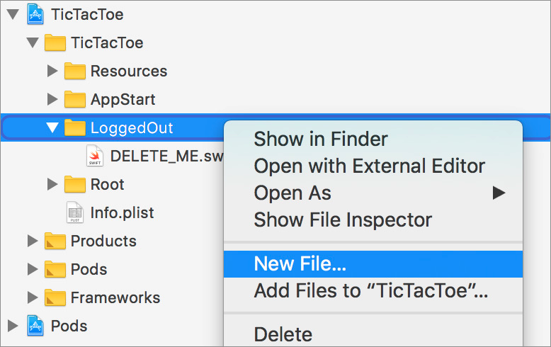
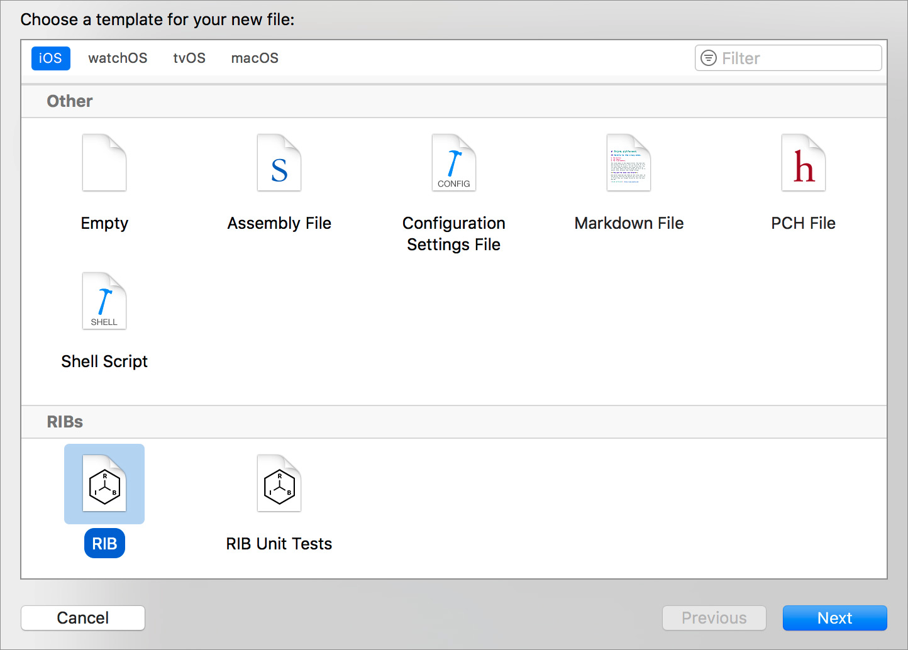
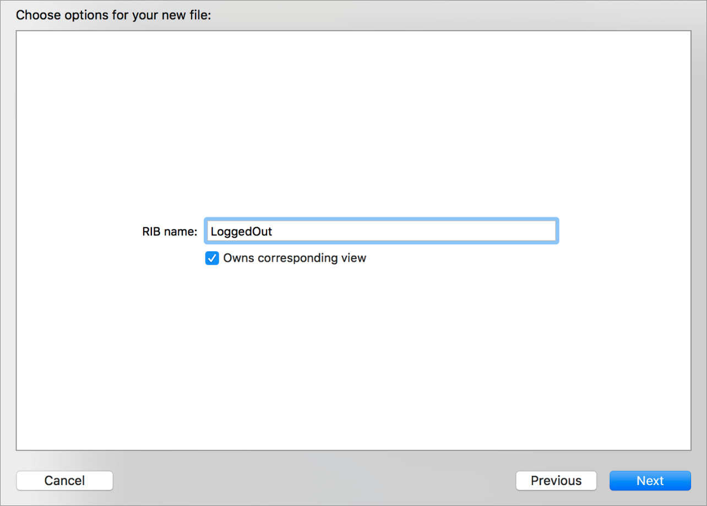
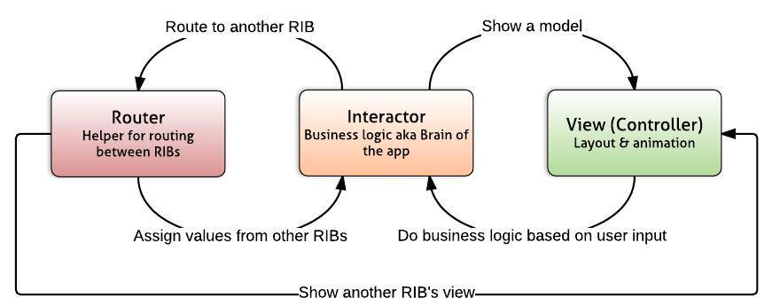
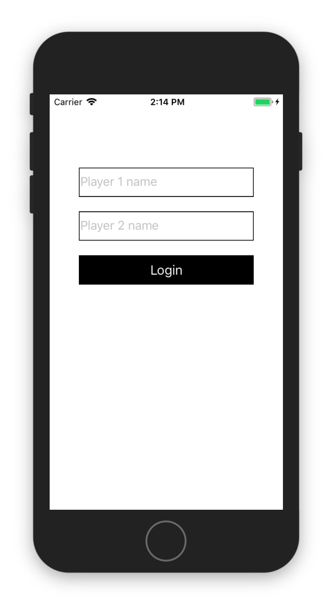

# RIBs Tutorial 1

<br />

### Create your first RIB

RIBs의 핵심 개념을 실습하도록 고안된 튜토리얼에 오신 것을 환영합니다. 튜토리얼의 일부로, RIBs 아키텍처 및 관련 툴링(도구)을 사용하여 간단한 TicTacToe 게임을 만들 예정입니다.

<br />

#### Goal

이 튜토링러의 목적은 RIB의 다양한 부분과 RIB이 서로 어떻게 상호작용하고 소통하는지를 이해하는 것입니다. 이 튜토리얼을 마치면 유저가 플레이어 이름을 입력하고 로그인 버튼을 누를 수 있는 화면으로 시작하는 앱이 있어야 합니다. 버튼을 누르면 플레이어 이름이 콘솔에 출력되어야 합니다.

<br />

#### Project structure

우리가 제공하는 상용 코드에는 2개의 RIB으로 구성된 iOS 프로젝트가 포함되어 이씁니다. 앱이 시작되면 AppDelegate는 Root RIB을 구축하고 앱에 대한 제어 권한을 RIB으로 전송합니다. Root RIB의 목적은 RIB 트리의 루트 역할을 하고 필요할 때 하위 트리로 제어 권한을 전송하는 것입니다. Root RIB의 코드는 대부분 Xcode 템플릿에 의해 자동 생성되므로 이 연습에서 이 코드를 이해하는 것은 필요하지 않습니다.

<br />

TicTacToe 앱의 두 번째 RIB은 로그아웃이며 로그인 인터페이스를 포함하고 인증 관련 이벤트를 관리해야 합니다. Root RIB이 AppDelegate에서 앱에 대한 제어 권한을 얻으면 즉시 로그인 화면을 보여주는 LoggedOut RIB으로 전송합니다. LoggedOut RIB의 presenting, building을 담당하는 코드는 이미 제공되었으며 RootRouter에서 찾을 수 있습니다.

<br />

LoggedOut RIB은 현재 구현되어 있지 않습니다. LoggedOut group을 열면 코드를 컴파일 하기 위해 필요한 stub만 있는 DELETE_ME.swift 파일만 있는 것을 알 수 있습니다. 이 튜토리얼에서 LoggedOut RIB의 적절한 구현을 만들 것입니다.

<br />

#### Create LoggedOut RIB

<br />

LoggedOut group에서 새 파일 생성.



<br />

RIB 템플릿 선택.



<br />

"LoggedOut"으로 이름을 짓고 "Owns corresponding view" 체크 박스 체크.



<br />

RIB이 고유한 뷰(컨트롤러)를 가질 필요는 없습니다. 그러나 우리는 LoggedOut RIB을 위한 뷰 컨트롤러를 생성하려고 합니다. 이 RIB에는 로그인 인터페이스(플레이어 이름을 위한 텍스트 필드, 로그인 버튼)가 포함되어 있어야 하기 때문입니다. "Owns corresponding view" 체크박스를 선택하면 해당 뷰 컨트롤러 클래스와 함께 새 RIB이 생성됩니다.

<br />

이후 DELETE_ME.swift 파일 삭제.

<br />

#### Understanding the generated code



LoggedOut RIB을 구성하는 모든 클래스를 방금 생성했습니다.

<br />

LoggedOutBuilder는 LoggedOutBuildable을 준수하므로 이 builder를 사용하는 다른 RIB은 buildable 프로토콜을 준수하는 mocked(모의) 인스턴스를 사용할 수 있습니다.

LoggedOutInteractor는 LoggedOutRouting 프로토콜을 사용하여 라우터와 통신합니다. 이는 Interactor가 필요한 것을 선언하는 의존성 역전 원칙을 기반으로 하며, 이 경우 LoggedOutRouter라는 다른 unit이 구현을 제공합니다. buildable 프로토콜과 마찬가지로 Interactor는 유닛 테스트를 할 수 있습니다.

LoggedOutPresentable은 interactor가 뷰 컨트롤러와 통신할 수 있는 것과 같은 개념입니다.

LoggedOutRouter는 interactor와 통신하기 위해 LoggedOutInteractable에서 필요한 것을 선언합니다. 뷰 컨트롤러와 통신하기 위해 LoggedOutViewControllable을 사용합니다.

LoggedOutViewController는 LoggedOutPresentableListener을 사용하여 동일한 의존성 역전 원칙에 따라 interactor와 통신합니다.

<br />

#### LoggedOut UI

<br />

아래는 빌드하고자 하는 UI이고, LoggedOutViewController를 수정해야 합니다. 시간을 절약하기 위해 이 코드를 LoggedOutViewCOntroller 구현에 사용할 수 있습니다.

<br />

```swift
		override func viewDidLoad() {
        super.viewDidLoad()

        view.backgroundColor = UIColor.white
        let playerFields = buildPlayerFields()
        buildLoginButton(withPlayer1Field: playerFields.player1Field, player2Field: playerFields.player2Field)
    }

    // MARK: - Private

    private var player1Field: UITextField?
    private var player2Field: UITextField?

    private func buildPlayerFields() -> (player1Field: UITextField, player2Field: UITextField) {
        let player1Field = UITextField()
        self.player1Field = player1Field
        player1Field.borderStyle = UITextBorderStyle.line
        view.addSubview(player1Field)
        player1Field.placeholder = "Player 1 name"
        player1Field.snp.makeConstraints { maker in
            maker.top.equalTo(self.view).offset(100)
            maker.leading.trailing.equalTo(self.view).inset(40)
            maker.height.equalTo(40)
        }

        let player2Field = UITextField()
        self.player2Field = player2Field
        player2Field.borderStyle = UITextBorderStyle.line
        view.addSubview(player2Field)
        player2Field.placeholder = "Player 2 name"
        player2Field.snp.makeConstraints { maker in
            maker.top.equalTo(player1Field.snp.bottom).offset(20)
            maker.left.right.height.equalTo(player1Field)
        }

        return (player1Field, player2Field)
    }

    private func buildLoginButton(withPlayer1Field player1Field: UITextField, player2Field: UITextField) {
        let loginButton = UIButton()
        view.addSubview(loginButton)
        loginButton.snp.makeConstraints { maker in
            maker.top.equalTo(player2Field.snp.bottom).offset(20)
            maker.left.right.height.equalTo(player1Field)
        }
        loginButton.setTitle("Login", for: .normal)
        loginButton.setTitleColor(UIColor.white, for: .normal)
        loginButton.backgroundColor = UIColor.black
        loginButton.addTarget(self, action: #selector(didTapLoginButton), for: .touchUpInside)
    }

    @objc private func didTapLoginButton() {
  
    }
```



<br />

#### Login logic

유저가 로그인 버튼을 누르면 LoggedOutViewCOntroller는 listener(LoggedOutPresentableListener)를 호출하여 유저가 로그인하길 원한다는 것을 알려야 합니다. listener는 로그인 요청을 진행하기 위해서 게임에 참여하는 플레이어의 이름을 받아야 합니다.

<br />

이 논리를 구현하기 위해 뷰 컨트롤러에서 로그인 요청을 수신하도록 listener를 업데이트해야 합니다.

<br />

LoggedOutViewController.swift 파일 내의 LoggedOutPresentableListener 프로토콜을 아래와 같이 수정하세요.

```swift
protocol LoggedOutPresentableListener: AnyObject {
    func login(withPlayer1Name player1Name: String?, player2Name: String?)
}
```

사용자가 플레이어 이름에 아무것도 입력하지 않을 수 있으므로 두 플레이어의 이름은 optional입니다. 두 이름을 모두 입력할 때까지 로그인 버튼을 비활성화할 수 있지만, 이 연습에서는 LoggedOutInteractor가 빈 이름을 처리하도록 하겠습니다. 플레이어 이름이 비어있으면 기본적으로 "Player 1", "Player 2"로 설정되게 구현합니다.

<br />

이제 다음 method를 추가하여 수정된 LoggedOutPresentableListener 프로토콜을 준수하도록 LoggedOutInteractor를 수정합니다.

```swift
// MARK: - LoggedOutPresentableListener

func login(withPlayer1Name player1Name: String?, player2Name: String?) {
    let player1NameWithDefault = playerName(player1Name, withDefaultName: "Player 1")
    let player2NameWithDefault = playerName(player2Name, withDefaultName: "Player 2")

    print("\(player1NameWithDefault) vs \(player2NameWithDefault)")
}

private func playerName(_ name: String?, withDefaultName defaultName: String) -> String {
    if let name = name {
        return name.isEmpty ? defaultName : name
    } else {
        return defaultName
    }
}
```

<br />

일단, 사용자가 로그인하면 사용자 이름만 출력하겠습니다.

<br />

마지막으로 로그인 버튼을 누르면 뷰 컨트롤러와 연결하여 listener 메소드를 호출합니다. LoggedOutViewController.swift 파일에서 didTapLoginButton 메소드를 다음 구현으로 변경하세요.

```swift
@objc private func didTapLoginButton() {
    listener?.login(withPlayer1Name: player1Field?.text, player2Name: player2Field?.text)
}
```

<br />

축하합니다! 방금 첫 번째 RIB을 만들었습니다. 지금 프로젝트를 빌드하고 실행하면 버튼이 있는 로그인 인터페이스가 표시됩니다. 버튼을 누르면 콘솔에 플레이어 이름을 출력하는 것을 볼 수 있을 겁니다.

<br />

이 튜토리얼에서 Xcode 템플릿에서 새 RIB을 생성하고 인터페이스를 업데이트하며 사용자가 입력한 데이터를 뷰 컨트롤러에서 interactor로 전달하는 버튼 탭 이벤트에 대한 handler를 추가했습니다. 이를 통해 우리는 두 유닛 간의 책임을 분리하고 코드의 테스트 가능성을 개선할 수 있습니다.

