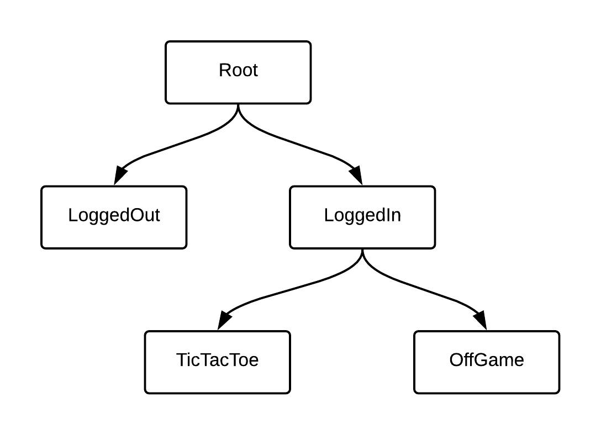

# RIBs Tutorial 2

#### Goals

이전 튜토리얼에서는 LoggedOut RIB에서 제공하는 로그인 양식을 포함하는 앱을 구축했습니다. 이 연습에서는 사용자가 로그인한 후 게임 필드를 보여주도록 앱을 확장합니다. 이 튜토리얼의 끝부분에서는 RIBdㅡㄹ 유닛 테스트하는 방법에 대해 간략히 설명하겠습니다.

<br />

이 연습의 주요 목표는 다음과 같은 개념을 이해하는 것입니다.

- 자식 RIB이 부모 RIB과 통신하도록 하는 것

- 상위 interactor가 하위 RIB을 연결 / 분리하는 것을 결정하는 것

- view-less RIB을 생성하는 것

- view-less RIB이 분리되었을 때 뷰 수정을 정리하는 것

- 상위 RIB이 처음 로드될 때 하위 RIB을 연결하는 것

- RIB의 생명주기를 이해하는 것

- RIB의 유닛 테스트

<br />

#### Project structure

이전 튜토리어를 완료한 후, Root와 LoggedOUt이라는 두 개의 RIB으로 구성된 앱을 게발하였습니다. 이 연습에서는 LoggedIn, OffGame, TicTacToe라는 세 가지 추가 RIB을 구현할 예정입니다. 이 튜토리얼을 마치면 앱의 RIB 계층은 다음과 같습니다.



여기서 LoggedIn RIB은 뷰가 없습니다. 이 RIB은 TicTacToe와 OffGame RIB 간 전환이 목적입니다.

다른 모든 RIB에는 자체 뷰 컨트롤러가 포함되어 있고 화면에 뷰를 표시할 수 있습니다.

<br />

OffGame RIB은 플레이어가 새 게임을 시작할 수 있도록 하며 "Start Game" 버튼이 있는 인터페이스를 포함합니다. TicTacToe RIB은 게임 필드를 표시하고 플레이어들이 움직일 수 있도록 할 것입니다.

<br />

#### Communicating with a parent RIB

플레이어 이름을 입력하고 로그인 버튼을 누르면 "Start Game" 뷰로 전환됩니다. 이를 지원하기 위해 활성화된 LoggedOut RIB은 Root RIB으로 로그인 액션을 알려야 합니다. 그런 다음 루트 라우터가 제어 권한을 LoogedOut RIB에서 LoggedIn RIB으로 전환합니다. viewless LoggedIn RIB은 OffGame RIB을 로드하고 그것의 뷰 컨트롤러를 화면에 표시합니다.

<br />

루트 RIB이 LoggedOut RIB의 부모이므로 해당 라우터가 LoogedOut의 interactor의 listner로 구성되어 있습니다. listner 인터페이스를 통해 LoggedOut RIB에서 Root RIB으로 로그인 이벤트를 전달해야 합니다.

<br />

먼저 LoggedOut RIB이 루트 RIB에게 플레이어가 로그인했다는 것을 알려주기 위한 메소드를 LoggedOutListener에 추가하여 업데이트합니다.

```swift
protocol LoggedOutListener: class {
    func didLogin(withPlayer1Name player1Name: String, player2Name: String)
}
```

이렇게 하면 LoggedOut RIB의 부모 RIB이 didLogin 함수를 구현하도록 강제하고 컴파일러가 상위 항목과 하위 항목 간의 계약을 적용하도록 합니다.

<br />

LoggedOutInteractor 내에서 로그인 함수의 구현을 변경하여 새로 선언된 listener call을 추가합니다.

```swift
func login(withPlayer1Name player1Name: String?, player2Name: String?) {
    let player1NameWithDefault = playerName(player1Name, withDefaultName: "Player 1")
    let player2NameWithDefault = playerName(player2Name, withDefaultName: "Player 2")
    listener?.didLogin(withPlayer1Name: player1NameWithDefault, player2Name: player2NameWithDefault)
}
```

이 변경을 통해, LoggedOut RIB의 listener는 RIB의 뷰 컨트롤러에서 로그인 버튼을 누르는 것을 알게 됩니다.

<br />

#### Routing to LoggedIn RIB

위의 다이어그램에서 볼 수 있듯이 유저가 로그인한 후 루트 RIB은 LoggedOut RIB에서 LoggedIn RIB으로 전환합니다. 이것을 지원하기 위해 routing 코드를 작성해 봅시다.

<br />

LoggedIn RIB으로 라우팅하는 메서드를 추가하여 RootRouting 프로토콜을 업데이트합니다.

```swift
protocol RootRouting: ViewableRouting {
    func routeToLoggedIn(withPlayer1Name player1Name: String, player2Name: String)
}
```

이렇게 하면 RootInteractor와 해당 라우터인 RootRouter 간의 계약이 성립합니다.

<br />

LoggedOutListener 프로토콜을 구현함으로써 RootInteractor에서 RootRouting을 호출하여 LoggedIn RIB으로 라우팅합니다. LoggedOut RIB의 부모로써, Root RIB은 그것의 listener 인터페이스를 구현해야 합니다.

```swift
// MARK: - LoggedOutListener

func didLogin(withPlayer1Name player1Name: String, player2Name: String) {
    router?.routeToLoggedIn(withPlayer1Name: player1Name, player2Name: player2Name)
}
```

이렇게 하면 루트 RIB이 사용자가 로그인할 때마다 LoggedIn RIB으로 라우팅합니다. 그러나, LoggedIn RIB이 아직 구현되지 않았으므로 Root RIB에서 LoggedIn RIB으로 전환할 수 없습니다. 누락된 RIB을 구현해 보겠습니다.

<br />

LoggedIn 그룹에서 DELETE_ME.swift 파일을 삭제합니다.

<br />

그런 다음 Xcode의 템플릿을 Viewless RIB으로 사용하여 LoggedIn RIB을 만듭니다. "Owns corresponding view" 체크박스를 해제하여RIB을 만듭니다. 새로 만든 파일들이 TicTacToe 타겟에 추가되었는지 확인합니다.

<br />

#### Attaching a viewless LoggedIn RIB and detaching LoggedOut RIB when the users log in

새로 만든 RIB을 연결하기 위해, 루트 라우터가 RIB을 빌드할 수 있어야 합니다. 이를 위해 LoggedInBuildable 프로토콜을 생성자 주입을 통해 RootRouter에 전달합니다. 다음과 같이 RootRouter의 생성자를 수정합니다.

```swift
init(interactor: RootInteractable,
     viewController: RootViewControllable,
     loggedOutBuilder: LoggedOutBuildable,
     loggedInBuilder: LoggedInBuildable) {
    self.loggedOutBuilder = loggedOutBuilder
    self.loggedInBuilder = loggedInBuilder
    super.init(interactor: interactor, viewController: viewController)
    interactor.router = self
}
```

또한, RootRouter에 private한 LoggedInBuilder 상수도 추가해야 합니다. 

```plain text
// MARK: - Private

    private let loggedInBuilder: LoggedInBuildable

    ...
```

그런 다음, RootBuilder를 업데이트하여 LoggedInBuilder 콘크리트 클래스를 인스턴스화하고 RootRouter에 주입합니다. 다음과 같이 RootBuilder의 build 함수를 수정합니다.

```swift
func build() -> LaunchRouting {
    let viewController = RootViewController()
    let component = RootComponent(dependency: dependency,
                                  rootViewController: viewController)
    let interactor = RootInteractor(presenter: viewController)

    let loggedOutBuilder = LoggedOutBuilder(dependency: component)
    let loggedInBuilder = LoggedInBuilder(dependency: component)
    return RootRouter(interactor: interactor,
                      viewController: viewController,
                      loggedOutBuilder: loggedOutBuilder,
                      loggedInBuilder: loggedInBuilder)
}
```

방금 수정한 코드를 보면, RootComponent를 생성자 주입을 사용하여 LoggedInBuilder의 dependencyfㅗ 전달합니다. 지금 왜 이러는지 걱정하지 마세요. 튜토리얼 3에서 바로 다루도록 하겠습니다.

<br />

RootRouter는 구체적인 LoggedInBuilder 클래스 대신 LoggedInBuildable 프로토콜에 의존합니다. 이렇게 하면 RootRouter를 유닛 테스트할 때 LoggedInBuildableㅇ에 대한 모의 테스트를 진행할 수 있습니다. 이것은 swizzling-based mocking이 불가능한 스위프트의 제약 사항입니다. 동시에, 이것은 프로토콜 기반 프로그래밍 원칙을 따르므로 RootRouter와 LoggedInBuilder가 단단히 결합되지 않도록 합니다.

<br />

LoggedIn RIB에 대한 모든 상용 코드를 만들어 Root RIB이 인스턴스화할 수 있도록 했습니다. 이제 RootRouter의 routeToLoggedIn 메소드를 구현할 수 있습니다.

<br />

추가하기 좋은 위치는 // MARK: - Private 섹션 바로 앞입니다.

```swift
// MARK: - RootRouting

func routeToLoggedIn(withPlayer1Name player1Name: String, player2Name: String) {
    // Detach LoggedOut RIB.
    if let loggedOut = self.loggedOut {
        detachChild(loggedOut)
        viewController.dismiss(viewController: loggedOut.viewControllable)
        self.loggedOut = nil
    }

    let loggedIn = loggedInBuilder.build(withListener: interactor)
    attachChild(loggedIn)
}
```

위의 코드 스니펫에서 볼 수 있듯이 상위 RIB이 하위 RIB으로 제어를 전환하려면 기존 하위 RIB을 분리한 후 분리된 하위 RIB 대신 새 하위 RIB을 연결해야 합니다. RIB 아키텍처에서 상위 라우터는 항상 하위 라우터를 연결합니다.

<br />

또한 RIB과 뷰 계층 간의 일관성을 유지하는 것은 언제나 상위 RIB의 책임입니다. 하위 RIB에 뷰 컨트롤러가 있는 경우 상위 RIB은 하위 RIB을 분리하거나 연결할 때 하위 뷰 컨트롤러를 dismiss하거나 present해야 합니다. routeToLoggedOut 메서드를 확인하면 뷰 컨트롤러를 소유한 RIB을 연결하는 방법을 알 수 있습니다.

<br />

새로 생성된 LoggedIn RIB에서 이벤트를 수신할 수 있도록 루트 RIB은 그것의 Interactor를 LoggedIn RIB의 listener로 구성합니다. 이 문제는 루트 RIB이 위의 코드에서 하위 RIB을 빌드할 때 발생합니다. 그러나 현재 루트 RIB은 LoggedIn RIB의 요청에 응답할 수 있는 프로토콜을 아직 구현하지 않았습니다.

<br />

RIB은 프로토콜 기반이기 때문에 listener 인터페이스 준수에 있어서 관대하지 않습니다. 다른 암묵적 관찰 방법 대신 프로토콜을 사용하여 컴파일러는 런타임 에러를 뱉는 대신 하위 항목의 이벤트를 모두 사용하지 않을 때 오류를 반환합니다. 이제 RootInteractable을 listener로 LoggedInBuilder의 build 메서드에 전달했으므로 RootInteractable은 LoggedInListener 프로토콜을 준수해야 합니다. RootInteractable 에 이 준수 사항을 추가하겠습니다.

```swift
protocol RootInteractable: Interactable, LoggedOutListener, LoggedInListener {
    weak var router: RootRouting? { get set }
    weak var listener: RootListener? { get set }
}
```

<br />

LoggedOut RIB을 분리하고 뷰를 dismiss 하기 위해 RootViewControllable 프로토콜에 새로운 dismiss 메서드를 추가해야 합니다.

프로토콜을 다음과 같이 수정하겠습니다.

```swift
protocol RootViewControllable: ViewControllable {
    func present(viewController: ViewControllable)
    func dismiss(viewController: ViewControllable)
}
```

<br />

dismiss 메서드를 프로토콜에 추가했으므로 RootViewController에서 구현해줘야 합니다. present 메서드 아래에 추가하겠습니다.

```swift
func dismiss(viewController: ViewControllable) {
	if presentedViewController === viewController.uiviewController {
		dismiss(animated: true, completion: nil)
	}
}
```

<br />

이제, 이전에 구현했던 routeToLoggedIn 메서드를 사용해 LoggedIn RIB으로 라우팅할 때 RootRouter는 올바르게 LoggedOut RIB을 분리하고 그것의 뷰 컨트롤러를 dismiss할 수 있습니다.

<br />

#### Pass in LoggedInViewControllable instead of creating it

LoggedIn RIB은 자체 view가 없지만 하위 RIB의 view를 표시할 수 있어야 하므로 LoggedIn RIB은 상위 RIB의 view에 액세스해야 합니다. 이 경우 LoggedIn RIB의 상위인 루트 RIB이 이 view를 제공해야 합니다.

<br />

RootViewController.swift 파일의 끝에 LoggedInViewControllable 익스텐션을 추가하여 준수하도록 업데이트합니다.

```swift
// MARK: LoggedInViewControllable

extension RootViewController: LoggedInViewControllable {
}
```

LoggedIn RIB에 LoggedInViewControllable 인스턴스를 주입해야 합니다. 튜토리얼 3에서 다루므로 지금은 다루지 않겠습니다. 지금은 LoggedInBuillder.swift의 내용을 이 코드로 override합니다.

```swift
//
//  Copyright (c) 2017. Uber Technologies
//
//  Licensed under the Apache License, Version 2.0 (the "License");
//  you may not use this file except in compliance with the License.
//  You may obtain a copy of the License at
//
//  http://www.apache.org/licenses/LICENSE-2.0
//
//  Unless required by applicable law or agreed to in writing, software
//  distributed under the License is distributed on an "AS IS" BASIS,
//  WITHOUT WARRANTIES OR CONDITIONS OF ANY KIND, either express or implied.
//  See the License for the specific language governing permissions and
//  limitations under the License.
//

import RIBs

protocol LoggedInDependency: Dependency {
    var loggedInViewController: LoggedInViewControllable { get }
}

final class LoggedInComponent: Component<LoggedInDependency> {

    fileprivate var loggedInViewController: LoggedInViewControllable {
        return dependency.loggedInViewController
    }
}

// MARK: - Builder

protocol LoggedInBuildable: Buildable {
    func build(withListener listener: LoggedInListener) -> LoggedInRouting
}

final class LoggedInBuilder: Builder<LoggedInDependency>, LoggedInBuildable {

    override init(dependency: LoggedInDependency) {
        super.init(dependency: dependency)
    }

    func build(withListener listener: LoggedInListener) -> LoggedInRouting {
        let component = LoggedInComponent(dependency: dependency)
        let interactor = LoggedInInteractor()
        interactor.listener = listener
        return LoggedInRouter(interactor: interactor,
                              viewController: component.loggedInViewController)
    }
}
```

이제 Root RIB에서 구현된 LoggedInViewControllable의 메서드를 호출하여 LoggedIn RIB은 하위 RIB의 view를 표시하거나 숨길 수 있습니다.

<br />

#### Attaching the OffGame RIB when the LoggedIn RIB loads

앞에서 말했 듯이, LoggedIn RIB은 뷰가 없으므로, 하위 RIB 간 전환만 할 수 있습니다. 첫 번째 자식 RIB인 OffGame을 만들어 Start Game Button을 표시하고 버튼의 탭을 처리할 것입니다.

<br />

이전 튜토리얼과 마찬가지로 view와 함께 RIB을 만듭니다. OffGame이라는 새로운 그룹을 만들 것을 제안합니다.

<br />

RIB을 만든 후에 OffGameViewController 클래스에 UI를 구현합니다. 시간을 절약하기 위해 제공된 구현을 사용할 수 있습니다.

```swift
final class OffGameViewController: UIViewController, OffGamePresentable, OffGameViewControllable {
    var uiViewController: UIViewController {
        return self
    }

    weak var listener: OffGamePresentableListener?
    
    init() {
        super.init(nibName: nil, bundle: nil)
    }
    
    required init?(coder: NSCoder) {
        fatalError("init(coder:) has not been implemented")
    }
    
    override func viewDidLoad() {
        super.viewDidLoad()
        
        view.backgroundColor = .yellow
        buildStartButton()
    }
    
    // MARK: - Private
    
    private func buildStartButton() {
        let startButton = UIButton()
        view.addSubview(startButton)
        startButton.snp.makeConstraints { maker in
            maker.center.equalTo(self.view.snp.center)
            maker.leading.trailing.equalTo(self.view).inset(40)
            maker.height.equalTo(100)
        }
        startButton.setTitle("Start Game", for: .normal)
        startButton.setTitleColor(.white, for: .normal)
        startButton.backgroundColor = .black
    }
}
```

이제 새로 만든 OffGame RIB을 부모인 LoggedIn에 연결하겠습니다. LoggedIn RIB은 OffGame RIB을 빌드하고 하위 RIB으로 연결할 수 있어야 합니다.

<br />

OffGameBuildable 인스턴스에 대한 의존성을 선언하도록 LoggedInRouter의 생성자를 변경합니다. 아래에 제시된 대로 생성자를 수정하세요.

```swift
init(interactor: LoggedInInteractable,
     viewController: LoggedInViewControllable,
     offGameBuilder: OffGameBuildable) {
    self.viewController = viewController
    self.offGameBuilder = offGameBuilder
    super.init(interactor: interactor)
    interactor.router = self
}
```

또한 offGameBuilder 참조를 담을 수 있는 private 상수를 선언합니다.

```swift
// MARK: - Private

...

private let offGameBuilder: OffGameBuildable
```

<br />

이제, LggedInBuilder를 업데이트하여 OffGameBuilder 콘크리트 클래스를 인스턴스화하고 LoggedInRouter 인스턴스에 주입합니다. build 함수를 다음과 같이 수정하세요

```swift
func build(withListener listener: LoggedInListener) -> LoggedInRouting {
    let component = LoggedInComponent(dependency: dependency)
    let interactor = LoggedInInteractor()
    interactor.listener = listener

    let offGameBuilder = OffGameBuilder(dependency: component)
    return LoggedInRouter(interactor: interactor,
                          viewController: component.loggedInViewController,
                          offGameBuilder: offGameBuilder)
}
```

<br />

OffGameBuilder의 의존성 계약을 이행하기 위해 OffGameComponent에 맞게 LoggedInComponent 클래스를 수정합니다. (RIB 의존성 및 컴포넌트는 튜토리얼 3에서 자세히 다룹니다)

```swift
final class LoggedInComponent: Component<LoggedInDependency>, OffGameDependency {
    
    fileprivate var loggedInViewController: LoggedInViewControllable {
        return dependency.loggedInViewController
    }
}
```

<br />

유저가 로그인한 후 OffGame RIB으로 구동되는 시작 화면을 바로 표시하고자 합니다. 즉, LoggedIn RIB이 로드되는 즉시 OffGame RIB을 연결해야 합니다. LoggedInRouter의 didLoad 메서드를 오버라이드하여 OffGame RIB을 로드합니다.

```swift
override func didLoad() {
    super.didLoad()
    attachOffGame()
}
```

<br />

attachOffGame은 OffGame RIB을 빌드 및 연결하고 뷰 컨트롤러를 표시하는데 사용되는 LoggedInRouter 클래스의 private 메서드가 됩니다. LoggedInRouter 클래스의 끝에 이 메서드 구현을 추가합니다.

```swift
// MARK: - Private

private var currentChild: ViewableRouting?

private func attachOffGame() {
    let offGame = offGameBuilder.build(withListener: interactor)
    self.currentChild = offGame
    attachChild(offGame)
    viewController.present(viewController: offGame.viewControllable)
}
```

<br />

attachOffGame 메서드에서 OffgameBuilder를 인스턴스화하려면 LoggedInInteractable 인스턴스를 주입해야 합니다. 이 interactor는 OffGame의 listener 인터페이스 역할을 하여 부모가 하위 RIB에서 수신되는 이벤트를 수신하고 해석할 수 있도록 합니다.

<br />

OffGame RIB 이벤트를 수신하려면 LoggedInInteractable이 OffGameListener 프로토콜을 준수해야 합니다. 여기에 프로토콜 준수를 추가하겠습니다.

```swift
protocol LoggedInInteractable: Interactable, OffGameListener {
    weak var router: LoggedInRouting? { get set }
    weak var listener: LoggedInListener? { get set }
}
```

이제 LoggedIn RIB은 로드된 직후에 OffGame RIB을 연결하고 이 RIB에서 시작된 이벤트를 청취할 수 있습니다.

<br />

#### Cleaning up the attached views when the LoggedIn RIB is detached

<br />

LoggedIn RIB에는 자체 view가 없고 상위 RIB의 view 계층을 수정하기 때문에 루트 RIB은 LoggedIn RIB이 수행할 수 있는 뷰 수정을 자동으로 제거할 수 있는 방법이 없습니다. 다행히 viewless LoggedIn RIB을 생성하는 데 사용한 Xcode 템플릿은 LoggedIn RIB이 분리되었을 때 뷰 수정 사항을 정리할 수 있는 후크?를 이미 제공합니다.

<br />

LoggedInViewControllable 프로토콜에 present와 dismiss 메서드를 선언합니다.

```swift
protocol LoggedInViewControllable: ViewControllable {
    func present(viewController: ViewControllable)
    func dismiss(viewController: ViewControllable)
}
```

<br />

다른 프로토콜 선언과 마찬가지로 LoggedIn RIB에 ViewControllable을 해제하는 기능이 필요함을 선언합니다.

그 다음 LoggedInROuter의 cleanupViews 메서드를 업데이트하여 현재 하위 RIB의 뷰 컨트롤러를 dismiss합니다.

```swift
func cleanupViews() {
    if let currentChild = currentChild {
        viewController.dismiss(viewController: currentChild.viewControllable)
    }
}
```

<br />

cleanupViews 메서드는 상위 RIB이 LoggedInRIB을 분리하기로 결정할 때 LoggedIn Interactor에 의해 호출됩니다. cleanupViews에서 표시된 뷰 컨트롤러를 해제하면 LoggedIn RIB이 분리된 후 상위 RIB의 뷰 계층에 해당 뷰를 그대로 두지 않습니다.

<br />

#### Switching to TicTacToe RIB on tapping "Start Game" button

<br />

본 튜토리얼의 앞에서 설명한 바와 같이, LoggedIn RIB은 유저가 OffGame RIB과 TicTacToe RIB 사이에서 전환할 수 있도록 해야 하며, 이전 RIB은 "Start Game" 화면을 보여주고 후자는 게임 필드를 그리고 플레이어의 움직임을 처리할 수 있는 책임이 있습니다. 지금까지 OffGame RIB만 구현하고 유저가 로그인한 후 LoggedIn RIB에서 제어를 얻도록 했습니다. 이제 TicTacToe RIB을 구현하고 유저가 OffGame RIB의 "Start Game" 버튼을 누르면 전환하도록 해야 합니다.

<br />

이 단계는 로그인 버튼을 누르면 LoggedIn RIB을 연결하고 LoggedOut RIB을 분리하는 것과 매우 유사합니다. 시간을 절약하기 위해 TicTacToe RIB이 이미 구현되어 프로젝트에 포함되어 있습니다.

<br />

TicTacToe로 라우팅하려면 LoggedInRouter 클래스에서 routeToTicTacToe 메서드를 구현하고 OffGameViewController에서 OffGame Interactor로 버튼 탭 이벤트를 연결하고 마지막으로 LoggedIn Interactor로 연결해야 합니다.

<br />

앱을 실행하면 로그인하여 Start Game 버튼을 눌러 TicTacToe RIB이 로드되어 게임 필드가 표시되는지 확인합니다.

<br />

이 연습을 수행할 때 새 OffGameListener 메서드의 이름을 startTicTacToe로 지정하는 것이 좋습니다. 이 메서드는 장치 테스트에 이미 스텁(stubbed)되어 있습니다. 그렇지 않으면 나중에 장치 테스트 대상을 작성할 떄 컴파일 오류가 표시됩니다.

<br />

#### Attaching the OffGame RIB and detaching the TicTacToe RIB when we have a winner

게임이 끝나면 TicTacToe RIB에서 OffGame RIB으로 다시 전환하고자 합니다. 그렇게 하기 위해 우리는 우리가 이미 연습한 것과 같은 Listener 기반 라우팅 패턴을 사용할 것입니다. 제공된 TicTacToe RIB에 이미 Listener가 설정되어 있습니다. LoggedIn RIB이 TicTacToe 이벤트에 응답할 수 있도록 LoggedIn Interactor에서 구현하기만 하면 됩니다.

<br />

LoggedInRouting 프로토콜에 routeToOffGame 메서드를 선언하세요.

```swift
protocol LoggedInRouting: Routing {
    func routeToTicTacToe()
    func routeToOffGame()
    func cleanupViews()
}
```

<br />

LoggedInInteractor 클래스에서 gameDidEnd 메서드를 구현하세요.

```swift
// MARK: - TicTacToeListener

func gameDidEnd() {
    router?.routeToOffGame()
}
```

<br />

그리고 난 후, LoggedInRouter 클래스에서 routeToOffGame 메서드를 구현하세요.

```swift
func routeToOffGame() {
    detachCurrentChild()
    attachOffGame()
}
```

<br />

private 섹션에 private 헬퍼 메서드를 구현하세요.

```swift
private func detachCurrentChild() {
    if let currentChild = currentChild {
        detachChild(currentChild)
        viewController.dismiss(viewController: currentChild.viewControllable)
    }
}
```

이제 앱은 승리자가 나오면 시작 화면으로 전환할 것입니다.

