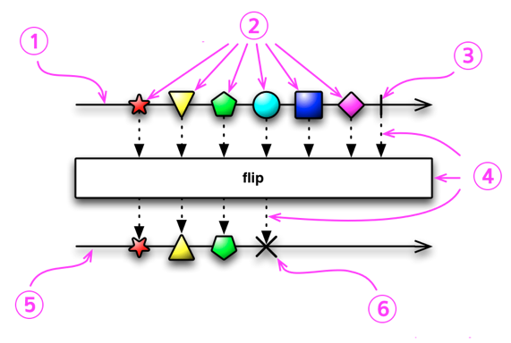
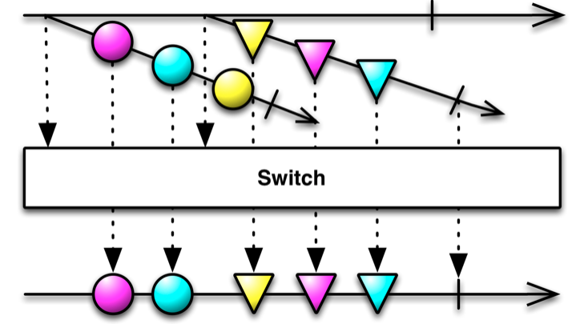
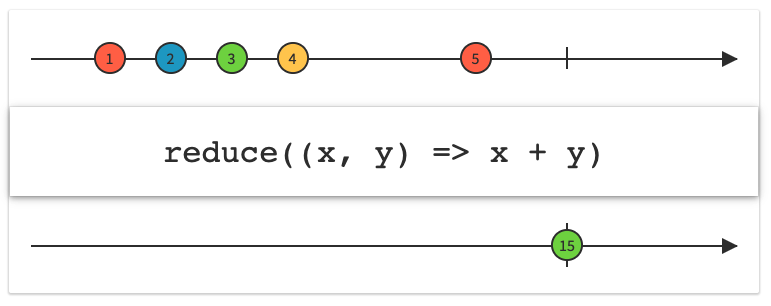
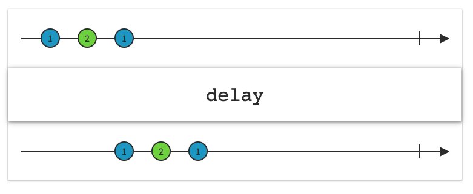
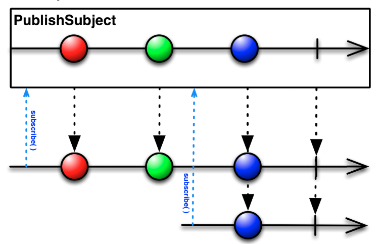
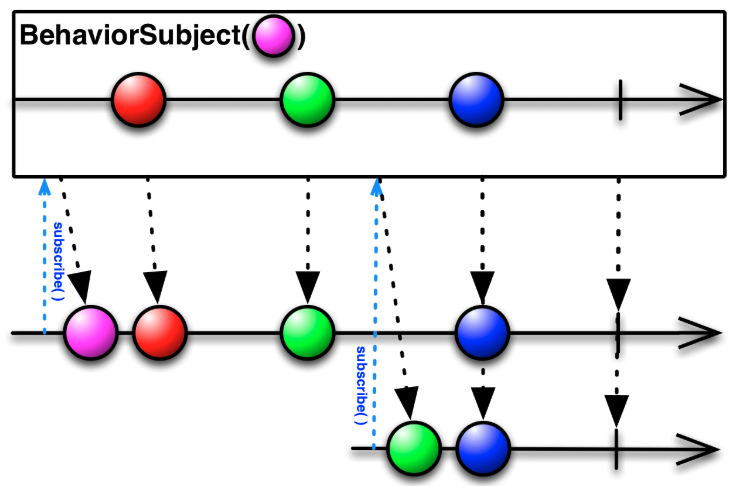
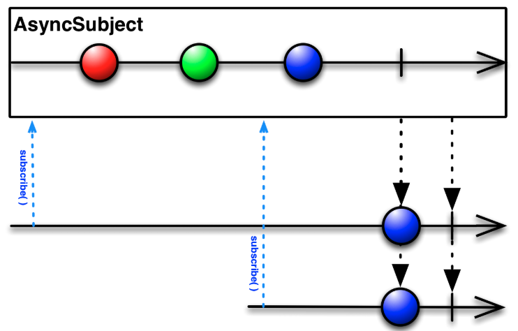

# RxSwift

[RxSwift 공식 홈페이지 번역](https://github.com/zxc1460/Self_Study/blob/master/RxSwift/Rxswift-공식-홈페이지-번역/Rxswift-공식-홈페이지-번역.md)

<br />

- ReactiveX(Rx) + Swift :ReactiveX 라이브러리를 Swift로 구현한 것

- Rx란? observable stream(관찰 가능한 시퀀스)를 이용하여 비동기 이벤트 기반 프로그래밍을 구현하기 위한 API

<br />

### 동기 vs 비동기

<br />

#### 동기(Synchronous)

- 요청과 결과가 동시에 일어나는 것을 의미

- 요청을 하면 시간이 얼마나 소요되는지 상관 없이 결과가 주어질 때까지 대기

- 장점

   - 설계가 간단하고 직관적

- 단점

   - 요청에 대한 결과가 반환되기 전까지 대기하기 때문에 자원 낭비 초래

#### 비동기(Asynchronous)

- 요청과 결과가 동시에 일어나지 않음

- 요청을 하면 그 결과를 기다리지 않고 다음 요청 수행

- 장점

   - 자원 효을적으로 사용 가능

- 단점

   - 동기식보다 복잡

   - 실행 순서 예측하기 어려움

<br />

### Marble Diagram



<br />

1. 실선 : Observable의 timeline, 시간 흐름 왼쪽 → 오른쪽

1. 도형 : Observable에서 방출한 next 이벤트, onNext 발생

1. 막대기 : Observable이 성공적으로 완료되었음을 나타내는 수직선, onCompleted 발생

1. 상자 : Observable의 연산자, Observable에 변환이 적용되고 있음을 나타냄

1. 변환된 결과가 출력된 새로운 Observable의 timeline

1. X : Observable이 비정상적으로 종료되거나 에러 발생 시 X로 표시, onError 발생

## Observable

- 이벤트를 시간 흐름에 따라 전달하는 전달자

- 비동기로 동작하는 일련의 항목들을 나타내는 시퀀스

- 세 가지 타입의 이벤트를 배출하고 Observer가 Observable을 구독하여 이벤트 수신

   - next : 다음 데이터를 가져오고 그 데이터를 옵저버가 받는다.

   - completed : 시퀀스를 성공적으로 마친다. 더이상 이벤트를 배출하지 않는다.

   - error : 오류가 발생하여 마친다. 이 또한 더이상 이벤트를 배출하지 않는다.

- __Observer가 Observable을 구독하고, Observable이 이벤트를 배출하면 Observer가 이에 반응__

   ```swift
   Observable<Int>.create {
   	emitter.onNext(1)
   	emitter.onNext(2)
   	emitter.onNext(3)
   
   	emitter.onCompleted()
   	
   	return Disposables.create()
   }
   ```

- Observable은 시퀀스의 정의일 뿐, 구독되기 전까지는 아무런 이벤트도 보내지 않는다.

   ```swift
   Observable<Int>.range(start: 1, count: 3)
   	.subscribe(onNext: {  value in
   		print(value)
   	})
   
   /*
   1
   2
   3
   */
   ```

- Observable의 생명주기 

   - Create

   - Subscribe

   - onNext

   - onComleted / onError

   - Disposed

- Hot Observable

   - 생성과 동시에 이벤트를 방출

   - 처음 생성된 이벤트부터 받지 못하고 중간부터 나온 이벤트부터 공유 가능

   - 여러 Observer가 하나의 Observable을 공유 가능

   - publish, replay ... 등 Subject 타입

- Cold Observable

   - 구독되는 시점부터 이벤트 방출

   - 처음부터 방출된 이벤트를 모두 구독할 수 있음

   - Observer마다 별도의 Observable 인스턴스를 가짐

   - Observable 타입

<br />

### Observer

- Observable을 구독하고 Observable이 배출하는 이벤트에 대해 반응(onNext, onCompleted, onError)

- Cold Observable(Observable 타입)의 경우 Observer마다 별도의 Observable 인스턴스를 가짐

- Hot Observable(Subject 타입)의 경우 Observer들이 하나의 Observable 공유 가능

### Dispose

- Observer는 기본적으로 Observable이 completed 또는 error 이벤트를 발생시킬 때까지 구독을 유지한다.

- 그러나 사용자가 이를 받기 전에 직접 제어할 수 있다.

- Observable을 구독하기 위해 subscribe 메서드를 사용하면 구독을 취소할 수 있는 Disposable 객체를 반환한다.

- dispose() : Disposable 객체의 dispose 메서드를 사용하면 completed 또는 error 이벤트가 발생하기 전에 구독을 취소할 수 있다.

   ```swift
   let disposable = Observable.from([1, 2, 3])
   	.subscribe(onNext: { value in
   			print(value)
   	})
   
   disposable.dispose()
   ```

- Disposable 객체를 저장하여 dispose 메서드를 수행해 개별적으로 구독을 관리할 수도 있지만 Observable 구독의 수가 많아지면 이를 관리하는 것도 쉽지 않다.

- 이를 위해 RxSwift는 DisposeBag을 제공한다.

- DisposeBag : 여러개의 Disposable 객체를 한 곳에 저장하여 한번에 dispose할 수 있게 해주는 객체

   ```swift
   var disposeBag = DisposeBag()
   
   Observable.of(1, 2, 3)
   	.subscribe(onNext: { value in
   		print(value)
   	})
   	.disposed(by: disposeBag)
   
   disposeBag = DisposeBag()
   // 뷰컨트롤러에서 disposeBag을 들고 있다면 뷰컨트롤러가 dismiss되거나 pop될 떄 뷰컨트롤러의
   // 인스턴스가 해제되고 뷰컨트롤러의 인스턴스가 해제됨에 따라 disposeBag의 인스턴스도 해제되므로
   // 이 때 disposeBag의 deinit 메서드가 불려 안의 disposable들을 dispose 시킨다.
   ```

   <br />

<br />

### Operator

#### 생성 연산자(Creating Operator)

__Create__

- 직접적인 코드 구현을 통해 옵저버 메서드를 호출해 Observable 생성

   ```swift
   Observable<String>.create { emitter in
       emitter.onNext("A")
       emitter.onNext("B")
       emitter.onCompleted()
       
       return Disposables.create()
   }.subscribe {
       print($0)
   } onError: {
       print($0)
   } onCompleted: {
       print("Completed")
   } onDisposed: {
       print("Disposed")
   }.disposed(by: disposeBag)
   
   // A
   // B
   // Completed
   // Disposed
   ```

__just__

- 파라미터로 전달한 요소를 단일 요소로 그대로 방출하고 complete 이벤트 발생

   ```swift
   Observable.just([1, 2, 3])
   
   ```

__of__

- 파라미터로 전달한 요소들을 하나씩 방출하고 complete 이벤트 발생

   ```swift
   Observable.of(1, 2, 3)
   	.subscribe { print($0) }
   	.disposed(by: disposeBag)
   // next(1)
   // next(2)
   // next(3)
   // completed
   ```

__from__

- 파라미터로 전달한 배열의 요소들을 하나씩 순서대로 방출하고 complete 이벤트 발생

   ```swift
   Observable.from([1, 2, 3])
   	.subscribe { print($0) }
   	.disposed(by: disposeBag)
   // next(1)
   // next(2)
   // next(3)
   // completed
   ```

__range__

- range(start, count)

- 파라미터로 전달된 range의 start부터 1씩 증가하는 count 개의 시퀀스 생성

   ```swift
   Observable.range(start: 1, count: 3)
       .subscribe { print($0) }
       .disposed(by: disposeBag)
   // next(1)
   // next(2)
   // next(3)
   // completed
   ```

__generate__

- generate(initialState, condition, iterate)

- 초기값인 initialState부터 condition 조건을 만족하지 않을때까지 이벤트를 발생하는 시퀀스 생성

   ```swift
   Observable.generate(initialState: 1, condition: { $0 <= 3 }) {
       $0 + 1
   }
   .subscribe { print($0) }
   .disposed(by: disposeBag)
   ```

__repeatElement__

- 동일한 요소를 반복적으로 방출하는 시퀀스 생성

- take 연산자로 갯수를 지정하지 않으면 무한대로 방출

   ```swift
   Observable.repeatElement("❤️")
       .take(3)
       .subscribe { print($0) }
       .disposed(by: disposeBag)
   
   // next(❤️)
   // next(❤️)
   // next(❤️)
   // completed
   ```

__defer__

- 옵저버가 구독하기 전까지 Observable 생성을 지연하고 구독이 시작되면 옵저버 별로 새로운 Observable 생성

- 특정 조건에 따라 옵저버블을 생성하기 위해 사용

   ```swift
   let animals = ["🐶", "🐱", "🐹"]
   let fruits = ["🍎", "🍐", "🍋"]
   var flag = true
   
   
   let observable: Observable<String> = Observable.deferred {
       flag = !flag
       if flag {
           return Observable.from(animals)
       } else {
           return Observable.from(fruits)
       }
   }
   
   observable
       .subscribe { print($0) }
       .disposed(by: disposeBag)
   
   observable
       .subscribe { print($0) }
       .disposed(by: disposeBag)
   /*
   		next(🍎)
   		next(🍐)
   		next(🍋)
   		completed
   		next(🐶)
   		next(🐱)
   		next(🐹)
   		completed
   */
   ```

__empty__

- 어떠한 요소도 방출하지 않는 시퀀스 생성

- completed 이벤트만 전달하고 종료

   ```swift
   Observable<Void>.empty()
       .subscribe { print($0) }
       .disposed(by: disposeBag)
   // Completed	
   ```

__error__

- 어떠한 요소도 방출하지 않는 시퀀스 생성

- error 이벤트만 전달하고 종료

   ```swift
   Observable<Void>.error(Myerror.error)
       .subscribe { print($0) }
       .disposed(by: disposeBag)
   // error(error)
   ```

   <br />

#### 변환 연산자 (Transforming Operator)

__toArray__

- 하나의 요소를 방출하는 Observable로 변환 (Single)

- 더이상 요소를 방출하지 않는 시점에 배열에 담아 전달

   ```swift
   let subject = PublishSubject<Int>()
   
   subject
       .toArray()
       .subscribe { print($0) }
       .disposed(by: disposeBag)
   
   subject.onNext(1)
   subject.onNext(2)
   subject.onNext(3)
   subject.onCompleted()
   
   // success([1, 2, 3])
   ```

__map__

- 원본 Observable이 방출하는 요소에 대해 함수를 실행하고 결과값으로 새로운 Observable 리턴

   ```swift
   let skills = ["Swift", "SwiftUI", "RxSwift"]
   
   Observable
       .from(skills)
       .map { $0.count }
       .subscribe { print($0) }
       .disposed(by: disposeBag)
   
   // next(5)
   // next(7)
   // next(7)
   // completed
   ```

__flatMap__

- Observabled에서 방출되는 항목마다 한 개의 새로운 Observable을 생성하고 이렇게 생성된 여러 개의 Observable을 하나의 Observable로 합쳐준다.

- 네트워크 요청을 구현할 때 활용

   ```swift
   let a = BehaviorSubject(value: 1)
   let b = BehaviorSubject(value: 2)
   
   let subject = PublishSubject<BehaviorSubject<Int>>()
   
   subject
       .flatMap({ $0.asObservable() })
       .subscribe { print($0) }
       .disposed(by: disposeBag)
   
   subject.onNext(a)
   subject.onNext(b)
   
   a.onNext(11)
   b.onNext(22)
   
   // next(1)
   // next(2)
   // next(11)
   // next(22)
   ```

__flatMapFirst__

- 첫번째로 변환된 Observable이 방출하는 항목만 전달

   ```swift
   let a = BehaviorSubject(value: 1)
   let b = BehaviorSubject(value: 2)
   
   let subject = PublishSubject<BehaviorSubject<Int>>()
   
   subject
       .flatMapFirst({ $0.asObservable() })
       .subscribe { print($0) }
       .disposed(by: disposeBag)
   
   subject.onNext(a)
   subject.onNext(b)
   
   a.onNext(11)
   b.onNext(22)
   b.onNext(222)
   a.onNext(111)
   
   // next(1)
   // next(11)
   // next(111)
   ```

__flatMapLatest__

- 가장 최근의 항목을 방출한 Observable의 요소만 방출

   ```swift
   let a = BehaviorSubject(value: 1)
   let b = BehaviorSubject(value: 2)
   
   let subject = PublishSubject<BehaviorSubject<Int>>()
   
   subject
       .flatMapLatest({ $0.asObservable() })
       .subscribe { print($0) }
       .disposed(by: disposeBag)
   
   subject.onNext(a)
   a.onNext(11)
   
   subject.onNext(b)
   b.onNext(22)
   
   a.onNext(11)
   
   // next(1)
   // next(11)
   // next(2)
   // next(22)
   ```

__scan__

- 이전에 방출된 항목과 새로 방출될 항목을 결합해 방출

- 값을 누적시키기 때문에 일종의 누산기 

   ```swift
   Observable.from([1, 2, 3, 4, 5])
       .scan(0) { oldValue, newValue in
           return oldValue + newValue
       }.subscribe { print($0) }
       .disposed(by: disposeBag)
   
   // next(1)
   // next(3)
   // next(6)
   // next(10)
   // next(15)
   // completed
   ```

__buffer__

- 특정 주기동안 Observable이 방출하는 항목을 모아 하나의 배열로 방출

- 파라미터는 최대 시간, 최대 갯수(하나만 충족하면 방출)

- 수집된 배열을 방출하는 Observable을 반환

   ```swift
   Observable<Int>.interval(.seconds(1), scheduler: MainScheduler.instance)
       .buffer(timeSpan: .seconds(2), count: 3, scheduler: MainScheduler.instance)
       .take(5)
       .subscribe { print($0) }
       .disposed(by: disposeBag)
   // next([0])
   // next([1, 2, 3])
   // next([4, 5])
   // next([6, 7])
   // next([8, 9])
   // completed
   ```

__window__

- 최대 시간, 최대 갯수를 지정해 원본 Observable이 방출하는 항목들을 작은 단위의 Observable로 분해

- Observable을 방출하는 Observable을 반환

```swift
Observable<Int>.interval(.seconds(1), scheduler: MainScheduler.instance)
    .window(timeSpan: .seconds(2), count: 3, scheduler: MainScheduler.instance)
    .take(5)
    .subscribe {
        print($0)
        
        if let observable = $0.element {
            observable.subscribe {
                print("inner: \($0)")
            }
        }
    }
    .disposed(by: disposeBag)
```

__groupBy__

- 방출되는 항목을 조건에 따라 그룹핑

- flatMap, toArray를 활용해 최종 결과를 하나의 배열로 방출할 수 있음

   ```swift
   let words = ["Apple", "Banana", "Orange", "Book", "City", "Axe"]
   
   Observable.from(words)
       .groupBy { $0.count }
       .subscribe(onNext: {
           print("key - \($0.key)")
           $0.subscribe { print("  \($0)") }
       })
       .disposed(by: disposeBag)
   // key - 5
   //   next(Apple)
   // key - 6
   //   next(Banana)
   //   next(Orange)
   // key - 4
   //   next(Book)
   //   next(City)
   // key - 3
   //   next(Axe)
   //   completed
   //   completed
   //   completed
   ```

   <br />

#### 필터링 연산자(Filtering Operator)

__filter__

- Observable이 방출하는 항목을 필터링하여 만들어진 항목을 방출하는 새 Observable 반환

- 고차함수의 filter와 동일

   ```swift
   Observable.from([1, 2, 3, 4, 5, 6])
       .filter { $0.isMultiple(of: 2) }
       .subscribe { print($0) }
       .disposed(by: disposeBag)
   
   // next(2)
   // next(4)
   // next(6)
   // completed
   ```

__ignoreElements__

- Observable이 방출하는 next 이벤트는 무시하고 completed, error 만 방출

   ```swift
   Observable.from(["A", "B", "C"])
       .ignoreElements()
       .subscribe { print($0) }
       .disposed(by: disposeBag)
   
   // completed
   ```

__elementAt__

- 특정 인덱스에 위치한 요소만 방출

- 하나의 next 이벤트만 전달하고 completed

   ```swift
   Observable.from([1, 2, 3])
       .elementAt(2)
       .subscribe { print($0) }
       .disposed(by: disposeBag)
   
   // next(3)
   // completed
   ```

__skip__

- 지정된 갯수만큼 무시하고 다음 항목부터 방출

   ```swift
   Observable.from([1, 2, 3])
       .skip(2)
       .subscribe { print($0) }
       .disposed(by: disposeBag)
   
   // next(6)
   // completed
   ```

__skipWhile__

- 클로저에 true로 리턴되는 동안 무시

- false를 리턴한 때부터 조건 없이 방출

   ```swift
   Observable.from([1, 2, 3, 4, 5])
       .skipWhile { !($0 % 2 == 0) }
       .subscribe { print($0) }
       .disposed(by: disposeBag)
   
   // next(2)
   // next(3)
   // next(4)
   // next(5)
   // completed
   ```

__skipUntil__

- Observable을 파라미터로 받음(트리거)

- 트리거 Observable이 next 이벤트를 전달하기 전까지 원본 Observable의 이벤트 무시\

   ```swift
   let subject = PublishSubject<Int>()
   let trigger = PublishSubject<Bool>()
   
   subject
       .skipUntil(trigger)
       .subscribe { print($0) }
       .disposed(by: disposeBag)
   
   subject.onNext(1)
   subject.onNext(2)
   
   trigger.onNext(true)
   
   subject.onNext(3)
   
   // next(3)
   ```

__take__

- 지정된 갯수만큼만 이벤트 방출하고 completed 이벤트 발생

   ```swift
   Observable<Int>.interval(.seconds(1), scheduler: MainScheduler.instance)
       .take(3)
       .subscribe { print($0) }
       .disposed(by: disposeBag)
   
   // next(0)
   // next(1)
   // next(2)
   // completed
   ```

__single__

- 첫번째 요소, 조건과 일치하는 첫번째 요소만 방출

- 조건을 안 줬을 때 시퀀스가 2개 이상 요소를 방출하면 에러 발생

   ```swift
   Observable.from([1, 2, 3])
       .single { $0 % 2 == 0 }
       .subscribe { print($0) }
       .disposed(by: disposeBag)
   
   // next(2)
   // completed
   ```

__distinctUntilChanged__

- 동일한 항목이 연속적으로 방출되지 않도록 함

- 바로 직전의 항목만 비교, 그 이전 값들은 신경 쓰지 않음

   ```swift
   Observable.from([1, 1, 3, 2, 2, 2, 3, 1, 5])
       .distinctUntilChanged()
       .subscribe { print($0) }
       .disposed(by: disposeBag)
   
   // next(1)
   // next(3)
   // next(2)
   // next(3)
   // next(1)
   // next(5)
   // completed
   ```

<br />

#### 결합 연산자 (Combining Operator)


__startWith__

- Observable이 항목을 방출하기 전에 다른 항목을 앞에 추가

- 주로 기본값이나 시작값을 지정할 때 활용

   ```swift
   Observable.from([2, 3, 4])
       .startWith(1)
       .startWith(0)
       .subscribe { print($0) }
       .disposed(by: disposeBag)
   
   // next(0)
   // next(1)
   ...
   // next(4)
   // completed
   ```

__concat__

- 두 개의 Observable 연결

- 타입 메서드와 인스턴스 메서드 둘 다 구현되어있음

   ```swift
   let ob1 = Observable.from([1, 2])
   let ob2 = Observable.from([3, 4])
   
   Observable.concat(ob1, ob2)
       .subscribe { print($0) }
       .disposed(by: disposeBag)
   
   // next(1)
   // ...
   // next(4)
   // completed
   ```

__merge__

- 여러 Observable이 방출하는 항목들을 하나의 Observable에서 방출하도록 병합

- concat과 동작 방식이 다름

- concat : 하나의 Observable이 모든 항목을 방출하고 completed 되면 다른 Observable이 방출 시작

- merge : Observable을 병합하고 모든 Observable에서 방출하는 항목을 순서대로 방출하는 Observable을 반환

   ```swift
   let oddNumbers = BehaviorSubject(value: 1)
   let evenNumbers = BehaviorSubject(value: 2)
   
   let source = Observable.of(oddNumbers, evenNumbers)
   
   source
       .merge()
       .subscribe { print($0) }
       .disposed(by: disposeBag)
   
   oddNumbers.onNext(3)
   evenNumbers.onNext(4)
   
   oddNumbers.onNext(5)
   
   oddNumbers.onCompleted()
   
   evenNumbers.onNext(10)
   evenNumbers.onCompleted()
   
   // next : 1, 2, 3, 4, 5 ,10
   // completed
   ```

__combineLatest__

- 소스 Observable을 결합하여 새 Observable 리턴

- 소스 Observable들이 방출하는 가장 최근 값끼리 결합하여 새 항목을 방출하는 Observable 생성

   ```swift
   let greetings = PublishSubject<String>()
   let languages = PublishSubject<String>()
   
   Observable.combineLatest(greetings, languages) { (lhs, rhs) -> String in
       return "\(lhs) \(rhs)"
   }
   .subscribe { print($0) }
   .disposed(by: bag)
   
   greetings.onNext("Hi")
   languages.onNext("World!")
   
   greetings.onNext("Bye")
   languages.onNext("Earth!")
   
   // next(Hi World!)
   // next(Bye World!)
   // next(Bye Earth!)
   ```

__zip__

- Observable을 결합

- Observable이 방출하는 항목의 index를 기준으로 짝을 일치시켜 항목을 결합한 후 전달

   ```swift
   let numbers = PublishSubject<Int>()
   let strings = PublishSubject<String>()
   
   Observable.zip(numbers, strings) { "\($0) - \($1)"}
       .subscribe { print($0) }
       .disposed(by: disposeBag)
   
   numbers.onNext(1)
   numbers.onNext(2)
   
   strings.onNext("one")
   strings.onNext("two")
   
   // next(1 - one)
   // next(2 - two)
   ```

__withLatestFrom__

- 트리거 Observable이 Next 이벤트를 방출하면 데이터 Observable이 가장 최근에 방출한 next 이벤트를 구독자에게 전달

- ex) 로그인 버튼을 탭하는 시점에 id, 비밀번호 텍스트 필드에 들어가 있는 값을 가져올 때

   ```swift
   let trigger = PublishSubject<Void>()
   let data = PublishSubject<String>()
   
   trigger.withLatestFrom(data)
       .subscribe { print($0) }
       .disposed(by: disposeBag)
   
   
   data.onNext("Hello")
   data.onNext("Bye")
   
   trigger.onNext(())
   
   // next(Bye)
   ```

__sample__

- 트리거 Observable이 next 이벤트르 전달할 때마다 데이터 Observable이 next 이벤트 방출

- 그러나 데이터 Observable의 동일한 next이벤트는 반복해서 방출하지 않음

   ```swift
   let trigger = PublishSubject<Void>()
   let data = PublishSubject<Int>()
   
   data.sample(trigger)
       .subscribe { print($0) }
       .disposed(by: disposeBag)
   
   data.onNext(1)
   data.onNext(2)
   
   trigger.onNext(())
   trigger.onNext(())
   
   data.onNext(3)
   trigger.onNext(())
   
   // next(2)
   // next(3)
   ```

switchLatest

- 가장 최근에 방출된 Observable을 구독하고, 이 Observable이 전달하는 이벤트를 구독자에게 전달

   

   ```swift
   let a = PublishSubject<Int>()
   let b = PublishSubject<Int>()
   
   let source = PublishSubject<Observable<Int>>()
   
   source
       .switchLatest()
       .subscribe { print($0) }
       .disposed(by: disposeBag)
   
   a.onNext(1)
   a.onNext(2)
   
   source.onNext(a)
   
   a.onNext(3)
   b.onNext(11)
   
   source.onNext(b)
   
   a.onNext(4)
   b.onNext(22)
   
   // next(3)
   // next(22)
   ```

__reduce__

- scan과 마찬가지로 방출하는 요소의 값을 조건에 따라 누적

- scan과 다르게 최종 결과만 방출

- 고차함수의 reduce와 동일

   

   ```swift
   Observable.from([1, 2, 3, 4, 5])
       .reduce(0, accumulator: +)
       .subscribe { print($0) }
       .disposed(by: disposeBag)
   
   // next(15)
   // completed
   ```

   <br />

#### Time-based Operator

__interval__

- 지정된 주기마다 정수 방출하는 Observable 생성

- 무한히 계속 발행

- 중지하려면 직접 dispose 호출, 또는 take로 갯수 제한

   ```swift
   Observable<Int>.interval(.seconds(1), scheduler: MainScheduler.instance)
   		.take(2)
       .subscribe { print($0) }
       .disposed(by: disposeBag)
   
   // next(0)
   // next(1)
   // completed
   ```

__timer__

- 지연 시간과 반복 주기를 지정해서 정수 방출하는 Observable 생성

- 중지하려면 직접 dispose 호출, 또는 take로 갯수 제한

   ```swift
   Observable<Int>.timer(.seconds(3), period: .seconds(1), scheduler: MainScheduler.instance)
       .take(2)
       .subscribe { print($0) }
       .disposed(by: disposebag)
   
   // next(0)
   // next(1)
   // completed
   ```

__delay__

- next 이벤트가 전달되는 시점을 지연

- 구독 시점을 지연하지는 않음

   

<br />

### Subject

- Observable이자 Observer

- Observer 역할로 하나 이상의 Observable을 구독

- Observable 역할로 항목을 방출할 수 있다.

- 다른 Observable로부터 이벤트를 받아 구독자로 전달

<br />

#### PublishSubject

- 구독된 이후에 발생한 이벤트만 전달

- 해당 시간에 발생한 데이터 방출

- 시간에 민감한 데이터를 모델링할 때 사용

   

   ```swift
   let subject = PublishSubject<String>()
   
   subject.onNext("Hello")
   
   let o1 = subject.subscribe { print(">> 1", $0) }
   o1.disposed(by: disposeBag)
   
   subject.onNext("RxSwift")
   
   let o2 = subject.subscribe { print(">> 2", $0) }
   o2.disposed(by: disposeBag)
   
   subject.onNext("Subject")
   
   subject.onCompleted()
   
   let o3 = subject.subscribe { print(">> 3", $0) }
   o3.disposed(by: disposeBag)
   
   // >> 1 next(RxSwift)
   // >> 1 next(Subject)
   // >> 2 next(Subject)
   // >> 1 completed
   // >> 2 completed
   // >> 3 completed
   ```

   <br />

#### BehaviorSubject

- 항상 최신의 next 이벤트를 방출

- 초기값을 가짐

- 구독할 때 그 이전에 방출된 항목 중 마지막 값 방출

- 항상 최신 데이터로 채워야 하는 경우 사용(유저 프로필)

   

   ```swift
   let subject = BehaviorSubject(value: 0)
   
   subject
       .subscribe { print(">> 1", $0) }
       .disposed(by: disposeBag)
   
   subject.onNext(1)
   
   
   subject
       .subscribe { print(">> 2", $0) }
       .disposed(by: disposeBag)
   
   subject.onNext(2)
   
   // >> 1 next(0)
   // >> 1 next(1)
   // >> 2 next(1)
   // >> 1 next(2)
   // >> 2 next(2)
   ```

<br />

#### ReplaySubject

- bufferSize 만큼 이벤트를 저장해 구독될 때 저장한 이벤트 방출

- 2개 이상의 이벤트를 저장하고 옵저버에게 전달하고 싶을 때 사용

- 최신의 여러 값들을 보여주고 싶을 때 사용 ( 최근 검색어 )

   

   ```swift
   let subject = ReplaySubject<Int>.create(bufferSize: 2)
   
   
   subject.onNext(1)
   subject.onNext(2)
   
   subject
       .subscribe { print(">> 1", $0) }
       .disposed(by: disposeBag)
   
   
   subject.onNext(3)
   
   subject
       .subscribe { print(">> 2", $0) }
       .disposed(by: disposeBag)
   
   // >> 1 next(1)
   // >> 1 next(2)
   // >> 1 next(3)
   // >> 2 next(2)
   // >> 2 next(3)
   ```

<br />

#### AsyncSubject

- Completed가 발생하면 가장 최근의 마지막 next 이벤트 하나만 구독자에게 전달

   

    

   ```swift
   let subject = AsyncSubject<Int>()
   
   subject.onNext(1)
   subject.onNext(2)
   subject.onNext(3)
   
   
   subject
       .subscribe { print($0) }
       .disposed(by: disposeBag)
   
   subject.onCompleted()
   
   // next(3)
   // completed
   ```

   <br />

#### Relay

- Relay는 **Subject**를 랩핑하고 있음

- RxSwift가 아닌 RxCocoa 프레임워크에 존재

- next 이벤트만 전달하여 Subject와 다르게 **error**나 **complete**을 통해 dipose 될 수 없음

- __onNext__ 대신 __accept__ 사용

- 주로 UI에 사용

   ```swift
   let relay = PublishRelay<Int>()
   
   relay.accept(0)
   
   relay.subscribe { print($0) }
       .disposed(by: disposeBag)
   
   relay.accept(1)
   relay.accept(2)
   
   // next(1)
   // next(2)
   ```

   <br />

   <br />

### Scheduler 스케줄러

> 스케줄러는 특정 코드가 실행되는 컨텍스트를 추상화한 것이다.
컨텍스트는 로우 레벨 Thread가 될 수 있고 Dispatch Queue, Operation Queue, Thread pool 등이 될 수 있다.
따라서 추상화된 컨텍스트이기 때문에 쓰레드와 1 대 1로 매칭되지 않는다.
Cocoa → GCD
RxSwift → Scheduler
컨텍스트 : 소스 코드를 실행하는데 필요한 환경을 제공하고 코드의 실행 결과를 실제로 관리하는 영역

<br />

#### subscribeOn

- 시퀀스가 시작될 때 어느 스케줄러에서 실행될 지 지정(최상위부터 적용)

<br />

#### observeOn

- 다음에 오는 작업들이 어느 스케줄러에서 실행될 지 지정(이 연산자가 사용된 후 하위부터 적용)

<br />

### 내장 스케줄러 (Builtin Schedulers)

<br />

#### CurrentThreadScheduler (Serial)

- 현재 스레드에 있는 작업의 단위들을 스케줄해준다. 이것은 요소를 생성하는 연산자의 기본 스케줄러이다.

- 만약 __CurrentThreadScheduler.instance.schedule(state) {}__ 가 어떤 스레드에서 처음으로 호출된 경우, 예약된 작업이 즉시 실행되고 재귀적으로 예약된 모든 작업들이 일시적으로 대기하는 숨겨진 큐가 생성된다.

- 만약 콜 스택의 몇몇 부모 프레임이 이미 **CurrentThreadScheduler.instance.schedule(state) {}** 를 실행 중이라면 예약된 작업은 현재 실행 중인 작업과 이전에 대기열에 추가된 모든 작업이 완료되면 대기열에 추가되고 실행된다.

<br />

#### MainScheduler (Serial)

- MainThread 에서 실행되어야 하는 추상적인 작업에서 사용한다. schedule 메서드가 메인 스레드에서 호출된 경우, 스케줄링 없이 작업 실행

- 이 스케줄러는 보통 UI 작업에서 쓰인다.

<br />

#### SerialDispatchQueueScheduler (Serial)

- 특정 dispatch queue에서 실행되어야 하는 추상적인 작업에서 사용

- 시리얼 스케줄러는 observeOn을 위한 특정 최적화를 가능하게 해준다.

- 메인 스케줄러는 SerialDispatchQueueScheduler의 인스턴스

<br />

#### ConcurrentDispatchQueueScheduler (Concurrent)

- 특정 dispatch queue에서 실행되어야 하는 추상적인 작업에서 사용

- 백그라운드에서 작업이 실행되어야 할 때 적합

<br />

#### OperationQueueScheduler (Concurrent)

- 특정 NSOperationQueue에서 실행되어야 하는 추상적인 작업에서 사용

- 이 스케줄러는 백그라운드에서 수행해야 하는 큰 작업이 있고 maxConcurrentOperationCount를 이용해 병행 처리 과정을 미세 조정할 경우에 적합하다.

- 이 스케줄러는 백그라운드에서 수행해야 하는 더 큰 작업 청크가 있고 maxConcurrentOperationCount를 사용하여 동시 처리를 미세 조정할 경우에 적합하다.

<br />

<br />

### Traits

> Traits를 통해 명확한 이벤트 발생 규칙을 가진 Observable을 사용하도록 지원한다.
코드의 명확함과 직관성을 가지고자 할 때 선택적으로 사용할 수 있고, 코드의 의도를 분명히 할 수 있다는 장점이 있다.

<br />

Traits은 간단하게 struct로 읽기 전용 Observable sequence property와 함께 랩핑 되어있다.

```swift
struct Single<Element> {
		let source: Observable<Element>
}

struct Driver<Element> {
		let source: Observable<Element>
}
```

<br />

#### Single

- Observable의 변형으로 일련의 요소들을 방출하는 대신 항상 단일 요소 또는 오류를 방출하도록 보장한다.

- 정확히 하나의 요소 또는 error만 방출 (success or error)

- 부수작용을 공유하지 않는다.

- ex) 응답, 오류만 반환할 수 있는 HTTP 요청 수행

<br />

#### Completable

- complete 하거나, error를 방출하고, 아무 요소도 방출하지 않는 것을 보장하는 Observable

- 제로 요소 방출

- 완료 이벤트 또는 에러만 방출

- 부수작용을 공유하지 않는다.

<br />

#### Maybe

- 단일 요소를 방출하거나 요소를 방출하지 않고 오류를 낼 수 있다.

- 이 세가지 이벤트 중 하나라도 방출되면 Maybe는 종료된다. 

<br />

#### Driver

- RxCocoa Traits

- 오류를 방출하지 않는다.

- observe는 Main Scheduler에서 발생

- 부수작용을 공유한다 (shareReplayLatestWhileConnected)

- UI레이어에서 reactive 코드를 작성하는 직관적인 방법을 제공하거나 애플리케이션에서 데이터 스트림을 모델링 하는 모든 경우를 위한 것

<br />

#### ControlProperty 

- RxCocoa Traits

- UI 요소의 속성을 나타내기 위한 Observabe / ObservableType을 위한 Trait

-  값의 순서는 초기 제어값과 사용자 시작 값 변경을 나타낸다. 프로그램 상의 값 변화는 리포트되지 않는다.

- 오류를 발생하지 않는다.

- MainScheduler 에서 이벤트를 전달한다.

<br />

#### ControlEvent

- RxCoca Traits

- UI 요소의 이벤트를 나타내는 Observable / ObservableType을 위한 Trait

- 오류가 발생하지 않는다.

- MainScheduler 에서 이벤트를 전달한다.

- 구독자에게 초기값을 전송하지 않는다.

<br />

### Bind 

- bind를 사용해 스트림에서 오류가 발생하지 않고 항목 이벤트에만 관심이 있다고 표현할 수 있다.

- 내부적으로 subscribe 사용

<br />

