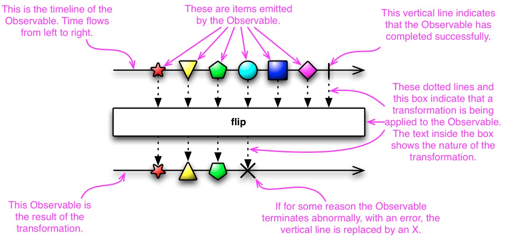

# RxSwift 공식 홈페이지 번역

### ReactiveX

 

ReactiveX는 관찰 가능한 시퀀스(observable sequences)를 사용하여 비동기식 및 이벤트 기반 프로그램을 구성하기 위한 라이브러리입니다.

 

데이터 및/또는 이벤트의 시퀀스를 지원하도록 옵저버 패턴을 확장하고 낮은 수준의 스레딩, 동기화, 스레드 안전성, 동시 데이터 구조 및 비차단 I/O와 같은 사항에 대한 우려를 추상화하면서 선언적으로 시퀀스를 함께 작성할 수 있는 연산자를 추가합니다.

 

Observable은 여러 항목의 비동기 시퀀스에 접근할 수 있는 이상적인 방법으로 빈틈을 메웁니다.

| 구분 | single items | multiple items |
 | --- | --- | --- |
| synchronous | T getData() | Iterable<T> getData() |
| asynchronous | Future<T> getData() | Observable<T> getData() |

Rx를 "함수형 반응 프로그래밍(functional reactive programming)"이라고 부르기도 하지만 이는 잘못된 이름입니다. Rx는 함수형일 수 있고 반응형일 수도 있지만 "함수형 반응 프로그래밍"은 다른 것입니다. 한 가지 주요 차이점은 함수형 반응 프로그래밍은 시간에 따라 지속적으로 변화하는 값에 대해 동작하는 반면, Rx는 시간에 따라 방출되는 이산적인 값에 대해 작동한다는 것입니다.

 

### Why Use Observables?

 Rx Observable 모델을 사용하면 비동기 이벤트 스트림을 배열과 같은 데이터 항목 집합에 사용하는 것과 동일한 종류의 단순하고 합성 가능한 작업으로 처리할 수 있습니다. 이를 통해 뒤엉킨 콜백 웹에서 벗어나 코드 가독성을 높이고 버그 발생 가능성을 줄일 수 있습니다.

 

#### Observables Are Composable

Java Futures와 같은 기술은 단일 레벨의 비동기 실행에 사용하기 쉽지만 중첩될 경우 복잡성이 커지기 시작합니다.

 

Future를 사용하여 조건부 비동기 실행 흐름을 최적으로 구성하기는 어렵습니다(또는 각 요청의 지연 시간이 런타임에 다르기 때문에 불가능합니다.) 물론 이렇게 할 수는 있지만, 빠르게 복잡해지거나(따라서 오류가 발생하기 쉬우므로) Future.get()을 조기에 차단하므로 비동기 실행의 이점이 사라집니다.

 

반면 Rx의 Observable은 비동기 데이터의 흐름과 시퀀스를 구성하기 위한 것입니다.

 

#### Observables Are Flexible

Rx의 Observable은 단일 스칼라 값의 방출 뿐만 아니라(Futures와 같이) 값의 시퀀스 또는 무한한 스트림의 방출도 지원합니다. Observable은 이러한 사용 사례에 사용할 수 있는 단일 추상화입니다. Observable은 거울과 같은 사촌인 Interable과 관련된 모든 유연성과 우아함을 가지고 있습니다.

| event | Iterable (pull) | Observable (push) |
 | --- | --- | --- |
| retrieve data | T next() | onNext(T) |
| discover error | throws Exception | onError(Exception) |
| complete | !hasNext() | onCompleted() |

#### Observables Are Less Opinionated

Rx는 동시성 또는 비동기성의 특정 소스에 치우치지 않습니다. Observable은 스레드 풀, 이벤트 루프, 비차단 I/O, 액터(예: Akka) 또는 필요에 맞는 구현, 스타일 또는 전문 지식을 사용하여 구현할 수 있습니다. 클라이언트 코드는 기본 구현이 차단인지 비차단인지 여부에 관계 없이 Observable과의 모든 상호 작용을 비동기식으로 처리하여 사용자가 구현하도록 선택합니다.

 

__How is this Observable implemented?__

- 호출자(Caller)와 동일한 스레드에서 동기적으로 작동합니까?

- 서로 다른 스레드에서 동기적으로 작동합니까?

- 호출자에게 데이터를 어떤 순서로든 반환할 수 있는 여러 스레드에 걸쳐 작업을 분할합니까?

- 스레드 풀 대신에 Actor를 사용합니까?

- 이벤트 루프가 있는 NIO를 사용하여 비동기식 네트워크 액세스를 수행합니까?

- 이벤트 루프를 사용하여 작업 스레드와 콜백 스레드를 분리합니까?

__Observable의 관점에서 이 모든 것들은 중요하지 않습니다.__

그리고 중요한 것은 Rx를 사용하면 나중에 Observable의 소비자를 방해하지 않고 Observable 구현의 기본 특성을 획기적으로 바꿀 수 있습니다.

 

#### Callbacks Have Their Own Problems

콜백은 차단을 허용하지 않음으로써 Future.get()에 대한 조기 차단 문제를 해결합니다. 응답이 준비가 되면 실행되기 때문에 자연적으로 효율적입니다. 그러나 Futures와 마찬가지로 콜백은 단일 수준의 비동기 실행으로 사용하기 쉬우며 중첩된 구성이 되면 감당하기 어려워집니다.

 

#### ReactiveX Is a Polyglot Implementation (Rx는 여러 언어로 구현되어있습니다.)

Rx는 현재 해당 언어의 관용어를 존중하는 방식으로 다양한 언어로 구현되고 있으며, 더 많은 언어가 빠른 속도로 추가되고 있습니다.

 

### Reactive Programming

Rx는 Observable을 필터링(filter), 선택(select), 변환(transform), 결합(combine) 및 합성(compose)할 수 있는 연산자 집합을 제공합니다. 이를 통해 효율적인 실행 및 구성이 가능합니다.

 

Observable 클래스를 Iterable의 "push" 즉, "pull"로 생각할 수 있습니다. Iterable을 사용하면 소비자가 생산자로부터 값을 가져오고 값이 도착할 때까지 스레드를 block시킵니다. 반대로 Observable을 사용하면 생산자는 값을 사용할 수 있을 때마다 소비자에게 값을 넘겨줍니다. 값이 동기식 또는 비동기식으로 도착할 수 있기 때문에 이 접근 방식이 더 유연합니다.

 

Observable 타입은 Gang of Four의 옵저버 패턴에 누락된 두 개의 구문을 추가하여 Iterable 타입에서 사용할 수 있는 것과 일치시킵니다.

1. 생산자가 더 이상 사용할 수 있는 데이터가 없다는 신호를 소비자에게 보내는 기능(이러한 경우 Iterable은 foreach 반복문은 정상적으로 완료되고 반환함; Observable은 observer의 onCompleted 메서드를 호출함)

1. 생산자가 소비자에게 오류가 발생했음을 알리는 기능(Iterable은 반복하는 동안 오류가 발생하면 예외를 발생시키고 Observable은 observer의 onError 메서드를 호출함)

이러한 추가 사항을 통해 Rx는 Iterable과 Observer 타입을 조화시킵니다. 둘 사이의 유일한 차이점은 데이터가 흐르는 방향입니다. 이제 모든 작업을 Iterable과 Observable에서 수행할 수 있기 때문에 이 작업은 매우 중요합니다.

 

### Observable

Rx에서 관찰자(Observer)는 Observable을 구독합니다. 그런 다음 관찰자는 Observable이 방출하는 아이템 또는 아이템들의 시퀀스에 반응합니다. 이 패턴은 Observable이 객체를 내보낼 때까지 기다리는 동안 차단할 필요가 없으므로 동시 작업을 쉽게 수행할 수 있으며, 대신 Observable이 나중에 수행할 때마다 적절하게 반응할 준비가 되어 있는 관찰자 형태의 보초(sentry)를 만듭니다.

 

이 페이지에서는 반응형 패턴이 무엇이고 Observable과 Observer가 무엇인지 그리고 관측자가 어떻게 Observable을 구독하는 지에 대해 설명합니다. 다른 페이지에서는 다양한 Observable 연산자를 사용하여 Observable을 서로 연결하고 해당 연산자의 동작을 변경하는 방법을 설명합니다.

 

이 문서는 "마블 다이어그램"과 함께 제공됩니다. 마블 다이어그램이 Observable과 Observable의 변환을 나타내는 방법은 다음과 같습니다.

 

#### Background

 

   많은 소프트웨어 프로그래밍 작업에서 작성하는 명령이 한 번에 하나씩 실행되어 작성하는 순서대로 완료될 것으로 예상합니다. 그러나 Rx에서는 많은 명령이 병렬적으로 실행될 수 있으며 나중에 "관찰자"에 의해 그 결과가 임의의 순서대로 캡처됩니다. 메서드를 호출하는 대신 "Observable"의 형태로 데이터를 검색하고 변환하는 메커니즘을 정의한 다음 관찰자가 Observable을 구독합니다. 이 때 이전에 정의된 메커니즘이 실행되어 관찰자가 대기 중인 데이터 방출을 캡처하고 응답합니다.

    

   이 접근 방식의 장점은 서로 의존하지 않는 여러 작업이 있는 경우 각 작업을 시작하기 전에 완료될 때까지 기다리지 않고 모든 작업을 동시에 시작할 수 있다는 것입니다. 이렇게 하면 전체 작업 집합이 묶음에서 가장 긴 작업을 완료하는 데 걸리는 시간만큼 걸립니다.

    

   이 비동기 프로그래밍과 디자인 모델을 설명하는 데는 많은 용어가 사용됩니다. 이 문서에는 다음 용어를 사용합니다. 관찰자는 Observable을 구독합니다. Observable은 관찰자의 메서드를 호출하여 아이템을 방출하거나 관찰자에게 알림을 보냅니다.

    

   다른 문서와 다른 맥락에서 우리는 "관찰자(Observer)"를 "구독자(Subscriber)", "감시자(watcher)" 또는 "반응자(reactor)"라고 부르기도 합니다. 일반적으로 이 모델을 "반응기 패턴(reactor pattern)"이라고 합니다.

    

   #### Establishing Observers

   이 페이지에는 Groovy와 유사한 의사 코드(수도코드)가 예제로 사용되지만 여러 언어로 구성된 Rx 구현이 있습니다. 

    

   일반적인 메서드 호출(즉, Rx에서 일반적인 비동기 병렬 호출이 아닌)에서 흐름은 다음과 같습니다.

   1. 메서드 호출

   1. 메서드의 반환값을 변수에 저장

   1. 새로운 값의 변수를 사용하여 유용한 작업 수행

    

   비동기 모델에서 흐름은 다음과 같습니다

   1. 비동기 호출의 반환 값으로 유용한 작업을 수행하는 메서드를 정의한다. 이 메서드는 관찰자의 일부이다.

   1. Observable의 형태로 비동기 호출 자체를 정의한다.

   1. Observable을 구독하여 관찰자를 연결합니다.(Observable의 action도 초기화한다.)

   1. 작업을 계속합니다. 반환될 때마다 관찰자의 메서드가 반환값에 대해 작동하기 시작합니다.(Observable이 방출한 item)

 

#### onNext, onCompleted, and onError

Subscribe 메서드는 관찰자를 Observable에 연결하는 방법입니다. 관찰자는 다음 메서드 중 일부를 구현합니다.

1. onNext : Observable은 항목을 방출할 때마다 이 메서드를 호출합니다. 이 메서드는 Observable로부터 내보내진 항목을 매개 변수로 사용합니다.

1. onError :  Observable은 이 메서드를 호출하여 예상 데이터를 생성하지 못했거나 다른 오류가 발생했음을 나타냅니다. onNext 또는 onCompleted를 더이상 호출하지 않습니다. onError 메서드는 매개 변수로 오류의 원인이 무엇인지 나타냅니다.

1. onCompleted : Observable은 오류가 발생하지 않은 경우 마지막으로 onNext를 호출한 후 이 메서드를 호출합니다.

 

Observable 계약에 명시된 조건에 따라, onNext는 0번 이상 호출될 수 있으며 그 후에는 onCompleted 또는 onError 둘 중 하나를 마지막으로 호출한다. 단 이 둘 모두를 호출하지는 않는다. 이 문서에서는 관례에 따라, onNext 호출을 항목의 "배출(emit)"로 부르며, onCompleted 또는 onError 호출을 "알림(notification)으로 부를 것이다.

 

#### 구독 해지

Rx 구현체 중에서는 Subscriber라는 특별한 옵저버 인터페이스가 있는데 이 인터페이스는 unsubscribe라는 메서드를 제공한다. 이 인터페이스는 unsubscribe 메서드를 제공한다. 현재 구독 중인 Observable 중, 옵저버가 더이상 구독을 원하지 않는 경우에 이 메서드를 호출하여 구독을 해지할 수 있다.만약 더이상 관심 있는 다른 옵저버가 존재하지 않는다면 Observable들은 새로운 항목들을 배출하지 않는다.

 

unsubscribe는 연산자 체인을 통해 옵저버가 구독하고 있었던 Observable들이 더 이상 항목들을 배출하지 못하도록 체인 안에 연결된 링크들을 끊어 버린다.

 

#### 명명 규칙에 관한 참고 내용

Rx를 구현하는 언어들은 자신만의 독특한 특징들을 갖고 있다. 그렇다고 반드시 지켜야 하는 강제성이 있는 규칙들이 존재하는 것은 아니지만, 언어 별 구현체 간에 공통적으로 유지해야 하는 많은 명명 규칙들이 존재한다.

뿐만 아니라, 이들 규칙 간에는 각기 다른 문맥에서 서로 다른 함축적인 의미로 사용되는 것들도 있으며 특정 언어의 관용구에서는 상당히 어색한 의미로 해석되기도 한다.

예를 들면, (onNext, onCompleted, onError 같은) onEvent 네이밍 패턴이 존재하는데, 어떤 문맥에서는 이런 이름들이 어떤 핸들러가 등록 되었는지를 가리키는 메서드로 사용되기도 한다. 하지만, Rx에서는 이벤트 핸들러 그 자체를 의미한다.

 

#### "뜨거운(Hot)", "차가운(Cold)", Observable

그럼 Observable은 연속된 항목들을 언제 배출할까? 이 질문에 대한 대답은, "Observable에 따라 다르다"이다. "뜨거운" Observable은 생성되자 마자 항목들을 배출하기도 하기 때문에, 이 Observable을 구독하는 옵저버들은 어떤 경우에는 항목들이 배출되는 중간부터 Observable을 구독할 수 있다. 반대로, "차가운" Observable은 옵저버가 구독할 때까지 항목을 배출하지 않기 때문에 이 Observable을 구독하는 옵저버는 Observable이 배출하는 항목 전체를 구독할 수 있도록 보장 받는다.

 

Rx의 구현 코드 중에는 "연결 가능한(Connectable)" Observable이라고 불리는 Observable 객체가 존재하는데, 이 Observable은 옵저버의 구독 여부와는 상관 없이 자신의 Connect 메서드가 호출되기 전까지 항목들을 배출하지 않는다.

#### Observable 연산자를 활용한 구성

Observable과 옵저버는 그저 Rx의 시작점일 뿐이다. 우리가 알고 있는 표준 옵저버 패턴을 조굼 확장한 것이며, 연속된 이벤트를 처리하는데 있어서는 싱글 콜백보다는 훨씬 더 효과적인 방법을 제공한다.

 

"리액티브 확장(reactive extensions)"(그래서 "ReactiveX"로 부르는)의 진짜 힘은 연산자로부터 나온다. 연산자들은 Observable이 배출하는 연속된 항목들을 변환시키고, 결합하고, 조작하는 기능들을 제공한다.

이 연산자들은 콜백이 제공하는 효율적인 장점들을 바탕으로 선언적인 방법을 통해 연속된 비동기 호출을 구성할 수 있는 방법을 제공하는데, 중요한 것은 일반적인 비동기 시스템이 가진 중첩된 콜백 핸들러의 단점들을 제거했다는 것이다.

여기에서 제공하는 문서들은 다양한 연산자에 대한 내용을 그룹으로 나눠 연결된 링크들을 통해 실제 사용에 필요한 예제를 제공한다.

 

__Observable 생성__

- Create, Defer, Empty / Never / Throw, From, Interval, Just, Range, Repeat, Start, Timer

__Observable 항목 변환__

- Buffer, FlatMap, GroupBy, Map, Scan, Window

__Observable 필터__

- Debounce, Distinct, ElementAt, Filter, First, IgnoreElements, Last, Sample, Skip, SkipLast, Take, TakeLast

__Observable 결합__

- And / Then / When, CombineLatest, Join, Merge, StartWith, Switch, Zip

__오류 처리 연산자__

- Catch, Retry

__유틸리티 연산자__

- Delay, Do, Materialize / Dematerialize, ObserveOn, Serialize, Subscribe, SubscribeOn, TimeInterval, Timeout, Timestamp, Using

__조건 및 불리언(Boolean) 연산자__

- All, Amb, Contains, DefaultIfEmpty, SequenceEqual, SkipUntil, SkipWhile, TakeUntil, TakeWhile

__수학과 조합 연산자__

- Average, Concat, Count, Max, Min, Reduce, Sum

__변환 Observable__

- To

__연결 가능한 Observable 연산자__

- Connect, Publish, RefCount, Replay

__역압(backpressure) 연산자__

- 특정 제어흐름 원칙들을 적용하는 다양한 연산자들

 

#### 연산자 체인

대부분의 연산자들은 Observable 상에서 동작하고 Observable을 리턴한다. 이런 접근 방법은 연산자들을 하나의 Observable에 적용하고 또 다음 연산자에 다시 적용할 수 있는 연산자 체인을 제공한다. 연산자 체인에 걸려있는 각각의 연산자들은 이전 연산자가 리턴한 Observable을 변경한다.

특정 클래스의 다양한 메서드 연산을 통해서 같은 클래스에 있는 항목들을 변경하는 빌더 패턴 같은 것도 존재한다. 이 패턴 역시 비슷한 방법으로 메서드 체인을 제공한다. 하지만, 연산자의 호출 순서가 문제가 되지 않는 빌더 패턴과는 달리, Observable 연산자들은 호출 순서에 영향을 받는다.

Observable 연산자 체인은 원본 Observable과는 떨어져서 동작할 수 없고 순서대로 동작하기 때문에, 호출 체인 중 바로 이전에 호출된 연산자가 리턴한 Observable을 기반으로 실행된다.

 

### 연산자 소개

Rx를 지원하는 언어별 구현체들은 다양한 연산자들을 제공하는데, 이 중에는 공통적으로 제공되는 연산자도 있지만 특정 구현체에서만 제공하는 연산자들도 존재한다. 또한, 언어별 구현체들은 이미 언어에서 제공하는 메서드의 이름과 유사한 형태로 연산자의 네이밍 컨벤션을 유지하고 있다.

 

#### ReactiveX의 연산자

이 페이지에서는 먼저 ReactiveX의 "핵심"연산자들을 나열하고, 각 연산자별로 제공된 링크를 통해 연산자들이 어떻게 동작하고 ReactiveX의 여러 언어별 구현체에서 연산자가 어떻게 구현됐는지 자세히 설명한다.

그 후에는 "결정 트리"를 통해 여러분에게 필요한 적절한 연산자를 선택할 수 있는 유용한 가이드를 제공한다.

마지막으로 ReactiveX의 다양한 언어별 구현체에서 제공하는 모든 연산자들을 알파벳 순으로 소개한다. 뿐만 아니라, 각각의 연산자 역시 링크를 통해 언어별 구현체가 제공하는 연산자와 가장 유사한 핵심 연산자에 관한 자세한 설명을 제공한다.

 

### 카테고리 별 연산자

#### Observable 생성

새로운 Observable을 만드는 연산자들

- __Create__ : 직접적은 코드 구현을 통해 옵저버 메서드를 호출하여 Observable 생성 

- __Defer__ : 옵저버가 구독하기 전까지는 Observable의 생성을 지연하고 구독이 시작되면 옵저버 별로 새로운
Observable 생성

- __Empty / Never / Throw__ : 아주 정확하고 제한된 행동을 하는 Observable 생성

- __From__ : 다른 객체나 자료 구조를 Observable로 변환

- __Interval__ : 특정 시간별로 연속된 정수형을 배출하는 Observable 생성

- __Just__ : 객체 하나 또는 객체 집합을 Observable로 변환, 변환된 Observable은 원본 객체들을 발행

- __Range__ : 연속된 범위의 정수를 발행하는 Observable 생성

- __Repeat__ : 특정 항목이나 연속된 항목들을 반복적으로 배출하는 Observable 생성

- __Start__ : 함수의 실행 결과를 배출하는 Observable 생성

- __Timer__ : 지정된 시간이 지나고 난 후 항목을 하나 배출하는 Observable 생성

#### Observable 변환

Observable이 배출한 항목들을 변환하는 연산자들

- __Buffer__ : Observable로부터 정기적으로 항목들을 수집하고 묶음으로 만든 후 묶음 안에 있는 항목들을 한번에 하나씩 배출하지 않고 수집된 묶음 단위로 배출

- __FlatMap__ : 하나의 Observable이 발행하는 항목들을 여러 개의 Observable로 변환하고, 항목들의 배출을 차례차례 줄 세워 하나의 Observable로 전달

- __GroupBy__ : 원본 Observable이 배출하는 항목들을 키(Key) 별로 묶은 후 Observable에 담는다. 이렇게 키 별로 만들어진 Observable들은 자기가 담고 있는 묶음의 항목들을 배출한다.

- __Map__ : Observable이 배출한 항목에 함수를 적용한다.

- __Scan__ : Observable이 배출한 항목에 연속적으로 함수를 적용하고 실행한 후 성공적으로 실행된 함수의 리턴 값을 발행

- **Window** : 정기적으로 Observable의 항목들을 더 작은 단위의 Observable 윈도우로 나눈 후에, 한번에 하나씩 항목들을 발행하는 대신 작게 나눠진 윈도우 단위로 항목들을 배출

#### Observable 필터링

소스 Observable에서 선택적으로 항목을 배출하는 연산자들

- __Debounce__ : Observable의 시간 흐름이 지속되는 상태에서 다른 항목들은 배출하지 않고 특정 시간 마다 그 시점에 존재하는 항목 하나를 배출

- __Distinct__ : Observable이 배출하는 항목들 중 중복을 제거한 항목 배출

- __ElementAt__ : Observable에서 n번째 항목만 배출

- __Filter__ : 필터 조건을 만족하는 항목들만 배출

- __First__ : 맨 첫 번째 항목 또는 조건을 만족하는 첫 번째 항목만 배출

- __IgnoreElements__ : 항목들을 배출하지 않고 종료 알림은 보낸다

- __Last__ : Observable의 마지막 항목만 배출

- __Sample__ : 특정 시간 간격으로 최근에 Observable이 배출한 항목들을 배출

- __Skip__ : Observable이 배출한 처음 n개의 항목들을 숨긴다

- __SkipLast__ : Observable이 배출한 마지막 n개의 항목들을 숨긴다

- __Take__ :  Observable이 배출한 처음 n개의 항목들만 배출한다

- __TakeLast__ : Observable이 배출한 마지막 n개의 항목들만 배출한다

#### Observable 결합

여러 개의 소스 Observable들을 하나의 Observable로 만드는 연산자들

- __And / Then / When__ : 두 개 이상의 Observable들이 배출한 항목들을 'Pattern'과 'Plan' 중계자를 이용해서 결합

- __CombineLatest__ : 두 개의 Observable 중 하나가 항목을 배출할 때 배출된 마지막 항목과 다른 한 Observable이 배출한 항목을 결합한 후 함수를 적용하여 실행 후 실행된 결과를 배출

- __Join__ : A Observable과 B Observable이 배출한 항목들을 결합하는데, 이 때 B Observable은 배출한 항목이 타임 윈도우를 가지고 있고 이 타임 윈도우가 열린 동안 A Observable은 항목의 배출을 계속한다. Join 연산자는 B Observable의 항목들을 배출하고 배출된 항목은 타임 윈도우를 시작시킨다. 타임 윈도우가 열려 있는 동안 A Observable은 자신의 항목들을 계속 배출하여 이 두 항목들을 결한다

- **Merge** :  복수 개의 Observable들이 배출하기 전에 다른 항목들을 머지시켜 하나의 Observable로 만듬

- **StartWith** : 소스 Observable이 항목을 배출하기 전에 다른 항목들을 앞에 추가한 후 배출

- **Switch** : Observable들을 배출하는 Observable을 싱글 Observable로 변환한다. 변환된 싱글 Observable은 변환 전 소스 Observable들이 배출한 항목들을 배출

- **Zip** : 명시한 함수를 통해 여러 Observable들이 배출한 항목들을 결합하고 함수의 실행 결과를 배출

#### 오류 처리 연산자

Observable이 던진 오류를 복구할 수 있도록 도와주는 연산자들

- **Catch** : 오류를 무시하고 배출되는 항목들을 계속 진행시켜 'onError'로부터 전달된 오류를 복구

- **Retry** : 만약 소스 Observable이 'onError'알림을 보낼 경우, 오류 없이 실행이 완료되기를 기대하며 재구독을 시도

#### Observable 유틸리티 연산자

Observable과 함께 동작하는 유용한 도우미 연산자들

- **Delay** : Observable의 배출을 특정 시간 동안 미룸

- __Do__ : Observable의 생명주기 동안 발생하는 여러 이벤트에서 실행될 액션을 등록

- **Materialize / Dematerialize** : 배출된 항목이 어떤 알림을 통해 옵저버에게 전달 됐는지를 표현하며, 그 반대 과정을 수행할 수 있다

- **ObserveOn** : 옵저버가 어느 스케줄러 상에서 Observable을 관찰할지 명시

- __Serialize__ : Observable이 직렬화된 호출을 생성하고 제대로 동작하도록 강제

- **Subscribe** : Observable이 배출하는 항목과 알림을 기반으로 동작

- **SubscribeOn** : Observable을 구독할 때 사용할 스케줄러를 명시

- **TimeInterval** : 항목들을 배출하는 Observable을, 항목을 배출하는데 걸린 시간이 얼마인지를 가리키는 Observable로 변환

- **Timeout** : 소스 Observable을 그대로 전달하지만, 특정 시간동안 배출된 항목이 없으면 오류 알림을 보낸다.

- **Timestamp** : Observable이 배출한 항목에 타임 스탬프 추가

- **Using** : 소스 Observable과 동일한 생명 주기를 갖는 Observable을 생성하는데, 이 Observable은 생명주기가 완료되면 리소스를 종료하고 반환

#### 조건과 불린 연산자

하나 이상의 Observable 또는 Observable이 배출한 항목을 평가하는 연산자들

- **All** : Observable이 배출한 전체 항목들이 어떤 조건을 만족시키는지 판단

- **Amb** : 두 개 이상의 소스 Observable이 주어질 때, 그 중 첫 번째로 항목을 배출한 Observable이 배출하는 항목 전달

- **Contains** : Observable이 특정 항목을 배출하는 지 아닌지를 판단

- **DefaultIfEmpty** : 소스 Observable이 배출하는 항목을 전달한다. 만약 배출되는 항목이 없으면 기본 항목 배출

- __SequenceEqual__ : 두 개의 Observable이 항목을 같은 순서로 배출하는 지 판단

- __SkipUntil__ : 두 번째 Observable이 항목을 배출하기 전까지 배출된 항목을 버린다

- **SkipWhile** : 특정 조건이 false를 리턴하기 전까지 Observable이 배출한 항목들을 버린다

- __TakeUntil__ : 두 번째 Observable이 항목을 발행하기 시작했거나 두 번째 Observable이 종료되면 그 때부터 발행되는 항목을 버린다

- **TakeWhile** : 특정 조건이 false를 리턴하기 시작하면 그 이후에 배출되는 항목을 버린다

#### 수학과 집계 연산자

Observable이 배출하는 항목 전체를 대상으로 동작하는 연산자들

- __Average__ : Observable이 발행한 항목의 평균 값을 발행

- __Concat__ : 두 개 이상의 Observable들이 항목을 발행할 때 Observable 순서대로 배출하는 항목들을 하나의 Observable 배출로 연이어 배출

- **Count** : 소스 Observable이 발행한 항목의 개수 배출

- __Max__ : Observable이 발행한 항목 중 가장 큰 값의 항목 배출

- **Min** :  Observable이 발행한 항목 중 가장 작은 값의 항목 배출

- __Reduce__ : Observable이 배출한 항목에 함수를 순서대로 적용하고 함수를 연산한 후 최종 결과를 발행

- __Sum__ : Observable이 발행한 항목의 합계를 배출

#### 역압(Backpressure) 연산자

- __backpressure operators__ : 옵저버가 소비하는 것보다 더 빠르게 항목들을 생산하는 OBservable을 복제하는 전략

#### 연결 가능한 Observable 연산자

좀 더 정확히 제어되는 구독 역학을 가진 전문 Observable들

- **Connect** : 구독자가 항목 배출을 시작할 수 있도록 연결 가능한 Observable 에게 명령을 내린다

- **Publish** : 일반 Observable을 연결 가능한 Observable로 변환

- **RefCount** : 일반 Observable처럼 동작하는 연결 가능한 Observable 생성

- **Replay** : 비록 옵저버가 Observable이 항목 배출을 시작한 후에 구독을 했더라도 배출된 모든 항목들을 볼 수 있도록 한다

#### Observable 변환 연산자

- **To** : Observable을 다른 객체나 자료 구조로 변환

 

### Observable 연산자 결정 트리

이 트리는 여러분이 원하는 Rx의 Observable 연산자를 찾는데 도움을 줄것이다.

