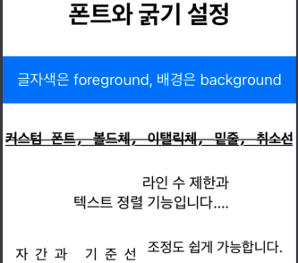

# SwiftUI

- Swift 언어 기반의 UI 프레임워크

<br />

### SwiftUI의 4가지 원칙

- 선언형

   - 명령형 : 어떻게 동작해야 하는지에 초점, 프로그램의 상태를 변화시키는 구문들에 초점

   - 선언형 : 무엇을 하는지에 초점, 어떻게 흘러가는지에 대한 묘사 없이 오직 프로그램의 논리에 초점

- 자동화

   - 가능한 많은 기능이 자동으로 수행될 수 있게 제공

   - 매번 직접 작성해 주어야 했던 많은 상용구를 생략할 수 있다

- 조합

   - 뷰의 조합과 분리를 간단히 할 수 있게 제공

   - 큰 뷰를 하나의 기능을 가진 작은 뷰들로 잘게 나누거나 각각의 뷰를 조합해 원하는 뷰를 쉽게 만들 수 있게 지원

- 일관성

   - UI는 항상 데이터와 동기화되어 일관성 있게 보여야 한다는 점

   - 뷰의 특정 상태를 저장할 State나 모델 객체의 변화를 관찰할 ObsevableObject 같은 원천 자료(Source Of Truth)의 변화를 반영해 뷰에 반영

<br />

#### SwiftUI vs Storyboard

- ContentView.swift

   - swiftUI는 뷰 프로토콜을 준수하는 구조체를 사용해 body 프로퍼티에 UI를 구성하는 코드를 작성한다 따라서 ContentView가 View Controller를 대체

- Main.storyboard 삭제

- Preview Assets.xcassets 추가

   - 개발 과정에서 프리뷰만을 위한 별도의 에셋 파일을 관리하는 기능 제공

   <br />

<br />

#### Content View

- 뷰 프로토콜

   - View 타입은 기존의 UIView와 달리 프로토콜로 선언

   - 필수로 구현해 주어야 하는 것은 읽기 전용인 body 연산 프로퍼티 뿐

   - 기존의 UIView 클래스가 상당히 많은 수의 프로퍼티를 가지는 것과 대조적

      - UIView는 사용 목적과 관계 없이 모든 프로퍼티를 보유해야 한다는 단점

      - 그래서 SwiftUI에서는 각각의 뷰 객체가 자신에게 필요한 속성만 가지고 필요한 뷰를 생성하도록 구현

   - body 프로퍼티의 반환 타입이 또다시 뷰 프로토콜을 준수

      - 무한재귀?

      - 실제 콘텐츠를 표현하는 기본 뷰와 컨테이너 뷰는 재귀호출이 일어나지 않게 Never 타입 사용

         - typealias Body = Never

#### 수식어(Modifier)

- 뷰에서 사용 가능한 메서드

- 추가 동작이나 시각적 변화가 가미된 새로운 뷰를 반환하는 메서드

- 뷰가 다시 또 다른 뷰를 반환하게 하는 메서드

#### Life Cycle

- UIKit App Delegate

   - SceneDelegate.swift 에서 앱의 Life Cycle을 관리

   - UIHostingController : UIViewController를 상속 받고, 뷰 프로토콜을 준수하는 제네릭 매개 변수 Content를 전달 받는 제네릭 클래스

- SwiftUI App

   - SceneDelegate.swift 대신 프로젝트명.swift가 존재

   - SceneDelegate에서 담당했던 Life Cycle을 WindowGroup에 onChange 이벤트를 통해 감지

   - iOS 14 이상에서만 지원

#### AutoLayout

- SwiftUI에서는 더이상 사용하지 않는다

- 프레임워크 내부에선 활용되지만, 개발자가 직접 다뤄야 하는 일이 사라졌다는 의미

- SwiftUI가 제공하는 자동화의 일부에 포함

- 그 대신 박스형 레이아웃 시스템과 선언형 문법을 이용해 UI 요소들을 배치

<br />

| UIKit | SwiftUI |
 | --- | --- |
| UILabel | Text |
| UITextField | TextField |
| UITextField(isSecureTextEntry) | SecureField |
| UIButton | Button |
| UIImageView | Image |
| UISwifth | Toggle |
| UISlider | Slider |
| UIStepper | Stepper |
| UIPickerView | Picker(WheelPickerStyle) |
| UISegmentedControl | Picker(SegmentedPickerStyle) |
| UIDatePicker | DatePicker |
| UITextView | 동일 요소 없음 |
| UIStackView | HStack(가로 방향), ZStack(세로 방향) |
| UIScrollView | ScrollView |
| UITableView(Plain) | List |
| UITableView(Grouped) | List(GroupedListStyle) |
| UICollectionView | 동일 요소 없음 |

| UIKit | SwiftUI |
 | --- | --- |
| UIViewController | View |
| UINavigationController | NavigationView |
| UITabBarController | TabView |
| UISplitViewController | NavigationView |
| UITableViewController | List |
| UICollectionViewController | 동일 요소 없음 |
| UIAlertController(actionSheet) | ActionSheet |
| UIAlertController(alert) | Alert |

#### 텍스트(Text)

- 화면에 원하는 문자열을 표현하는 뷰

- 텍스트에 적용할 수 있는 수식어

   ```swift
   struct ContentView: View {
       var body: some View {
           VStack(spacing: 30) {
               Text("폰트와 굵기 설정")
                   .font(.title)       // 폰트 설정
                   .fontWeight(.black) // 폰트 굵기
               
               Text("글자색은 foreground, 배경은 background")
                   .foregroundColor(.white)    // 글자색
                   .padding()                  // 택스트 주변 여백 설정
                   .background(Color.blue)     // 텍스트 배경 설정(Color 명시)
               
               Text("커스텀 폰트, 볼드체, 이탤릭체, 밑줄, 취소선")
                   .font(.custom("Menlo", size: 16))
                   .bold()             // 볼드체
                   .italic()           // 이탤릭체
                   .underline()        // 밑줄
                   .strikethrough()    // 취소선
               
               Text("라인 수 제한과 \n 텍스트 정렬 기능입니다. \n 이건 안 보입니다.")
                   .lineLimit(2)                       // 텍스트 최대 2줄 표현
                   .multilineTextAlignment(.trailing)  // 다중행 문자열 정렬 방식 지정
                   .fixedSize()                        // 주어진 공간의 크기가 작아도 텍스트를 생략하지 않고 표현되도록 설정
               
               // 2개 이상의 텍스트를 하나로 묶어서 동시에 적용
               (Text("자간과 기준선").kerning(8)     // 자간
                   + Text(" 조정도 쉽게 가능합니다.").baselineOffset(8)) // 기준선
                   .font(.system(size: 16))
           }
       }
   }
   ```

   

   <br />

#### 이미지(Image)

- UIKit의  UIImageView와 같이 지정된 이미지를 표현하는 뷰

- 이미지는 기본적으로 주어진 공간과 관계 없이 그 고유의 크기를 유지한다.
ex) 100 x 100 크기의 이미지를 200 x 200의 크기로 변경할 때 frame 수식어를 적용해도 이미지의 크기는 변하지 않고 뷰가 차지하는 공간만 달라진다.

- resizable : 이미지의 크기를 변경해야 하는 경우 resizable 수식어를 적용해야 한다.C

   | UIKit | SwiftUI | 설명 |
    | --- | --- | --- |
   | Scale To Fill | 기본값 | 비율과 관계 없이 이미지를 늘려서 주어진 공간을 가득 채움 |
   | Aspect Fit | .scaleToFit() | 이미지 원본의 비율을 그대로 유지한 상태에서, 가능한 최대 크기까지 늘어남, 최대 크기는 주어진 공간의 너비와 높이 중 작은 값을 기준 |
   | Aspect Fill | .scaledToFill() | 이미지 원본의 비율을 그대로 유지한 상태에서 가능한 최대 크기까지 늘어남, 최대 크기는 주어진 공간의 너비와 높이 중 큰 값을 기준, 이미지의 일부가 주어진 공간을 벗어나 더 크게 표현될 수 있음 |

- AspectRatio : 이미지 비율에 대해 세부적인 조정이 필요할 때 사용하는 수식어

   - 콘텐츠 모드가 반영된 상태에서 추가로 이미지의 너비와 높이의 비율 조정

- ClipShape : 이미지를 원하는 모양으로 만들 때 사용하는 수식어

- RenderingMode 

   - template : 이미지의 불투명 영역이 가진 본래의 색을 무시하고 원하는 색으로 변경해 템플릿 이미지로 활용

   - original : 항상 이미지 본래의 색을 유지

- ImageScale : 이미지의 크기 설정, small, medium, large

- Font : 이미지 스케일 이외에도 폰트를 이용해 크기 변경 가능

- Weight : 이미지에는 굵기를 바로 조정할 수 있는 수식어가 없어, 굵기를 변경하려면 font 수식어를 이용해서 변경

<br />

#### 뷰 레이아웃

- 스택

   - SwiftUI 내부에서 뷰를 배치하는 데 사용하는 컨테이너 뷰

   - 뷰 프로토콜을 준수하는 Content를 제네릭 매개 변수로 받아 자식 뷰로 표현하는 제네릭 구조체로 선언되어 있으며, 그 자신도 뷰 프로토콜을 채택

   - 스택을 사용하면 콘텐츠로 전달받은 자식 뷰들을 특정 방식으로 표현하는 하나의 새로운 뷰가 만들어짐 

   - Horizontal Stack(HStack) : 가로 방향으로 뷰 배열

   - Vertical Stack(VStack) : 세로 방향으로 뷰 배열

   - Depth Stack(ZStack) : 뷰 계층을 겹겹이 쌓아 올리는 형태로 배열

   - 생성자

      - alignment : 뷰의 정렬, 기본값 .center

      - spacing : 자식 뷰 간에 간격, 기본값 nil, nil 인 경우 뷰에 따라 다른 기본값 적용

      - content : 실제 콘텐츠

- Spacer 

   - 뷰 사이의 간격을 설정하거나 뷰의 크기를 확장할 용도로 사용되는 레이아웃을 위한 뷰

   - Spacer는 스택 외부에서 사용될 때와 스택 내부에서 사용될 때 그 특성이 각각 달라지게 된다.

   - 스택 외부에서 단독 사용될 경우 부모 뷰가 제공하는 공간 내에서 가능한 최대 크기로 확장하며, 시각적 요소를 적용할 수 있는 하나의 뷰로 사용

   - ZStack의 경우도 그 특성상 각각 개별적인 뷰가 게층 구조를 이루고 있는 것으로 취급되므로 스택 외부에서 사용된 Spacer와 동일하게 취급

   - HStack, VStack의 경우 시각적 요소가 제외되고 공간을 차지하기 위한 역할로만 기능, 콘텐츠 없이 단독 사용되는 경우 아예 뷰가 없는 것으로 취급

   - frame : 길이 제한 수식어

   - minLength : 최소 간격 지정

- Overlay

   - 뷰 원본의 공간을 기준으로 그 위에 새로운 뷰를 중첩하여 쌓는 기능을 하는 수식어

   - UIKit의 addSubview 메서드를 사용하는 개념과 유사

- Background

   - overlay와 마찬가지로 뷰 원본의 공간을 기준으로 뷰를 중첩하는 것은 같지만, 위가 아니라 아래 방향으로 쌓아 나간다.

   <br />

#### 불투명 타입

- 특정 실체 타입을 반환하는 대신, 타입 정보를 숨기고 프로토콜에 대한 정보만 남긴 채 API를 사용할 수 있도록 도와주는 타입

- 컴파일러만 정확한 타입 정보에 접근하고 모듈의 클라이언트는 불투명한 타입을 이용하도록 강제하는 역할

- 프레임워크나 라이브러리 제공자 측에서 구현에 사용하는 구체적인 타입들을 명시하는 대신, API를 추상화하고 모듈 간 결합성을 낮추는 데 도움

- 제네릭을 반대로 적용하는 것과 같은 개념이기 때문에 리버스 제네릭이라고도 함

   - 제네릭 : 코드를 호출하는 측(caller)에서 호출되는 측(callee)의 타입을 결정

      ```swift
      func genericFunction<T: Animal>(_ animal: T) { ... }
      genericFunction(Dog())
      genericFunction(Cat())
      ```

   - 불투명 타입 : 호출된 코드가 호출한 코드의 타입을 결정

      ```swift
      // 호출된 쪽에서 타입 결정
      func opaqueTypeFunction() -> some Animal { Dog() }
      // 호출한 측은 추상화된 타입을 전달
      let animal: some Anmial = opaqueTypeFunction()
      ```

      <br />

#### 버튼(Button)

- 유저가 탭을 하는 것처럼 지정 이벤트가 발생했을 때 특정 작업을 수행하게 하는 가장 기본적인 컨트롤

   - 뷰 : 화면에 콘텐츠를 표현하는 것에만 초점을 맞춘 것

   - 컨트롤 : 유저와의 상호작용을 할 수 있도록 추가적인 행동이 정의된 뷰

- UIButton 같은 역할

| 구분 | 설명 |
 | --- | --- |
| DefaultButtonStyle | buttonStyle 수식어 생략 시 기본 적용값, 모든 OS에서 공통으로 사용할 수 있는 버튼 스타일, 버튼이 사용된 환경에 따라 시스템이 알아서 적절한 버튼 스타일 반영 |
| BorderlessButtonStyle | iOS에서 대부분의 경우 기본 반영되는 스타일, 콘텐츠에 미리 지정된 시각적 효과가 적용되며 그 명칭이 의미하는 것처럼 테두리를 그리지 않는다. iOS에서 제공되는 버튼 스타일 중 테두리를 그리는 것은 없지만, macOS에선 BorderedButtonStyle이 함께 제공되므로 대조되는 의미에서 이 이름 사용, watchOS에선 사용할 수 없다. |
| PlainButtonStyle | 모든 OS에서 공통으로 사용할 수 있는 버튼 스타일, 유휴 상태(IDLE)에서는 버튼의 콘텐츠에 어떤 시각적 요소도 적용하지 않는다. |

<br />

#### onTapGesture

- onTapGesture를 사용해 버튼을 사용하지 않고도 같은 기능을 하게 구현 가능

<br />

<br />

### 내비게이션 뷰(NavigationView)

#### 내비게이션 뷰

- 내비게이션 스택을 이용해 콘텐츠 뷰들을 관리하는 컨테이너 뷰

- 스타일에 따라 UINavigationController 또는 UISplitViewController의 역할 수행

- 내비게이션 뷰는 콘텐츠 뷰를 스택처럼 감싸 주기만 하면 된다.

   ```swift
   NavigationView {
   	Image("SwiftUI")
   }
   ```

#### 내비게이션 바 타이틀(NavigationBarTitle)

- 내비게이션 제목을 표현할 수 있는 수식어

- 내비게이션 뷰를 수식하는 것이 아닌 그 내부에서 사용해야 한다.

   ```swift
   // 잘못된 방법
   NavgationView { ... }.navigationBarTitle("내비게이션 바 타이틀")
   
   //옳은 방법
   NavgationView { 
   	...
   		.navigationBarTitle("내비게이션 바 타이틀")
   }
   ```

   <br />

#### 내비게이션 바 아이템(NavigationBarItems)

- UIBarButtonItem의 역할을 수행하는 것으로, 각 아이템을 버튼으로 정의하여 navigationBarItems 수식어에 전달

- leading이나 trailing 위치에 둘 이상의 아이템을 넣어야 한다면, HStack을 이용해서 버튼 정의

#### 내비게이션 링크(NavigationLink)

- 지정한 목적지로 이동할 수 있도록 만들어진 버튼

- 뷰를 눌렀을 때 또는 미리 지정된 특정 조건을 만족했을 때 화면 전환

- UINavigationController의 pushViewController 메서드 기능을 수행하는 것과 동일

#### Hidden 수식어

- 필요에 따라 내비게이션 바 또는 뒤로 가기 버튼을 숨길 수 있다.

<br />

| 구분 | 설명 |
 | --- | --- |
| DefaultNavigationViewStyle | 내비게이션 뷰 기본 스타일, 내비게이션 뷰가 사용된 환경에 따라 자동으로 스타일 결정, watchOS 제외 모든 플랫폼 사용 가능 |
| StackNavigationViewStyle | 내비게이션 계층 구조를 하나의 뷰만으로 탐색해 나가는 스타일, UINavigationController가 사용, iOS와 tvOS만 사용 가능 |
| DoubleColumnNavigationViewStyle | Master와 Detail로 구분되는 2개의 칼럼(뷰)를 이용해 콘텐츠를 표현하는 스타일, watchOS 제외 모든 플랫폼 사용 가능, 내부적으로 SplitViewController 사용, 이 스타일을 사용할 수 없는 기기는 StackNavigationViewStyle로 전환 |
|     |     |

<br />

### 리스트(List)

- 하나의 열에 여러 개의 행으로 표현되는 UI를 구성해 다중 데이터를 쉽게 나열할 수 있도록 구성된 뷰

- 정적 콘텐츠 : 리스트의 생성자에 원하는 뷰를 전달하면 하나씩 각 로우에 담아 표현

- 동적 콘텐츠

   - Range<Int> : 범위만큼 로우 생성

   - RandomAccessCollection : RandomAccesCollection 프로토콜을 준수하는 데이터 제공

      - 데이터의 각 요소들을 구분하고 식별할 수 있도록 반드시 2가지 방법 중 하나를 택해 id 값을 제공

         - id 식별자 지정 : id로 사용할 값을 직접 인수로 제공, Hashable 프로토콜을 준수하는 프로퍼티 지정 가능, 그 데이터 타입 자체가 Hashable을 준수한다면 간단히 self로 입력 가능

         - identifiable 프로토콜 채택: 매개 변수에 id를 전달하는 대신 데이터 타입 자체에 identifiable 프로토콜 채택, 타입 자체에 id 프로퍼티를 만들고 이것을 식별자로 삼는다.

         <br />

#### 섹션(Section)

- 리스트는 섹션을 이용해 데이터를 쉽게 그룹화하는 것도 가능

   | 구분 | 설명 |
    | --- | --- |
   | DefaultListStyle | 리스트 기본 스타일. 사용 환경에 따라 적절한 스타일 결정 |
   | PlainListStyle | 데이터 목록을 각 행마다 하나씩 나열하는 형태의 기본 스타일, 모든 플랫폼 사용 가능 |
   | GroupedListStyle | 각 섹션을 분리된 그룹으로 묶어 표현하는 스타일. 사용 환경에 따라 grouped 또는 insetGrouped 스타일 중 하나가 자동으로 선택. iOS와 tvOS에서만 사용 가능 |
   |     |     |

   <br />

### 지오메트리 리더(GeometryReader)

- 자식 뷰에 부모 뷰와 기기에 대한 크기 및 좌표계 정보를 전달하는 기능을 수행하는 컨테이너 뷰

- 지오메트리 리더에 자식 뷰가 하나만 있을 때는 중앙에 정렬되지만, 두 개 이상 사용되면 좌상단을 기준으로 배치

- 크기를 지정하지 않으면, 주어진 공간 내에서 최대 크기를 가진다.

#### 지오메트리 프록시(GeometryProxy)

- 지오메트리 리더의 레이아웃 정보를 자식 뷰에 제공

   | 구분 | 설명 |
    | --- | --- |
   | size | 지오메트리 리더의 크기를 반환 |
   | safeAreaInsets | 지오메트리 리더가 사용된 환경에서의 안전 영역에 대한 크기 반환 |
   | frame(in:) | 특정 좌표계를 중심으로 한 프레임 정보 제공 |
   | subscript(anchor:) | 자식 뷰에서 anchorPreference 수식어를 이용해 제공한 좌표나 프레임을 지오메트리 리더의 좌표계를 기준으로 다시 변환하여 사용하는 첨자 이때 Anchor의 제네릭 매개 변수는 CGRect 또는 CGPoint 타입 두 가지 사용 가능 |

- frame

   - 지오메트리 프록시는 프레임에 대한 정보도 제공

   - 단순 자신의 CGRect 값을 전달하는 것이 아닌 CoordinateSpace라는 열거형 타입이 가진 세 가지 값 중 하나를 지정하면 그 좌표 공간에 대한 정보 반환

      ```swift
      enum CoordinateSpace {
      	case global
      	case local
      	case named(AnyHashable)
      }
      ```

      | 구분 | 설명 |
       | --- | --- |
      | global | 화면 전체 영역(윈도우의 bounds)을 기준으로 한 좌표 정보 |
      | local | 지오메트리 리더의 bounds를 기준으로 한 좌표 정보 |
      | named | 명시적으로 이름을 할당한 공간을 기준으로 한 좌표 정보 |

      <br />

   #### 프레임 수식어

   - UIKit에서 뷰에 프레임을 설정했던 것과는 사뭇 다르다

   - SwiftUI에서의 프레임은 예전 방식과 같이 제약 조건을 설정하는 것이 아니라, 액자처럼 콘텐츠를 담고 있는 하나의 뷰라는 점을 인식해야 한다.

   - SwiftUI에서 프레임은 자식 뷰가 사용 가능한 크기를 제안하기 위해 사용

   - 동시에 뷰의 정렬 위치를 결정하는 역할도 함

   - 다만, 제안된 공간 내에서 실제로 자식 뷰가 어느 정도 크기를 가지고 어떻게 보일 지는, 그 뷰가 직접 결정

   #### 뷰 레이아웃 과정

   - 부모 뷰가 활용 가능한 크기를 자식 뷰에 제안

   - 자식 뷰는 그 자신의 크기를 결정

   - 부모 뷰는 자신의 좌표 공간에서 자식 뷰를 적절히 배치

   #### 고정 크기 vs 크기 제약 조건

   - 고정 크기 : width, height 중 하나 또는 둘 다 값을 입력해 항상 고정된 크기를 가지게 할 때 사용

   - 크기 제약 조건 : 고정된 값을 입력하는 대신 최소나 최대 또는 이상적인 값에 대한 제약 조건을 입력하는 방법

   #### Layout Priority

   - 레이아웃의 우선순위가 높을 경우 부모 레이아웃이 자식에 공간을 할당함에 있어 형제 뷰 그룹 내에서 우선권을 가진다. 

   - 이 경우 부모 뷰의 공간이 늘어날 때 다른 형제 뷰보다 더 빨리 늘어나고, 줄어들 때는 더 늦게 줄어든다.

   <br />

   #### @ViewBuilder

   - 뷰 빌더는 함수로 정의된 매개 변수에 뷰를 전달 받아 하나 이상의 자식 뷰를 만들어 내는 기능 수행

   - 뷰의 생성자에서 content 매개 변수에 @ViewBuilder 속성을 적용하고, body에서 content를 전달해 주기만 하면 된다.

   - 뷰 빌더는 buildBlock이라는 타입 메서드에 값을 전달하고, 2개 이상의 뷰일 때는 TupleView라는 타입을 반환한다.

   - 이 때 buildBlock 매개 변수의 최대 개수는 10개이므로 ViewBuilder 속성 매개 변수 최대 개수는 10개이다.

   - 더 많은 뷰를 추가하고 싶을 때는 컨테이너 뷰를 활용

   <br />

   <br />

   ### 프리뷰(Preview)

   #### 프리뷰 동작 과정

   - 현재 소스 에디터에 PreviewProvider 프로토콜을 준수하는 타입이 존재하는지 확인

   - PreviewProvider 프로토콜의 필수 구현 사항인 previews 타입 프로퍼티에 뷰 생성

   - 액티브 스킴의 목적지로 선택한 시뮬레이터 또는 맥에 연결한 기기의 형태로 프리뷰 컨테이너 렌더링.

   - 리뷰 컨테이너를 직접 지정해줄 경우 해당 기기 형태로 렌더링

   #### 프리뷰 기기 지정

   - previewDevice(_:) 수식어를 적용해 현재 시뮬레이터로 선택된 기기와 별개로 직접 프리뷰를 위한 기기 지정 가능

   - previewDisplayName 수식어를 통해 프리뷰 컨테이너의 이름 지정 가능

   #### 레이아웃 변경

   - previewLayout 수식어를 이용해 프리뷰 컨테이너의 크기 변경 가능

   - 이 수식어는 PreviewLayout 열거형 타입의 값을 전달 받음

      | 구분 | 설명 |
       | --- | --- |
      | device | 기본값, 컨테이너가 기기 본래의 크기와 형태로 나타남 |
      | sizeThatFits | 컨테이너를 프리뷰 크기에 맞춰서 유동적으로 조절 |
      | fixed(width:height:) | 지정한 너비와 높이에 맞춰서 컨테이너 크기 고정 |

   #### EnvironmentValues

   - 뷰를 구성하는 데 필요한 각종 환경설정과 관련된 정보를 EnvironmentValues 타입이 관리

   - colorScheme, timeZone, locale, calender, layoutDirection, sizeCategory, undoManager 등 기존에는 UITraitCollectiond을 비롯해 다양흔 클래스에서 나뉘어 사용되고 관리되던 속성들을 이제 EnvironmentValues 하나에 모두 담아서 쉽게 접근 및 관리 가능

   - EnvironmentValues는 프레임워크에 의해 별도로 관리되며, 어떤 뷰에서든 접근 가능하다. 

   - 이 때 얻게 되는 값은 상위 계층의 뷰가 가진 환경 요소를 그대로 상속받는다.

   - 단, 하위 계층에 있는 뷰에서 개별적으로 다른 환경을 구성했다면 그 뷰에 속한 자식 뷰들은 변경된 값을 우선 적용한다.

   - environment 수식어를 통해 환경 구성 가능

   <br />

   #### @Environment

   - @Environment 프로퍼티 래퍼는 읽기 전용으로 특정 뷰에서 EnvironmentValues의 특정 요소를 읽어와 뷰 구성에 반영해야 할 때 사용

   #### Custom Environment

   - 필요에 따라 앱에 환경 변수를 직접 추가하고 활용할 수 있음

   - EnvironmentKey 프로토콜을 채택한 타입을 만들고, defaultValue 타입 프로퍼티를 정의해야 한다.

   - 정의된 EnvironmentKey는 EnvironmentValues 타입에 있는 첨자를 이용해 다룰 수 있다.

      ```swift
      subscript<K>(key: K.Type) -> K.Value where K: EnvironmentKey
      ```

   - 따라서 EnvironmentValues 타입에 우리가 실제로 사용할 이름의 연산 프로퍼티를 추가한 뒤 이 첨자를 이용해 getter, setter를 정의한다.

      ```swift
      extension EnvironmentValues {
      	var myEnvironment: Int {
      		get { self[MyEnvironmentKey.self] }
      		set { self[MyEnvironmentKey.self] = newValue }		
      	}
      }
      ```

      <br />

### 데이터 흐름

#### 데이터 흐름의 2가지 원칙

- 데이터 의존성

   - 뷰는 매번 데이터가 변경될 때마다 그 값을 반영해야 하므로, 데이터에 대한 의존성을 가진다.

   - SwiftUI에서는 뷰가 어떤 데이터에 대해 의존성이 있는지만 알려주면 나머지는 프레임워크에서 알아서 처리하도록 설계(일일이 변경 사항을 뷰에 반영하려고 추가 코드를 수작업으로 작성할 필요 없음)

   - 사용자가 앱과 상호 작용하여 일부 상태를 변형시키는 동작을 발생하면, 프레임워크에 의해 이 동작이 수행되고 시스템은 변경된 상태를 감지해 해당 상태에 의존하고 있는 뷰를 갱신해 새로운 버전의 UI 생성

- 단일 원천 자료(Single Source of Truth)

   - SwiftUI는 데이터를 크게 원천 자료와 파생자료로 구분

      - 원천 자료 : 그 자체가 본질적인 데이터

      - 파생 자료 : 원천 자료로부터 부차적으로 파생된 것

   - 뷰가 참조하는 데이터는 단일 원천 자료여야 한다.

   - 즉, 동일한 데이터 요소가 여러 곳으로 나뉘어 중복되지 않고 한 곳에서 다뤄지고 수정되어야 한다는 것을 의미

   <br />

#### @State

- 뷰 자체에서 가져야 할 상태 프로피티이자 원천 자료

- 어떤 데이터에 대한 영속적인 상태를 저장하고 관찰하는 역할 수행

#### @Binding

- 상위 뷰가 가진 상태를 하위 뷰에서 사용하고 수정할 수 있게 해주는 파생 자료

- 연산 프로퍼티의 형태로 사용되어 그 자신이 직접 값을 보유하는 대신, 값을 읽고 수정하여 다른 뷰에 갱신된 데이터를 전달하는 역할

```swift
struct ContentView: View {
    @State private var isFavorite = true
    @State private var count = 0
    
    var body: some View {
        VStack(spacing: 30) {
            Toggle(isOn: $isFavorite) {
                Text("isFavorite: \(isFavorite.description)")
            }
            
            Stepper(value: $count) {
                Text("Count: \(count)")
            }
        }
        .frame(width: 300)
    }
}
```

- 두 프로퍼티에 모두 @State 프로퍼티 래퍼가 적용되었다. 이것은 토글과 스테퍼의 상태를 저장하기 위한 용도이며, true와 0은 초깃값으로 사용된다.

- @State는 뷰 자신의 UI 상태를 저장하기 위한 데이터로 설계되었으므로, 해당 뷰가 소유하고 관리한다는 개념을 명시적으로 나타내기 위해 항상 private 접근 레벨을 사용하는 것이 좋다.

- $ 접두어와 함께 프로퍼티를 사용하면, 내부적으로 projectedValue라는 프로퍼티를 이용하게 되는데 이 타입이 Binding 타입이기에 Binding 타입의 매개 변수에 상태 프로퍼티의 값을 전달해줄 수 있는 것이다.

- 토글에 Binding 타입을 사용하는 이유는 토글은 Content View가 가진 상태를 표현하거나 변경하는 역할만 하면 되기 때문이다. 그 자신이 어떤 값을 보유하고 수정한다면 상위 뷰의 값과 불일치 문제가 발생할 수 있다.

- 같은 뷰 내에서 값을 읽거나 쓰는 경우 접두어 없이 일반 변수처럼 사용할 수 있다.

<br />

#### ObservableObject

- 뷰 외부의 모델이 가진 원천 자료를 다루기 위한 도구, 참조 타입을 사용하는 경우에 사용

- @ObservedObject : ObservableObject 프로토콜을 준수하는 모델에 해 뷰가 의존성을 가진다는 것을 알리기 위해 사용하는 속성

#### @Published

- 변수의 값이 추가, 삭제, 변경되었다는 것을 뷰가 알 수 있게 해준다.

- Obsevableobject를 준수한 클래스는 objectWillChange라는 프로퍼티를 사용할 수 있는데 objectWillChange.send()를 이용하기 위함이다(변경된 사항이 있는 것을 알려주는 함수)

- @published는 해당 변수가 변경되면 자동으로 objectWillChange.send()를 호출해준다.

#### @EnvironmentObject

- @ObservedObject가 모델에 대한 직접적인 의존성을 만드는 데 사용했다면, @EnvironmentObject는 간접적인 의존성을 만드는 데 사용하는 래퍼 타입이다.

- 바인딩 가능한 객체가 변경될 때마다 현재 view를 invalidate 하기 위해 상위 view에서 제공한 Binding 가능한 객체를 사용하는 dynamic view property

   - 즉 모든 뷰가 읽을 수 있는 shared data

- 반드시 environmentObject(_:) 메소드를 호출하여 상위 뷰에서 모델 객체를 설정해야 함

<br />

### Alert, ActionSheet

- 각각 알림창 및 액션 시트를 화면에 출력하는 컨테이너 객체

- 내부적으로는 UIKit의 UIAlertController를 그대로 활용

#### Alert

| 구분 | 설명 |
 | --- | --- |
| default | 기본 스타일이 반영된 일반적인 용도의 버튼 |
| cancel | 수행하려던 작업을 취소하고, 창을 닫는다. Alert에서는 항상 화면에서 leading 방향에 위치하며 ActionSheet에서는 화면 하단에 고정, 최대 1개만 사용 가능하고 2개 이상 정의하면 런타임 에러 |
| destructive | 데이터를 삭제하는 것과 같이 주의가 필요한 버튼에 사용, 빨간색으로 강조 |
|     |     |

- UIAlertController vs Alert

   - UIAlertController는 버튼을 여러 개 추가할 수 있었으나 Alert는 최대 2개 버튼 구성 가능

   - UIAlertController의 경우 UIAlertAction을 추가하지 않으면 알림창을 닫을 수 없었지만 Alert는 OK 버튼을 자동으로 생성

#### ActionSheet

- Alert와 달리 버튼을 배열 형태로 전달받는다

- 버튼을 생략하면 기본 스타일로 cancel이 사용

- ActionSheet은 아이폰이나 애플 워치 같은 작은 화면을 가진 기기에서만 사용 가능

### 프레젠테이션 스타일

- SwiftUI는 현재 pageSheet 스타일을 사용하는 Sheet와 popover 스타일을 사용하는 Popover 두 가지만 제공

#### Sheet

- pageSheet 스타일로 새로운 뷰를 출력

- isPresented/item은 출력 조건을 전달

- content 매개 변수는 출력될 뷰를 정의

- onDismiss 매개 변수는 화면이 닫히기 직전에 수행할 작업 정의

#### Popover

- 콘텐츠와 관련된 추가적인 정보를 제공하거나 설정을 변경하도록 현재 화면 위로 일시적인 뷰를 표시하는 것

- 아이패드와 같이 상대적으로 큰 화면을 사용하는 기기를 위해 만들어진 스타일

- HIG에서도 가급적이면 아이폰에서 사용하지 말 것을 권장

- attachmentAnchor : Popover의 앵커로 사용할 영역 또는 위치 결정

<br />

<br />

#### ViewModifier

- ViewModifier를 통해 커스텀 수식어를 만들 수 있다.

- 이 프로토콜은 뷰 프로토콜처럼 body를 구현해야 하지만, 프로퍼티가 아닌 함수 형태로 구현한다.

- 수식어로 사용할 타입을 만들어 ViewModifier 프로토콜을 채택하고, body 메서드 내에서 필요한 동작이나 효괄르 추가한다.

   ```swift
   struct CustomViewModifier: ViewModifier {
   	var borderColor: Color = .red
   	
   	func body(content: Content) -> some View {
   		content
   		 .font(.title)
   		 .foregroundColor(Color.white)
   		 .padding()
   		 .background(Rectangle().fill(Color.gray))
   		 .border(borderColor, width: 2)
   	}
   }
   ```

- 위처럼 작성한 커스텀 수식어를 다음 2가지 방법 중 하나를 택해 적용할 수 있다.

   ```swift
   // #1
   Text("Custom ViewModifier")
   	.modifier(CustomModifier(borderColor: .blue))
   
   // #2
   ModifiedContent(content: Text("Custom ViewModifier"),
   								modifier: CustomViewModifier(borderColor: .blue))
   ```

- concat : 서로 다른 역할을 하는 ViewModifier를 결합하게 해주는 것

   ```swift
   struct MyModifier1: ViewModifier {
   	func body(content: Content) -> some View {
   		content.font(.title)
   	}
   }
   
   struct MyModifier2: ViewModifier {
   	func body(content: Content) -> some View {
   		content.foregroundColor(.blue)	
   	}
   }
   
   Text("My ViewModifier")
   	.modifier(MyModifier1().concat(MyModifier2()))
   ```

- Extension을 활용한 ViewModifier 적용 (뷰 프로토콜 확장)

   ```swift
   extension View {
   	func customModifier(borderColor: Color = .red) -> some View {
   		self.modifier(CustomViewModifier(borderColor: borderColor)
   	}
   }
   ```

   <br />

### 커스텀 스타일

- 현재 대부분은 프레임워크에서 제공하는 스타일만 활용 가능하지만 버튼과 토글은 커스텀 스타일을 만들 수 있다.

#### 버튼

- 버튼 스타일은 ButtonStyle과 PrimitiveButtonStyle 두 가지 프로토콜로 제공된다.

- 두 프로토콜은 공통으로 makeBody 메서드 하나만 구현해주면 되는데, configuration 매개 변수를 통해 프레임워크에서 제공해 주는 정보를 바탕으로 뷰를 재구성 해주면 된다.

- ButtonStyle 프로토콜

   - 버튼이 눌리고 있을 때와 아닐 때를 구분하여 버튼 외형을 정의하는 프로토콜

   - 버튼 눌림 상태를 판단하기 위한 isPressed 프로퍼티 제공 

- PrimitiveButtonStyle 프로토콜

   - 버튼의 액션 수행 조건이나 그 시점 등 좀 더 세세한 컨트롤을 요구할 때 이용

   - Configuration 타입에 isPressed 대신 trigeer라는 메서드가 주어져 버튼 이벹느 발생 시점을 직접 결정할 수 있다.

#### 토글

- 토글 또한 버튼을 구현하는 방식과 다르지 않다.

- ToggleStyle 프로토콜을 채택하고 configuration 매개 변수를 제공하는 makeBody 메소드를 구현하면 된다.

- 여기서 label 프로퍼티는 토글의 사용 용도를 알려주는 뷰에 불과해, 실제로 토글에서 중요한 스위치 기능을 하는 뷰는  Configuration 타입이 제공해 주는 isOn 값을 이용해 직접 만들어야 한다.

   ```swift
   // 상하로 움직이는 토글 예제
   struct CustomToggleStyle: ToggleStyle {
       let size: CGFloat = 30
       
       func makeBody(configuration: Configuration) -> some View {
           let isOn = configuration.isOn
           return HStack {
               configuration.label
               
               Spacer()
               
               ZStack(alignment: isOn ? .top : .bottom) {
                   Capsule()
                       .fill(isOn ? Color.green : Color.red)
                       .frame(width: size, height: size * 2)
                   
                   Circle()
                       .frame(width: size - 2, height: size - 2)
                       .onTapGesture {
                           withAnimation {
                               configuration.isOn.toggle()
                           }
                       }
               }
           }
           
       }
   }
   ```

### UIAppearance

- 클래스의 외형 프록시 객체에 수정 메시지를 전달하여, 그와 관련된 클래스의 모든 인스턴스에 대한 속성을 일괄적으로 변경할 수 있도록 편리한 기능을 제공하는 프로토콜

- 단 한 번의 설정만으로도 전체 인스턴스에 대해 쉽게 원하는 값을 반영해 줄 수 있어 편리하지만, 반대로 모두에 반영되어 주의해야 함

   ```swift
   // ex) NavigationBar
   UINavigationBar.appearance().titleTextAttributes = [
   	.foregroundColor: UIColor.systemTeal,
   	.font: UIFont.italicSystemFont(ofSize: 25)
   ]
   
   // ex) UISwitch
   UISwitch.appearance().onTintColor = .red
   UISwitch.appearance().thumbTintColor = .green
   ```

<br />

### 스크롤 뷰(ScrollView)

- 스크롤을 통해 표현하는 컨테이너 뷰

- 내부적으로 UIKit의 UIScrollView 활용

- 생성자

   ```swift
   init(
       _ axes: Axis.Set = .vertical,
       showsIndicators: Bool = true,
       @ViewBuilder content: () -> Content
   )
   ```

   - _ axes : 스크롤 방향, 기본값 세로축 스크롤

   - showsIndicators : 인디케이터 표현 여부, 기본값 true

   - content : 콘텐츠 정의 매개 변수

- 스크롤 뷰는 Color, Rectangle과 같이 확장성을 가진 뷰의 크기를 idealWidth 또는 idealHeight만큼만 할당한다.

- 즉, 스크롤 뷰는 내부에서 스크롤 방향에 따라 fixedSize 수식어를 적절히 적용하고 있는 것이다.

- ContentOffset

   - UIScrollView에서는 콘텐츠의 위치를 다루기 위해 ContentOffset을 이용했지만 SwiftUI에서는 이 값을 제공하지 않는다.

   - 따라서 자식 뷰에서 부모 뷰에 데이터를 전달할 수 있는 기능인 PreferenceKey를 이용하거나 지오메트리 리더의 글로벌 좌표를 이용해 값을 계산해야 한다.

   <br />

### 탭 뷰(TabView)

- 탭 아이템을 이용해 여러 개의 콘텐츠 뷰를 쉽게 전환할 수 있도록 만들어진 컨테이너 뷰

- 내부에서 UITabBarController 사용

- 탭 아이템은 이미지, 텍스트 또는 이미지 + 텍스트 만 가능

   - 이미지나 텍스트를 2개 이상 넣더라도 첫 번째 이미지와 텍스트만 보여짐

- tabItem 수식어가 특정 뷰에서 사용되더라도 실제 적용은 탭 뷰에 포함된 순서에 따라 결정됨

#### 태그(Tag)

- SelectionValue를 관리하는 생성자를 사용해 탭뷰를 만든 뒤 각 탭 아이템 별로 tag 수식어를 통해 각 탭 아이템과 연관된 값을 지정할 수 있다.

<br />

### 애니메이션(Animation)

- 그것이 발생하는 어떤 계기가 있기 전의 상태, 애니메이션이 동작하는 상태, 동작이 끝난 상태 크게 3가지로 구분해서 생각할 수 있다.

- animation 수식어를 사용해 간단하게 적용 가능

   ```swift
   Image("cat")
   	...
   	.animation(.default)
   ```

- animation 수식어가 적용된 뷰는 애니메이션이 가능한 모든 상태(크기, 위치, 배경색, 투명도 등) 중 하나라도 변하면 뷰를 새로 그리면서 관련된 애니메이션 수행

- 특정 상태의 변화에 대한 조건 설정 : Equatable 타입을 전달 받는 또 다른 animation 수식어를 이용

   ```swift
   .animation(.default, value: reduction)
   ```

- 애니메이션 비활성화 

   - 애니메이션 수식어의 위치에 따라 애니메이션이 적용될 수식어를 결정할 수 있다.

   - 나중에 적용되는 수식어들에 한해서 애니메이션을 적용해야 한다면 적용되기 전 수식어들 이후에 animation 수식어에 nil을 넣어주면 된다.

   - withAnimation : 특정 값이 변하면 관련된 값을 사용하는 모든 뷰에 애니메이션을 동작하도록 하는 함수 

- 암시적 vs 명시적 애니메이션

   - 암시적 애니메이션 : animation 수식어 (그 이전에 적용된 모든 애니메이션 가능한 항목에 대해 애니메이션 적용)

   - 명시적 애니메이션: withAniamation 함수 (애니메이션으로 동작하는 데 영향을 미칠 데이터를 직접 지정)

#### 애니메이션 타이밍

- default

   - 매개 변수 생략 시 기본 적용되는 값

   - easeInOut 유형이 사용되며 지속 시간 0.35초

- linear

   - 처음부터 끝까지 일정한 속도로 애니메이션 진행

   - 반복되는 애니메이션에 많이 사용

- easeIn

   - 처음에는 느리게 시작했다가 점점 빠르게 진행되는 애니메이션

   - 갑작스럽게 끝나는 느낌을 줄 수 있으므로 화면 내에서 움직이는 뷰보다는 화면 밖으로 사라지는 뷰 등에 적합

- easeOut

   - 처음에 빠르게 시작했다가 끝에서 천천히 진행되는 애니메이션

   - 자연스러운 감속효과

- easeInOut

   - easeIn과 easeOut이 결합한 형태

   - 시작과 끝에서 느리게 동작하고 중간 지점에서 빠르게 진행

   - 일반적으로 가장 많이 사용하는 유형

- timingCurve

   - timingCurve 옵션을 사용해 타이밍 직접 조절 가능

#### 스프링 애니메이션

- 스프링 애니메이션을 이용해 목적 지점에서 진동 효과를 주어서 좀 더 동적인 느낌을 줄 수 있음

   ```swift
   .animation(.spring(response: 0.55, dampingFraction: 0.825, blendDuration: 0))
   ```

   - response : 스프링의 강성 및 애니메이션 지속 시간에 대한 근사치, dampingFraction 값에 영향을 받으므로 실제 지속 시간과는 차이가 있다.

   - dampingFraction : 스프링 애니메이션의 진동 수준을 결정 짓는 값, 감쇠비에 해당

      - 1이면 진동하지 않으면서 최단 시간 내에 목적 지점에서 그대로 멈춤

      - 1보다 작으면 진동이 생김, 0에 가까울수록 진동이 커짐, 0이면 진동이 계속 유지되어 애니메이션 영구적으로 지속, 음수 값이면 진동이 오히려 점점 심해지므로 주의

      - 1보다 크면 목적지에 도착하는 시간이 길어지고 진동하지 않음

   - blendDuration : 스프링 애니메이션이 조합될 때 response 값의 변화를 보간(interpolate)하는데 사용

#### 애니메이셔 제어

- 애니메이션을 원하는 방식으로 제어하고 사용할 수 있도록 4가지 인스턴스 메서드 제공

- delay

   ```swift
   func delay(_ delay: Double) -> Animation
   ```

   Double 타입의 값을 매개 변수로 받아 그 값에 해당하는 시간동안 애니메이션 지연시킨 후 수행

- speed

   ```swift
   func speed(_ speed: Double) -> Animation
   ```

   애니메이션을 지정한 배율만큼 곱한 속도로 진행하게 만듬

- repeatCount, repeatForever

   ```swift
   func repeatCount(_ repeatCount: Int, autoreverses: Bool = true) -> Animation
   func repeatForever(autoreverses: Bool = true) -> Animation
   ```

   repeatCount는 애니메이션을 일정 횟수만큼만 반복할 때 사용, repeatForever는 이 반복을 무한정 실행 autoreverses 매개 변수는 true이면 애니메이션이 수행되기 전과 후의 모습을 오가는 모습을 볼 수 있다.

<br />

#### 트랜지션(Transition)

- 뷰 계층 구조에 새로운 뷰가 추가되거나 기존에 있던 것이 제거될 때 적용되는 애니메이션의 한 종류

- 따라서 transition 수식어 단독으로 동작하지 않고 animation 수식어나 withAnimation 함수와 함께 사용

- 뷰 게층 구조에 변화가 생겨야 하므로, 뷰는 동일하고 그 안의 내용이 바뀌는 경우 트랜지션은 적용되지 않음

   | 구분 | 설명 |
    | --- | --- |
   | opacity | 불투명도를 조절해 페이드 인 / 아웃 효과를 줌, 트랜지션을 적용하지 않았을 때 기본값 |
   | scale | 뷰의 배율을 조절하여 전환 효과를 줌, 매개 변수에 값을 지정하여 앵커를 변경한 뒤 적용 기준점을 바꾸거나 최대 배율 지정 가능 |
   | slide | 뷰가 삽입될 때는 좌측에서부터 나타났다가 제거될 때 우측으로 움직여 미끄러지듯이 사라지는 효과 |
   | move | 상하좌우 중 한 가지 방향을 지정해, 그 방향에서 뷰가 나타났다가 다시 사라지게 함, slide와 유사하지만, slide는 나타날 때와 사라질 때 위치가 반대지만 move는 동일 |
   | offset | x, y 좌표 또는 CGSize 값을 전달해 특정 좌표로부터 나타나거나 그 위치로 움직이면서 사라지는 뷰 표현 가능 |

#### 트랜지션 합성

- combined

   ```swift
   func combined(with: AnyTransition) -> AnyTransition
   ```

   서로 다른 전환 효과들을 하나의 효과로 합성하기 위한 메서드

- asymmetric 

   ```swift
   static func asymmetric(insertion: AnyTransition, removal: AnyTransition) -> AnyTransition
   ```

   뷰가 삽입되고 제거될 때 서로 다르게 효과를 줄 때 사용하는 메서드

- modifier

   ```swift
   static func modifier<E>(active: E, identity: e) -> AnyTransition where E: ViewModifier
   ```

   뷰가 제거되기 직전의 상태(active), 뷰가 삽입되어 보이게 될 상태(identity)를 정의하여 애니메이션의 시작과 끝에서 두 매개 변수 값의 차이만큼 전환 효과 발생

   <br />

### 커스텀 뷰 애니메이션

#### Shape 프로토콜

- Shape 프로토콜을 채택하면 body를 대신해 Path 타입을 반환하는 path(in:) 메서드를 구현해야 한다. 여기서 Path 타입으로 반환된 내용이 뷰로 사용된다.

- Path는 기본적으로 주어진 경로의 내부를 가득 채우는 형태로 표현하지만 strokedPath 수식어를 사용하면 lineWidth 값만큼 테두리를 따라 그리게 된다.

#### Animatable 프로토콜

- SwiftUI에서 애니메이션이 가능하게 해주는 프로토콜

- 이 프로토콜을 채택하면 animatableData 프로퍼티를 구현해 주어야 하는데, 이 프로퍼티의 값이 애니메이션의 다음 동작을 연산하는 데 사용된다. 그리고 이 값들이 연속적으로 이어지면서 화면에 그려지면 애니메이션이 되는 것이다.

<br />

### 제스처(Gesture)

- SwiftUI에서는 Gesture 프로토콜을 채택한 여러 제스처 제공

- 자주 사용하는 제스처들에 대해서는 이미 뷰 프로토콜에 별도의 수식어로 구현되어 있다.

- 이외에 다른 제스처를 사용하거나 제스처를 조합하여 사용할 때는 gesture 수식어를 사용한다.

   ```swift
   func gesture<T>(_ gesture: T, including mask: GestureMask = .all) -> some View Where T : Gesture
   ```

| UIKit | SwiftUI |
 | --- | --- |
| UITapGestureRecognizer | TapGesture |
| UILongPressGestureRecognizer | LongPressGesture |
| UIPanGestureRecognizer | DragGesture |
| UIPinchGestureRecognizer | MagnificationGesture |
| UIRotationGestureRecognizer | RotationGesture |
| UISwipeGestureRecognizer | 없음 |
| UIScreenEdgePanGestureRecognizer | 없음 |

#### TapGesture

- 정해진 횟수만큼 탭 했을 때 지정한 동작을 수행하는 제스처

- UITapGestureRecognizer는 손가락 몇 개로 터치했는 지도 알 수 있었으나 TapGesture는 아직 탭 횟수만 제어 가능

- onTapGesture 수식어를 이용하거나, TapGesture의 인스턴스를 생성하여 gesture 수식어에 전달해 사용

   ```swift
   // onTapGesture
   Circle().onTapGesture { print("Tapped") }
   Circle().onTapGesture(count: 2) { print("Tapped") } // 탭을 2회 연속 해야 인식
   
   // TapGesture
   let tapGesture = TapGesture(count: 2)
   							.onEnded { print("Tapped") } // 제스처를 인식했을 때 수행할 액션 지정
   return Circle().gesture(tapGesture)
   ```

#### LongPressGesture

- 일정 시간 이상(기본값 0.5초) 화면을 누르고 있을 때 지정한 동작을 수행하는 제스처

- TapGesture와 마찬가지로 onLongPressGesture 수식어를 추가하거나 직접 인스턴스를 생성해 적용

- UILongPressGestureRecognizer는 연속형에 속해 터치한 채로 움직였을 때 이벤트가 반복적으로 발생했지만 SwiftUI에서는 단일 이벤트로 인식되는 불연속형으로 동작

   ```swift
   // onLongPressGesture
   Circle().onLongPressGesture { print("LongPressed") }
   Circle().onLongPressGesture(minimumDuration: 0.5, // 인식에 필요한 시간 지정
   														// 처음 누른 위치에서 지정 거리 이상 떨어지면 인식 실패로 간주
                               maximumDistance: 10, 
   														// 뷰를 눌렀을 때 그리고 인식 성공 / 실패 시 호출
                               pressing: { pressing in print(pressing) },
   														// 길게 누른것으로 인식됐을 때 수행할 동작
                               perform: { print("Recognized") })
   
   // LongPressGesture
   let longPressGesture = LongPressGesture()
   		.onChanged({ pressing in print(pressing) }) // 뷰를 눌렀을 때 호출
   		.onEnded({ _ in print("Long Pressed!") }) // 길게 누른 것으로 인식됐을 때 호출
   return Circle().gesture(longPressGesture)
   ```

#### DragGesture

- 화면 터치 후 손을 뗄 떼까지 그 움직임에 따라 인식된 정보를 전달하는 제스처

- 내부에 Value라는 이름의 구조체로 time, location, startLocation, translation 등의 프로퍼티가 정의되어 있어 어떤 정보를 제공하는지 확인할 수 있다.

- DragGesture의 생성자는 minimumDistance와 coordinateSpace를 지정할 수가 있어, 일정 거리 이상을 드래그해야만 인식하도록 하거나 특정 좌표계를 기준으로 설정할 수 있다.

   ```swift
   init(minimumDistance: CGFloat = 10, coordinateSpace: CoordinateSpace = .local)
   ```

   ```swift
   // 드래그한 위치를 따라 뷰가 움직이는 예제
   // GestureState - 제스처를 사용 중일 때 변화하는 제스처의 현재 상태를 임시 저장하는 용도
   @GestureState private var translation: CGSize = .zero
   
   let dragGesture = DragGesture()
   		.updating($translation) { (value, state, _) in
   			state = value.translation // translation의 프로퍼티에 지금까지 움직인 위치 저장
   		}
   
   return Circle()
   	.offset(translation)  // 제스처로 이동한 거리만큼 뷰 이동
   	.gesture(dragG 
   ```

#### MagnificationGesture

- 두 손가락을 터치해 오므리거나 벌리는 정도에 따라 그 변화된 값을 반환하는 제스처

- 이 때 CGFloat 값을 전달하므로 이것을 그대로 scaleEffect 수식어에 적용하면 줌인 / 줌아웃 효과를 줄 수 있다.

- 생성자에는 minimumScaleDelta 값을 지정할 수 있는데 이 값 이상의 비율로 확대 / 축소 해야만 제스처가 반응한다. 기본값 0.01

   ```swift
   // DragGesture와 달리 제스처가 종료되어도 상태가 초기화되자 않고 마지막 상태를 유지하는 예제
   @GestureState private var scale: CGFloat = 1 // 제스처 사용 중 변화하는 값 임시 저장
   @State private var latestScale: CGFloat = 1 // 제스처의 마지막 상태 영구 저장
   
   let magnificationGesture = MagnificationGesture()
   	.updating($scale) { (value, state, _) in
   		state = value // 현재 제스처의 확대, 축소 비율 저장
   	}.onEnded { scale in
   		self.latestScale *= scale // 제스처 종료 시 최종 배율 계산해 저장
   	}
   
   return Circle()
   	.scaleEffect(latestScale * scale) // 마지막으로 적용된 배율과 현재 변화하는 배율의 곱
   	.gesture(magnificationGesture)
   ```

#### RotationGesture

- 두 손가락을 터치한 뒤 회전시킨 정도에 따라 그 회전 각도를 반환하는 제스처

- 이 때 반환하는 Angle 타입의 값을 그대로 rotationEffect 수식어에 적용하면 쉽게 뷰를 회전시키는 효과를 줄 수 있다.

- 생성자는 minimumAngleDelta 값을 전달 받으며 이 각도 이상 회전해야 제스처기 인식한다, 기본값은 1도

   ```swift
   init(minimumAngleDelta: Angle = .degree(1))
   ```

   ```swift
   @GestureState private var angle: Angle = .zero
   
   let rotationGesture = RotationGesture()
   	.updating($angle) { (value, state, _) in
   		state = value
   	}
   return Capsule()
   	.rotationEffect(angle)
   	.gesture(rotationGesture)
   ```

   <br />

#### 제스처 콜백

- 제스처는 updating, onChanged, onEnded라는 세 가지 형태의 콜백 제공

- updating

   - SwiftUI는 제스처를 인식하면 즉시 updating 콜백 호출(TapGesture 제외)

   - 그리고 제스처가 다루는 값이 변화할 때마다 호출되는데, 동작이 종료될 때나 취소될 때는 호출되지 않음

   - updating 콜백은 호출될 때마다 제스처에서 다루는 Value 타입에 대한 정보를 제공

   - @GestureState는 @State와 달리 읽기 전용이므로 그 값을 직접 변경할 수 없고, updating 콜백 내에서 관련 매개 변수를 통해 수정 가능

   - GestureState는 제스처가 동작 중일때만 활용될 임시 값을 저장하는 것으로, 제스처가 종료된 이후에는 다시 초깃값으로 돌아간다.

- onChanged

   - 제스처가 가진 값이 새로운 것으로 변경되었을 때 호출하는 콜백

   - 시점상으로는 updating 이후 호출

   - onChanged는 상태를 영구적으로 저장하는 데 사용

- onEnded

   - 제스처 인식이 종료되었을 때 호춣되는 콜백

   - 제스처가 마지막 순간에 가진 값을 전달

   - updating과 마찬가지로 종료되었을 때 다시 초깃값으로 돌려줌

#### Gesture 수식어

- highPriorityGesture : 우선 순위를 가지는 제스처 수식어

- simultaneousGesture : 두 가지 이상 제스처를 동시에 사용해야 할 때 쓰는 제스처 수식어

#### GestureMask

- 제스처 마스크를 이용해 제스처를 특징 지어 사용하게 할 수 있다.

- gesture : 자식 뷰에 포함한 제스처는 무시하고 해당 수식어로 추가하는 제스처를 사용

- subviews : 해당 수식어로 추가하는 제스처는 무시되고 자식 뷰에 포함된 제스처 사용

- none : 해당 뷰와 자식 뷰에 포함된 모든 제스처 무시

- all : 해당 뷰와 자식 뷰에 포함된 모든 제스처 인식

<br />

### 컨텍스트 메뉴(ContextMenu)

- 표준 시스템 제스처에 반응해, 특정 뷰를 길게 눌렀을 때 해당 뷰와 관련된 메뉴를 보여주는 기능

- 두 가지 수식어 중 하나를 사용해야 한다.

   - contextMenu(_:) : ContextMenu라는 컨테이너 타입을 전달하여 메뉴 아이템 구성, 매개 변수 타입이 옵셔널이므로 컨텍스트 메뉴를 출력하지 않아야 하는 상황에는 nil 전달

   - contextMenu(menuItems:): 뷰 빌더를 이용하여 바로 메뉴 아이템을 정의, 이 수식어는 nil 대신 조건문을 이용해 메뉴 아이템 구성을 제어

   <br />

### 폼(Form)

- 데이터 입력에 사용되는 다양한 컨트롤을 섹션을 이용해 그룹화하여 표현하기 위한 컨테이너 뷰

   ```swift
   Form {
   	// Content
   }
   ```

- 폼은 내부적으로 리스트를 사용하는데 자동으로 각 플랫폼에 적합한 스타일로 설정됨

   - iOS, macOS는 GroupedListStyle

   - watchOS는 PlainListStyle

### 피커

- 다양한 선택지 중에서 하나의 값을 선택할 때 사용하는 컨트롤

- 적용 스타일에 따라 UIPickerView나 UISegmentedControl 클래스와 같은 역할 수행

   ```swift
   Picker(selection: .constant(1), label: Text("Picker")) {
   		Text("1").tag(1)
   		Text("2").tag(2)
   }
   ```

   - 피커를 구현할 때는 selection 매개 변수에 바인딩 타입을 전달해 피커에서 선택한 값을 연동

   - label 매개 변수에는 피커의 용도를 나타내기 위한 뷰 정의

   - 텍스트는 사용자에게 보이는 피커의 선택지를 의미하고, 태그는 선택지를 구분하기 위한 식별자로 selection 매개 변수에 연동될 값을 지정

#### 피커 스타일

- DefaultPickerStyle : 상황에 따라 다른 스타일 적용

- WheelPickerStyle

   - UIPickerView를 사용해 세로 방향으로 나열된 선택지 중 하나를 선택하는 스타일

   - 피커를 단독으로 사용하는 경우 DefaultPickerStyle 역시 이 스타일 사용 (macOS와 tvOS는 지원하지 않음)

- SegmentedPickerStyle

   - UISegmentedControl 클래스 사용

   - 데이터가 가로 방향으로 나열되고, 탭으로만 선택할 수 있다.

   - 현재 SwiftUI에서 제공하는 기능 중에는 선택 항목에 대한 색을 변경할 수 있는 방법이 없기 때문에, UISegmentedControl의 외형 프록시 객체에 값을 전달하는 방법으로 수정해주어야 한다

#### 폼과 피커

- 폼에서 피커를 사용하는 경우 리스트를 이용한 형식으로 표현한다.

- 피커만 사용할 경우 화면에 즉시 데이터를 선택할 수 있지만, 폼에서는 하나의 행에 피커 레이블과 선택된 값이 무엇인지만 알려주고 내비게이션 뷰에 포함시켜 다음 화면에서 값을 선택할 수 있다.

- 이 스타일은 폼에서 피커를 사용했을 때 피커 스타일을 생략하거나 DefaultPickerStyle로 지정하면 된다.

<br />

### 텍스트 필드(TextField)

- 사용자가 직접 텍스트를 수정할 수 있는 인터페이스를 제공하는 컨트롤

   ```swift
   TextField("PlaceHolder", text: value)
   ```

   - 첫 번째 매개 변수는 입력된 텍스트가 없을 때 나타내줄 플레이스 홀더의 문자열

   - 두 번째 매개 변수는 사용자가 입력한 텍스트와 연동할 바인딩 타입 전달

- 내부적으로 UITextField 사용

- 텍스트 필드 스타일

   - DefaultTextFieldStyle

   - PlainTextFieldStyle

      - 테두리 없음

   - RoundedBorderTextFieldStyle

      - 텍스트 필드의 테두리가 둥근 사각형으로 그려짐

- 이미지 조합 : HStack을 이용해 이미지와 텍스트 필드를 조합하면 텍스트 필드의 용도를 한눈에 파악하기 좋다.

   ```swift
   Form {
   	HStack {
   		Image(systemName: "envelope").frame(width: 30)
   		TextField("이메일", text: $email)
   			.textFieldStyle(RoundedBorderTextFieldStyle())
   	}
   }
   ```

- 생성자

   - formatter 매개 변수 : 포맷터를 지정해서 형식을 강제할 수 있음, 단, 포맷터를 사용한 경우 단순히 출력되는 것만 바뀌는 것이 아니라 텍스트 필드에 다른 값을 입력할 때도 포맷터 형식에 맞게 수정해주어야 함

   - onEditingChanged : 텍스트 필드의 텍스트 편집이 시작되는 순간과 종료되는 순간으로 나뉘어 호출되며, 현재 편집 중인지 아닌지를 의미하는 Bool 타입의 값을 전달. 즉, 편집이 시작될 때는 true, 종료일 때는 false UIKit에서 사용했던 onEditingChanged 처럼 매번 글자를 입력할 때마다 호출되는 것이 아님

      ```swift
      onEditingChanged: @escaping (Bool) -> Void = { _ in }
      ```

   - onCommit : 텍스트 필드가 포커싱 되어 있는 동안 사용자가 키보드의 리턴키를 눌렀을 때 수행할 작업을 정의하는 매개 변수, 텍스트 필드에 대한 입력이 끝났을 때가 기준이 아니므로 다른 화면으로의 이동, 다른 텍스트 필드로 포커스가 이동할 때는 호출되지 않는다.

      ```swift
      onCommit: @escaping () -> Void = {}
      ```

- 수식어

   - textContentType : 입력할 데이터가 무작위 값이 아닌 주소, 이메일, 이름, 우편 번호 등 특정 사용 목적이 있음을 키보드와 시스템에 전달하여 의미 부여, 시스템에서 사용자가 입력할 내용을 예상 가능한 경우, 자동으로 입력할 수 있게 값을 제안

   - keyboardType : 키보드 타입 선택, 미지정 시 default 사용

   - autocapitalization : 입력한 텍스트를 자동으로 대문자 변환하는 방식에 대한 스타일 지정

      - 4가지 (none, words, sentences, allCharacters) 중 하나 선택 가능, 기본값은 sentences로 문장 첫 글자만 대문자 변환

   - disableAutocorrection : 입력한 텍스트를 시스템이 자동으로 교정할 수 있게 할 것인지 허용 여부 결정 기본값 nil

   - truncationMode : 텍스트를 텍스트 필드 범위 내에서 다 표현하지 못할 때 head, middle, trail 중 어떤 영역의 텍스트를 생략할지 결정, 기본값은 trail이어서 뒷부분 생략

   - minimumScaleFactor : 텍스트를 생략하지 않고도 가능한 한 더 많은 텍스트를 표현할 수 있도록, minimumScaleFactor에 지정한 비율 이하로 내려가기 직전까지 글자 크기 조절, 기본값 1.0

   - allowsTightening : 텍스트를 생략하기 전에, 먼저 자간을 압축하여 전체 텍스트를 표현할 공간을 조금이라도 더 확보할지를 결정, 기본값 false

   - multilineTextAlignment : 텍스트 필드에 입력한 텍스트를 어떻게 정렬할지 결정, leading, center, trailing이 있으며 기본값 leading

   - flipsForRightToLeftLayoutDirection : RTL 언어 환경에서 콘텐츠 방향을 반대로 향하게 할지를 결정하는 수식어

### 시큐어 필드(SecureField)

- UIKit에서는 입력값을 숨겨야 할 경우 UITextField의 isSecureTextEntry 프로퍼티를 활성화하여 문자열을 가렸다.

- 그러나 SwiftUI는 텍스트 필드의 속성을 변경하는 대신 시큐어 필드라는 별개의 컨트롤 사용

- 코드 스니펫 역시 텍스트 필드와 동일

   ```swift
   SecureField(Label, text: Value)
   ```

- 눈에 띄는 차이점은 생성자의 매개 변수로 onChangeEditing이 제외되고 onCommit만 사용 가능

<br />

### UIViewControllerRepresentable

- UIKit의 뷰 컨트롤러를 SwiftUI에서 표현할 수 있게 해주는 프로토콜

- 필수로 구현해야 하는 메서드 2개, 상황에 따라 선택할 수 있는 메서드 2개

- 필수 메서드

   - makeUIViewController(context:) : SwiftUI의 뷰로 사용할 UIViewController 타입을 반환하는 메서드, 인스턴스를 생성하고 초기 설정을 진행, 매개 변수로 전달되는 context를 통해 설정에 필요한 정보를 얻을 수 있다.

   - updateUIViewController(_:context:) : 인스턴스 생성 시 makeUIViewController 메서드 호출 직후에 함께 호출된 뒤, 이후부터는 뷰가 갱신될 때마다 반복적으로 호출, 어떤 시점이나 조건에 따라 수행해야 하는 작업이 있다면 이 메서드 활용

   - dismantleUIViewController(_:context:) : 뷰 컨트롤러를 제거하기 전에 정리 코드를 실행하는 소멸자 역할, 타입 메서드로 선언

   - makeCoordinator() 

      - UIKit에서 흔하게 사용되는 @objc 선언 속성을 이용한 타깃 - 액션 패턴은 클래스에서만 사용 가능하고, 프레임워크에서 제공해 주는 델리게이트 프로토콜 역시 NSObjectProtocol을 채택한 클래스 타입이어야 한다. 그런데 SwiftUI의 뷰는 구조체로 정의되어 있어 이 기능들을 활용할 수 없기 때문에 이를 보완하고자 UIViewControllerRepresentable 프로토콜을 채택한 타입 내부에 Coordinator 라는 이름의 클래스를 정의하여 이것을 UIViewController 타입과 SwiftUI 간 조정하는 데 활용

      - makeCoordinator 메서드는 이 Coordinator 클래스의 인스턴스를 만들고 UIViewControllerRepresentableContext에 담아둔다. 그리고 이것은 makeUIViewController와 updateUIViewController 메서드의 매개 변수로 제공되어야 하므로 makeCoordinator 메서드가 순서상 가장 먼저 호출된다.

   - 생성 : makeCoordinator → makeUIViweController → updateUIViewController

   - 갱신 : updateUIViewController

   - 소멸 : dismantleUIViewController

#### UIViewControllerRepresentableContext

- 아래 3가지 속성을 가진다.

   - coordinator : makeCoordinator 메서드에서 반환한 Coordinator 타입에 대한 정보를 가지고 있다. 해당 메서드를 구현하지 않았다면 Void 타입을 반환

   - transaction : 애니메이션을 멈추거나 변경하는 등 애니메이션 제어 기능을 제공

   - environment : SwiftUI의 현재 환경 정보를 읽어서 UIViewController에 전달하는 데 사용, 예를 들어 sizeCategory, locale, colorScheme 같은 시스템 환경이 될 수 있고 앱에서 정의한 커스텀 프로퍼티일 수도 있다.

#### UIViewRepresentable

- UIView 클래스를 SwiftUI에서 사용할 수 있게 지원하는 프로토콜

- UIViewControllerRepresentable과 이름만 빼고 모두 동일

<br />

### UIKit에서 프리뷰 활용

- 뷰 컨트롤러를 보여줄 프리뷰 구조체 생성

- 프리뷰 구조체에서 UIViewControllerRepresentable 프로토콜 채택

- 프리뷰만을 위한 용도이므로 makeUIViewController 메서드에서 뷰컨트롤러 그대로 반환

<br />

