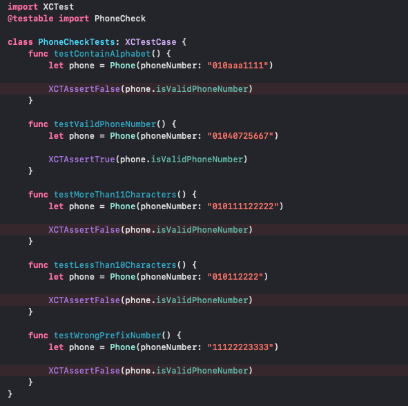

# TDD

### TDD란?

- 테스트 주도 개발 (Test Driven Development)로 소프트웨어를 개발하는 여러 방법론 중 하나

- 제품의 기능 구현을 위한 코드와 별개로, 해당 기능이 정상적으로 움직이는지 검증하기 위한 테스트 코드 작성

- 테스트가 실패할 경우, 테스트를 통과하기 위한 최소한으로 코드를 개선

- 최종적으로 테스트에 성공한 코드를 리팩토링 하는 과정을 거침

 

### TDD의 효과

1. 코드가 내 손을 벗어나기 전 가장 빠르게 피드백을 받을 수 있음

1. 작성한 코드가 가지는 불안정성을 개선해 생상선 향상

1. 오버 엔지니어링 방지

1. 개발 과정이 테스트 코드로 남기 때문에 과거의 의사결정을 쉽게 상기할 수 있음

 

### 테스트 기법의 종류

1. 수동 테스트

   - QA라고 부르는 전문 담당자들이 UI를 활용해 검증하는 방식

   - 장점

      - 사용자와 가장 가까운 관점에서 테스트 가능

      - 가장 온전한 전체 코드를 검증할 수 있는 기법

   - 단점

      - 실행 비용이 높고 결과 변동이 큼

      - 새로 추가된 코드로 인해 영향을 받을 기존 코드에 대한 테스트를 건너뛰거나 충실히 진행하지 못하는 경우가 많음

1. 테스트 자동화

   - 사람이 직접 테스트하지 않고, 어떤 기능을 검증하는 또 다른 코드를 작성하는 방식

   - 장점

      - 실행 비용이 낮고 결과의 신뢰도가 높음

   - 단점

      - 테스트 코드의 작성과 관리가 프로그래머 역량에 크게 영향 받음

1. 인수 테스트

   - 배치된 시스템을 대상으로 검증하는 방식

   - 주로 클라이언트가 의뢰한 소프트웨어를 최종적으로 사용할 수 있는 수준인지 검증하는 테스트

   - 장점

      - 전체 시스템 이상 여부에 대한 신뢰도가 높음

   - 단점

      - 비용이 매우 높음

      - 피드백 품질이 낮음

1. 단위 테스트

   - 시스템의 일부를 대상으로 기능을 검증하는 테스트

   - 장점

      - 비용이 상대적으로 낮음

      - 문제 해결을 위한 피드백의 품질이 높음

   - 단점

      - 전체 시스템의 이상 여부를 판단하는 신뢰도는 낮음

 

### TDD의 메인 프로세스

 

1. RED : 테스트 실패

   - 구체적인 하나의 요구사항을 검증하는 하나의 테스트 추가

   - 추가된 테스트가 실패하는지 확인

   - 실패한느 것이 확인 되어야, 테스트가 검증력을 가진다고 신뢰할 수 있음

   - 실패의 이유는 운영 코드가 아직 변경되지 않았기 때문이어야 한다. 테스트 코드의 문제이면 안 됨

1. GREEN : 테스트 성공

   - 추가된 테스트를 포함해, 모든 테스트가 성공하게끔 운영 코드 변경

   - 테스트의 성공은 모든 요구사항을 만족했음을 의미

   - 테스트 성공을 위한 최소한의 코드 변경만 진행

1. REFACTOR : 리팩토링

   - 코드베이스를 정리

   - 인터페이스 뒤에 숨어 있는 구현 설계 개선

   - 가독성, 적용성, 성능을 고려

    

### TDD 세부 프로세스

- 단위 테스트 작성 → 단위 테스트 실행 → 운영 코드 작성 → 단위 테스트 실행 → 설계 개선 → 단위 테스트 → ... 실행 반복

 

### 단위테스트할 요소(Right-BICEP)

- Right : 결과가 올바른가?

   - 테스트 코드는 기대한 결과를 선출하는지 검증할 수 있어야 한다.

- B : 경계 조건은 맞는가?

   - 모호하고 일관성 없는 값 ex) 특수문자가 포함된 파일 이름

   - 잘못된 양식의 데이터 ex) 최상위 도메인이 빠진 이메일 주소

   - 수치적 오버플로우를 일으키는 연산

   - 비거나 빠진 값 ex) 0, 0.0, nil

   - 이성적인 기댓값을 훨씬 벗어나는 값 ex) 200세의 나이

   - 중복을 허용해서는 안 되는 목록에 중복 값이 있는 경우 ex) 교실의 당번표

   - 정렬이 안 된 정렬 리스트 혹은 그 반대

   - 시간 순이 맞지 않는 경우

- I : 역 관계를 검사할 수 있는가?

- C : 다른 수단을 황룡하여 교차 검사할 수 있는가?

- E: 오류 조건을 강제로 발생시킬 수 있는가?

   - 환경적인 제약 사항을 담은 오류 사항

      - 메모리가 가득 찰 때

      - 디스크 공간이 가득 찰 때

      - 서버와 클라이언트 간 시간이 달라서 발생하는 문제

      - 네트워크 가용성 및 오류들

      - 시스템 로드

- P : 성능 조건은 기준에 부합하는가?

### TDD In iOS

- XCode에서 제공하는 Test의 종류는 두가지이다.

- UnitTest

   - 논리적인 부분을 테스트

   - ex) 피보나치 알고리즘, 모델

- UITest

   - UI와 관련된 부분을 테스트

   - ex) 어떤 버튼을 눌렀을 때 텍스트가 올바르게 변경되는지

- XCTest 프레임워크

   - XCode에서 XCTest 프레임워크를 이용하여 테스트를 진행할 수 있다.

      

- XCTest에서 테스트를 사용할 때 쓰는 메서드

   - class func setUp()

      - 타입 메서드로 테스트 시작 전 딱 한 번만 호출

      - 모든 테스트 메서드에서 실행 전에 정의하거나 초기화할 작업을 오버라이드하여 구현

   - func setUpWithError()

      - 각 테스트 메서드가 실행되기 전에 실행

      - 각 테스트 메서드 실행 전에 정의하거나 초기화할 작업을 오버라이드하여 구현

   - func setUp()

      - setUpWithError()와 마찬가지로 각 테스트 메서드가 실행되기 전에 실행

      - 차이점은 setUpWithError()는 실행 도중 발생한 에러를 처리할 수 있음

   - func testMethod() & addTestdownBlock(_:)

      - 실질적인 테스트를 수행하는 메서드

      - addTestdownBlock 메서드는 testMethod가 종료될 때 실행되는 코드 블록 먼저 선언된 블럭이 나중에 실행되는 LIFO 구조로 호출

   - func testDown()

      - 각 테스트 메서드가 종료되고 나서 실행

      - 각 테스트 메서드를 수행하고 정리하는 작업을 오버라이드하여 구현

   - func tearDownWithError()

      - tearDown과 마차낙지로 각 테스트 메서드가 종료되고 나서 실행

      - 실행 도중 발생한 에러를 처리할 수 있음

   - class func tearDown()

      - 타입 메서드로 모든 테스트가 종료되고 딱 한 번 호출

      - 모든 테스트를 마치고 정리해야할 작업을 오버라이드하여 구현

       

   - Assert Methods

      - Equality Test

         - XCTAssertEqual(expression1, expression2, "optional description")

            - 두 연산이 같은 값을 갖는 지 확인

         - XCTAssertEqualWithAccuracy(expression1, expression2, accuracy, "optional description")

            - 두 연산이 특정 accuracy 이내의 같은 값을 갖는 지 확인

         - XCTAssertNotEqual(expression1, expression2, "optional description")

            - 두 연산이 다른 값을 갖는 지 확인

         - XCTAssertGreaterThan(expression1, expression2, "optional description")

            - 연산1이 연산2보다 큰 값인지 확인

         - XCTAssertGreaterThanOrEqual(expression1, expression2, "optional description")

            - 연산1이 연산2보다 크거나 같은 값인지 확인

         - XCTAssertLessThan(expression1, expression2, “optional description”)

            - 연산1이 연산2보다 작은 값인지 확인

         - XCTAssertLessThanOrEqual(expression1, expression2, “optional description”)

            - 연산1이 연산2보다 작거나 같은 값인지 확인

      - Boolean Test

         - XCTAssertTrue(expression, “optional description”)

            - 연산이 참인지 확인

         - XCTAssertFalse(expression, “optional description”)

            - 연산이 거짓인지 확인

      - Nil Test

         - XCTAssertNil(expression, “optional description”)

            - 연산이 nil 값인지 확인

         - XCTAssertNotNil(expression, “optional description”)

            - 연산이 nil 값이 아닌지 확인

         - XCTUnwrap

            - 연산이 nil이 아닌지 확인, 언래핑한 값을 반환

      - Exception Test

         - . XCTAssertThrowsError(expression, “optional description”)

            - 연산이 Error를 던지는지 확인

         - XCTAssertNoThrow(expression, “optional description”)

            - 연산이 Error를 던지지 않는지 확인

   ### XCTest를 활용한 TDD 실습 (핸드폰 번호 검증)

    

   - 프로젝트 생성시 Include Tests를 체크해준다.

   - 테스트하고자 하는 베이스 코드 생성 (핸드폰 번호 검증)

      

       

   - Test 타겟에 PhoneCheckTests 클래스 생성

      

       

   - 핸드폰 번호 검증에 대한 테스트 코드 작성

   

    

    

   - 테스트할 때는 테스트 메서드 옆에 있는 마름모 모양을 클릭해 테스트 시작

      

       

   - 테스트를 통과할 수 있도록 핸드폰 번호 검증 기능 구현 (정규식 활용)

      

       

   - 테스트 실행

      

    

