# 디자인 패턴

<br />

## 객체지향 모델링

1. 모델링 : 모두에게 공통적으로 이해되도록 약속된 방식으로 표현하는 것

- 모델링의 역할

   - 서로의 해석을 공유해 합의를 이루거나 해석의 타당성을 검토

   - 현재 시스템 또는 앞으로 개발할 시스템의 원하는 모습을 가시화

   - 시스템의 구조와 행위를 명세할 수 있으며 시스템을 구축하는 틀 제공

- 기반 : 모델링은 추상화에 바탕을 두고 만들어져야 한다.

   - 특정 관점에서 관련이 있는 것만 부각시키고 관련이 없는 것은 무시

1. UML 

- 시스템을 모델로 표현해주는 대표적인 모델링 언어

- 요구 분석, 설계, 구현 등의 개발 과정에서 개발자 사이의 의사 소통을 원활하게 이뤄지도록 하기 위한 표준화된 통합 모델링 언어

- UML 다이어그램

   - 구조 다이어그램

      - 클래스 다이어그램 : 시스템을 구성하는 클래스들의 관계를 표현하는 다이어그램  (시간에 따라 변하지 않는 시스템의 정적인 면을 보여주는 대표적인 UML 구조 다이어그램)

         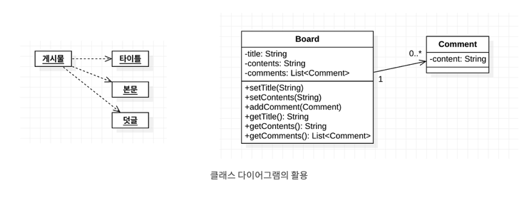

         - 왼쪽 다이어그램 : 문제 해결을 위한 도메인 구조를 나타내어 보이지 않는 도메인 안의 개념과 같은 추상적인 개념을 기술하기 위해 나타낸 것.

         - 오른쪽 다이어그램 : 소프트웨어의 설계 혹은 완성된 소프트웨어의 구현 설명 목적

         - 클래스 : 동일한 속성과 행위를 수행하는 객체의 집합

         - 가장 윗부분 클래스 이름, 중간 속성, 하단 연산으로 구성

         - 클래스 다이어그램의 기본 요소

            - 접근 제어자 리스트 

               - + (Public) : 어떤 클래스에서도 접근 가능

               - - (Private) : 해당 클래스에서만 접근 가능

               - # (Protected) : 동일 패키지 내의 클래스 또는 해당 클래스를 상속 받은 외부 패키지의 클래스에서만 접근 가능

               - ~ (Package) : 동일 패키지에 있는 클래스의 객체들만 접근 가능

            - 관계 표현

               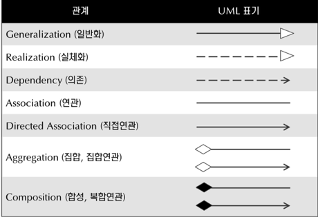

               - 일반화 : 일반적으로 알고 있는 상속

               - 실체화 : 책임들의 집합인 인터페이스와 이 책임들을 실제로 실현한 클래스들 사이의 관계를 나타냄, 인터페이스에 있는 것을 오버라이딩하여 실제로 구현하는 것

               - 의존 : 한 클래스가 다른 클래스에서 제공하는 기능을 사용할 때를 나타냄,  해당 클래스와의 관계를 계속 유지하지 않음(메소드 호출이 끝나면 연관된 클래스와의 관계도 마무리)

               - 연관 : 클래스들이 개념상 서로 연결되었음을 나타냄

                  - 1 : 1개의 표현

                  - * : 0 ~ n개의 표현

                  - n...m : n부터 m까지의 연관 관계

               - 집합 : 전체 객체와 부분 객체의 생명 주기가 다름, 부분 객체를 여러 전체 객체가 공유할 수 있음, 실선에 빈 다이아몬드

               - 합성 : 전체 객체가 없어지면 부분 객체도 사라짐.

      - 객체 다이어그램 : 객체 정보를 보여주는 다이어그램

      - 복합체 구조 다이어그램 : 복합 구조의 클래스와 컴포넌트 내부 구조를 표현

      - 배치 다이어그램 : 소프트웨어, 하드웨어, 네트워크를 포함한 실행 시스템의 물리 구조를 표현

      - 컴포넌트 다이어그램 : 컴포넌트 구조 사이의 관계를 표현

      - 패키지 다이어그램 : 클래스나 유즈 케이스 등을 포함한 여러 모델 요소들을 그룹화해 패키지를 구성하고 패키지들 사이의 관계를 표현

   - 행위 다이어그램

      - 활동 다이어그램 : 업무 처리 과정이나 연산이 수행되는 과정을 표현

      - 상태 머신 다이어그램 : 객체의 생명주기를 표현

      - 유즈 케이스 다이어그램 : 사용자 관점에서 시스템 행위를 표현

   - 상호작용 다이어그램

      - 순차 다이어그램 : 시간 흐름에 따른 객체 사이의 상호작용을 표현

      - 상호작용 개요 다이어그램 : 여러 상호작용 다이어그램 사이의 제어 흐름을 표현

      - 통신 다이어그램 : 객체 사이의 관계를 중심으로 상호작용을 표현

      - 타이밍 다이어그램 : 객체 상태 변화와 시간 제약을 명시적으로 표현

다양한 관점에서 시스템을 모델링하기 위해 다양한 다이어그램 제공

<br />

## 객체지향 원리

- 추상화 : 어떤 영역에서 필요로 하는 속성이나 행동을 추출하는 작업

- 캡슐화 : 객체의 속성과 행위를 하나로 묶고, 정보 은닉을 통해 높은 응집도와 낮은 결합도를 갖도록 하는 것

   - 정보 은닉 : 알 필요가 없는 정보는 외부에서 접근하지 못하도록 제한

   - 응집도 : 클래스나 모듈 안의 요소들이 얼마나 밀접하게 관련되어 있는지

   - 결합도 : 어떤 기능을 실행하는 데 다른 클래스나 모듈에 얼마나 의존적인지 

- 일반화 관계 : 상속 관계, 공통된 특성을 부각시켜 개념을 일반화한 것 

   - 필요한 이유 : ex) 과일을 일반화하지 않고 냉장고에 과일이 총 몇개 있는지 물어볼 때 모든 과일 종류의 수를 다 일일이 세야 함. or 냉장고에 키위가 있다면 과일 개수에 포함해야 하는가? 라는 질문도 필요할 수 있음

- 다형성 : 서로 다른 클래스의 객체가 같은 메시지를 받았을 때 각자의 방식으로 동작하는 것

   - 오버라이딩 : 자식 클래스에서 부모 클래스의 메소드를 새롭게 정의하는 것

   - 오버로딩 : 같은 이름의 메소드들을 매개 변수나, 반환 타입을 다르게 하여 여러 개 가질 수 있게 하는 것

- 피터 코드의 상속 규칙

   - 자식 클래스와 부모 클래스 사이는 '역할 수행' 관계가 아니어야 한다.

   - 한 클래스의 인스턴스는 다른 서브 클래스의 객체로 변환할 필요가 절대 없어야 한다.

   - 자식 클래스가 부모 클래스의 책임을 무시하거나 재정의하지 않고 확장만 수행해야 한다.

   - 자식 클래스가 단지 일부 기능을 재사용할 목적으로 유틸리티 역할을 수행하는 클래스를 상속하지 않아야 한다.

   - 자식 클래스가 역할, 트랜잭션, 디바이스 등을 특수화해야 한다.

## SOLID 원칙

1. 단일 책임 원칙(SRP) : 단 하나의 책임만을 가져야 한다.

   - 변경 : 변경이 있을 때 가능한 한 영향 받는 부분을 줄이기 위해 책임을 좀 더 현실적인 개념으로 파악할 필요가 있다.

   - 책임이 많아질수록 내부에서 서로 다른 역할을 수행하는 코드끼리 강하게 결합될 가능성이 높아진다.

   - 책임 분리 : 한 클래스에 너무 많은 책임을 부여하지 않고 단 하나의 책임만 수행하도록 하여 변경 사유가 될 수 있는 것을 하나로 만드는 것

   - '단일 책임'은 절대적으로 측정할 수 있는 개념이 아니다.

      - 어느 정도의 수준으로 추상화를 하느냐에 따라서 '단일'일 수 있고 아닐 수도 있다.

      - 단일 책임 원칙에서 말하는 '단일'은 객체들 간의 협력과 책임을 고려해서 되도록 작은 범위로 잡을 것을 권고하는 의미이다.

   - 액터 : 서비스를 이용하는 주체자

   - 책임 : 하나의 특정 액터를 위한 기능 집합

   - 단일 책임 원칙을 지키지 않은 코드

      ```swift
      class Book {
          // 책 제목 조회
          func getTitle() -> String {
              return "Harry Poter"
          }
          
          // 책 저자 조회
          func getAuthor() -> String {
              return "J.K. Rowling"
          }
          
          // 페이지 넘기기 기능
          func turnPage() {
          }
          
          // 현재 페이지를 화면에 출력
          func printCurrentPage() {
              print("show current page")
          }
      }
      ```

      Book 객체를 운용하는 액터는 '책을 조회해서 도서관에 책을 정리하는 사람' 이나 'UI로 렌더링 시키는 시스템'이 될 수 있다. 이 둘은 서로 아주 다른 액터이기 때문에 위 클래스는 단일 책임 원칙을 지키지 않았다고 볼 수 있다.

   - 단일 책임 원칙을 지킨 코드

      ```swift
      // 책을 조회해서 도서관에 책을 정리하는 사람이 사용하는 기능들
      class Book {
          // 책 제목 조회
          func getTitle() -> String {
              return "Harry Poter"
          }
          
          // 책 저자 조회
          func getAuthor() -> String {
              return "J.K. Rowling"
          }
          
          // 페이지 넘기기 기능
          func turnPage() {
          }
          
          // 현재 페이지를 화면에 출력
          func getCurrentPage() -> String {
              return "current page content"
          }
      }
      
      // UI로 렌더링시키는 시스템이 사용하는 기능들
      protocol Printer {
          func printPage()
      }
      ```

      위 코드는 '책을 조회해서 도서관에 책을 정리하는 사람'을 위한 기능과 'UI로 렌더링 시키는 시스템'을 위한 기능을 분리하여 단일 책임 원칙을 지켰다고 볼 수 있다.

1. 개방 폐쇄의 원칙(OCP) : 기존의 코드를 변경하지 않으면서 기능을 추가할 수 있도록 설계되어야 한다.

   - 확장에는 열려 있어야 하고 변경에는 닫혀 있어야 한다.

   - 개방 폐쇄 원칙을 지키는 방법

      - 변화하는 부분을 추상화(인터페이스를 통한 구현)

      - 상속을 이용

   - 개방 폐쇄 원칙을 어긴 코드

      ```swift
      class User {
          func activate(logic: String) {
              if logic == "logic" {
                  let logic = Logic()
                  logic.activate()
              } else if logic == "newLogic" {
                  let logic = NewLogic()
                  logic.activate()
              }
          }
      }
      
      class Logic {
          func activate()
      }
      
      class NewLogic {
          func activate()
      }
      ```

      newLogic이라는 기능을 추가적으로 확장할 때 Logic, newLogic이라는 기능을 사용하는 User의 코드를 변경해야 하므로 OCP 원칙을 어겼다고 볼 수 있다.

   - 개방 폐쇄 원칙을 지킨 코드

      ```swift
      class User {
          func activate(logic: Logic) {
              logic.activate()
          }
      }
      
      class Logic {
          func activate() {
              print("activate Logic")
          }
      }
      
      class LogicA: Logic {
          override func activate() {
              print("activate LogicA")
          }
      }
      ```

      로직과 관련된 기능을 사용하는 User의 코드 변경 없이 Logic을 상속하는 새 Logic을 추가하기만 하면 되므로 개방폐쇄 원칙을 지켰다고 볼 수 있다.

1. 리스코프 치환 원칙(LSP) : 부모 클래스와 자식 클래스 사이의 행위가 일관성이 있어야 한다.

   - 상위 타입의 객체를 하위 타입의 객체로 치환해도 정상적으로 동작해야 한다.

   - 리스코프 치환 원칙을 지키지 않은 코드

      ```swift
      class Rectangle {
          var width: Int?
          
          func setWidth() {
              
          }
          
          func increaseWidth(rectangle: Rectangle) {
              guard let rectangle = rectangle as? Square else {
                  print("해당 클래스는 이 메소드를 수행할 수 없습니다.")
                  return
              }
              
              setWidth()
          }
      }
      ```

      위 코드의 상위 타입의 객체(Rectangle)을 하위 타입의 객체(Square)로 치환하게 되면 increaseWidth 메소드에서 예외가 발생하므로 리스코프 치환 원칙을 어긴 것이다.

   - 리스코프 치환 원칙을 지킨 코드

      ```swift
      class SuperClass {
          func setMethod() {
              print("superclass method")
          }
      }
      
      class SubClass: SuperClass {
          override func setMethod() {
              print("subclass method")
          }
      }
      
      func someMethod(sc: SuperClass) {
          sc.setMethod()
      }
      
      
      someMethod(sc: SuperClass())
      someMethod(sc: SubClass())
      ```

      someMetohd 함수에서 상위 타입인 SuperClass 또는 하위 타입인 SubClass를 전달하더라도 정상 작동하므로 리스코프 치환 원칙을 지켰다고 볼 수 있다.

1. 의존 역전 원칙(DIP) : 고수준 모듈이 저수준 모듈의 구현에 의존해서는 안 된다.

   - 의존 역전 원칙을 만족하려면 어떤 클래스가 도움 받을 때 구체적인 클래스보다는 인터페이스나 추상 클래스와 의존 관계를 맺도록 설계

   - 의존성 주입이라는 기술로 변화를 쉽게 수용할 수 있는 코드를 작성할 수도 있음.

1. 인터페이스 분리 원칙(ISP) : 클라이언트가 자신이 이용하지 않는 기능에 의존하지 않아야 한다는 원칙

   - 클라이언트 입장에서 사용하는 기능만 제공하도록 인터페이스를 분리해야 한다.

   - 인터페이스를 분리하게 되면 인터페이스가 명확해지고, 대체 가능성이 높아진다.

   - 인터페이스 분리 원칙을 어긴 코드

      ```swift
      protocol MultiFunctionPrinter {
          func copy()
          func fax(to: String)
          func printPaper()
      }
      
      class CopyMachine: MultiFunctionPrinter {
          func copy() {
              print("@@@@복사@@@@")
          }
          
          func fax(to: String) {
          }
          
          func printPaper() {
          }
      }
      ```

      MultiFunctionPrinter에 모든 기능을 넣었더니 CopyMachine을 구현하는 데 필요하지 않은 fax나 printPaper와 같은 메소드도 모두 구현해줘야 하기 때문에 인터페이스 분리 원칙을 어겼다고 볼 수 있다.

   - 인터페이스 분리 원칙을 지킨 코드

      ```swift
      protocol Copy {
          func copy()
      }
      
      protocol Print {
          func printPaper()
      }
      
      protocol Fax {
          func fax(to: String)
      }
      
      class CopyMachine: Copy {
          func copy() {
              print("@@@@복사@@@@")
          }
      }
      ```

      CopyMachine가 사용하는 기능만 제공하도록 인터페이스를 분리하였기 때문에 인터페이스 분리 원칙을 지켰다고 볼 수 있다.

<br />

## Design Pattern

- Design Pattern이란? : 과거의 소프트웨어 개발 과정에서 발견된 설계의 노하우를 축적하여 이름을 붙이고, 이후에 재사용하기 좋은 형태로 특정의 규약을 묶어서 정리한 것

- 소프트웨어를 설계할 때 자주 발생하는 고질적 문제들이 재등장했을 때 재사용할 수 있는 훌륭한 해결책

   - "바퀴를 다시 발명하지 마라"라는 말처럼 잘 만들어져있는 것이 있다면 처음부터 다시 만들 필요가 없음

### Singleton

- 특정 용도로 객체를 하나만 생성하여 공용으로 사용하고 싶을 때 사용하는 디자인 패턴

- 해당 클래스를 최초에 한번만 메모리를 할당하고(static) 그 메모리에 인스턴스를 만들어 사용하는 디자인 패턴

- iOS에서는 UIApplication, UserDefaults, URLSession, FileManager 등이 대표적 Singleton 패턴

   ```swift
   class AdminUser {
       static let shared = AdminUser()
       
       private init() {
       }
       
       var name: String?
       var age: Int?
   }
   
   class LogInViewController: UIViewController {
       override func viewDidLoad() {
           super.viewDidLoad()
           
           let admin = AdminUser.shared
           admin.name = "admin"
           admin.age = 20
       }
   }
   
   class MainViewController: UIViewController {
       override func viewDidLoad() {
           super.viewDidLoad()
           
           print(AdminUser.shared.name ?? "name is empty")
       }
   }
   ```

- Class 내부에서 static 전역 변수로 해당 클래스의 인스턴스를 만들어준다.

- init()을 private으로 선언해주어서 다른 곳에서 인스턴스를 생성하지 못하도록 막는다. (Thread-Safe)

- 장점

   1. 객체를 여러개 생성할 필요가 없고, 기존에 생성된 것을 가져다 쓰기 때문에 메모리 낭비를 방지할 수 있다.

   1. 싱글톤으로 만들어진 클래스의 인스턴스는 전역이기 때문에 다른 클래스의 인스턴스들이 데이터를 공유하기 쉽다.

   1. 프로그램의 생애 주기 동안 인스턴스가 절대적으로 하나만 존재한다는 것을 보장할 수 있다.

   1. 두 번째 Call부터 객체 로딩 시간이 줄어 성능이 좋아질 수 있다.

- 단점

   1. 싱글톤을 구현하는 코드가 많이 들어간다. (thread-safe 고려)

   1. 클래스 내부에서 객체를 직접 생성하기 때문에 SOLID 원칙의 OCP와 DIP를 위반한다.

   1. 테스트가 어렵다.

- SOLID 관점에서 본 싱글톤

   - 개방 폐쇄 원칙(OCP) : 클래스 내부에서 객체를 직접 생성하고 사용한다. 싱글톤 기능의 확장으로 다른 객체를 사용할 경우 코드가 변경되어야 하기 때문에 개방 페쇄 원칙을 위배한다.

   - 의존성 역전 원칙(DIP) : 추상화에 의존하지 않고 직접 구현체와 결합하고 있기 때문에 의존성 역전 원칙을 위배한다.

<br />

### Mediator

- 객체 간 직접 통신을 제한하고 Mediator(중재자) 객체를 통해서 통신을 가능하게 해 상호 작용을 독립적으로 만들도록 하는 디자인 패턴

- 객체 간 종속성을 줄일 수 있는 패턴

- Use When?

   - 하나의 객체에서 발생한 이벤트에 대해 다른 객체가 조치를 취하고 또 해당 객체가 다른 객체에게 영향을 미치는 추가적인 이벤트를 생성할 때

- 장점

   1. 다양한 객체 간 통신을 하나의 객체에서 수행해 코드를 이해하기 쉽고 유지보수도 간편해진다.

   1. OCP를 준수할 수 있다. (객체들을 변경하지 않고 새로운 Mediator를 도입할 수 있다.)

   1. 프로그램의 다양한 구성 요소 간 결합도를 줄일 수 있다.

   1. 개별 객체들을 더 쉽게 재사용할 수 있다.

- 단점 

   1. 시간이 지남에 따라 Mediator 객체가 비대해질 수 있다. Mediator 객체가 복잡해지고 유지하기 어려운 단일체가 될 가능성이 있다.

```swift
protocol Mediator {
    func notify(sender: Colleague, eventType: EventType)
}

enum EventType {
    case checkBoxSelect
    case checkBoxUnselect
}

class Colleague {
    var mediator: Mediator?
    
    func setMediator(mediator: Mediator) {
        self.mediator = mediator
    }
}

class CheckBox: Colleague {
    var isSelect: Bool = false {
        didSet {
            if isSelect {
                print("체크박스 선택")
            } else {
                print("체크박스 선택 해제")
            }
        }
    }
    
    func checkBoxTap() {
        self.isSelect.toggle()
        
        self.mediator?.notify(sender: self, eventType: self.isSelect ? .checkBoxSelect : .checkBoxUnselect)
    }
}

class TextField: Colleague {
    var isHidden: Bool = false {
        didSet {
            if isHidden {
                print("텍스트필드 숨김 활성화")
            } else {
                print("텍스트필드 숨김 비활성화")
            }
        }
    }
}

class SomeUI: Mediator {
    var checkBox: CheckBox
    var textField: TextField
    
    init(checkBox: CheckBox, textField: TextField) {
        self.checkBox = checkBox
        self.textField = textField
        
        self.checkBox.setMediator(mediator: self)
        self.textField.setMediator(mediator: self)
    }
    
    func notify(sender: Colleague, eventType: EventType) {
        switch eventType {
        case .checkBoxSelect:
            self.textField.isHidden = false
        case .checkBoxUnselect:
            self.textField.isHidden = true
        }
    }
}


let checkBox = CheckBox()
let textField = TextField()
let someUI = SomeUI(checkBox: checkBox, textField: textField)

someUI.checkBox.checkBoxTap()
someUI.checkBox.checkBoxTap(
```

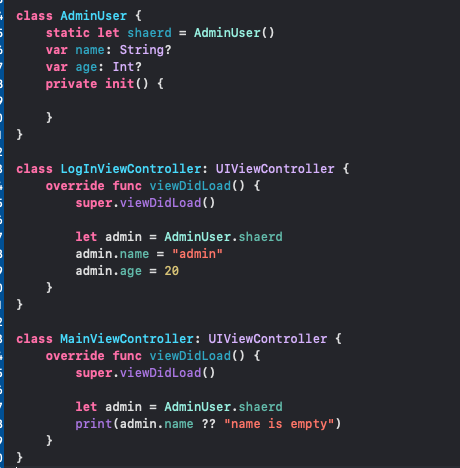

- 체크박스를 선택하면 텍스트필드의 숨김이 활성화되는 간단한 중재자 패턴 사용 예제


### Observer

- 객체의 상태 변화를 관찰하는 관찰자들의 목록을 객체에 등록하여 상태 변화가 있을 때마다 메소드 등을 통해 객체가 직접 목록의 각 관찰자에게 통지하는 디자인 패턴

- 한 객체의 상태 변화에 따라 다른 객체의 상태도 연동되도록 1 : N 객체 간 의존 관계를 구성하는 디자인 패턴

- iOS의 경우 Notification과 KVO(Key-Value Observing)

- 장점

   1. 실시간으로 한 객체의 변경사항을 다른 객체에 전파할 수 있다.

   1. 느슨한 결합으로 시스템이 유연하고 객체 간의 의존성을 제거할 수 있다.

- 단점

   1. 너무 많이 사용하면 상태 관리가 힘들 수 있다.

   1. 데이터 배분에 문제가 생기면 큰 문제로 이어질 가능성이 있다.

- 구조

   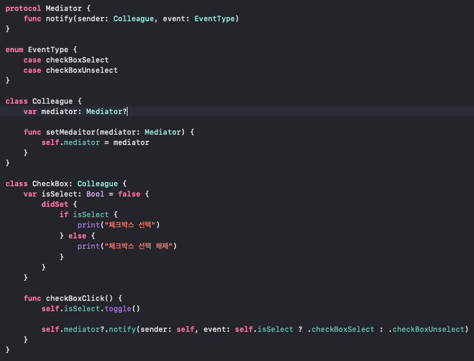

   Subject : 구독자가 이벤트를 받을 주요 객체, 해당 Subject의 특정 이벤트 변경 시 구독하고 있는 구독자들이 해당 이벤트를 수신한다.

   Observer : 구독자들의 부모가 되는 추상 클래스 객체

   ConcreteObserver : Subject의 이벤트를 받게 되는 구독자 객체

   ```swift
   class Subject {
       var state: Int = { return Int(arc4random_uniform(10)) }()
       private lazy var observers = [Observer]()
       
       func attach(_ observer: Observer) {
           print("Subject : Attached an Observer")
           self.observers.append(observer)
       }
       
       func detach(_ observer: Observer) {
           if let index = observers.firstIndex(where: { $0 === observer }) {
               observers.remove(at: index)
               print("Subject : Detached an Observer")
           }
       }
       
       func notify() {
           print("Subject : Notifying Observers")
           observers.forEach { $0.update(subject: self) }
       }
       
       func updateState() {
           state = Int(arc4random_uniform(10))
           notify()
       }
   }
   
   protocol Observer: AnyObject {
       func update(subject: Subject)
   }
   
   class ConcreteObserverA: Observer {
       func update(subject: Subject) {
           print("ConcreteObserverA - updated a state : \(subject.state)")
       }
   }
   
   class ConcreteObserverB: Observer {
       func update(subject: Subject) {
           print("ConcreteObserverB - updated a state : \(subject.state)")
       }
   }
   
   let subject = Subject()
   
   let observerA = ConcreteObserverA()
   let observerB = ConcreteObserverB()
   
   subject.attach(observerA)
   subject.attach(observerB)
   
   subject.updateState()
   ```

   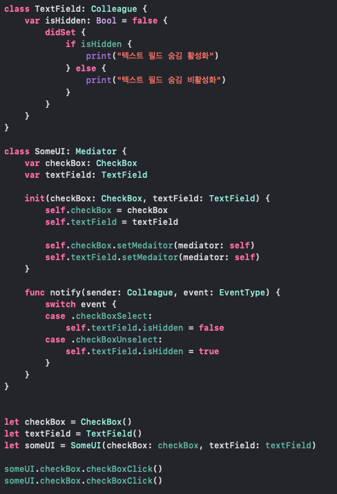

### Factory (Factory Method Pattern)

- 객체를 생성하는 인터페이스는 미리 정의하고, 인스턴스를 만들 클래스의 결정은 서브 클래스 쪽에서 수행하는 디자인 패턴

- 여러 개의 서브 클래스를 가진 부모 클래스가 있을 때 인풋에 따라 하나의 자식 클래스의 인스턴스를 리턴해주는 방식

- Use When ? 

   - 어떤 클래스가 자신이 생성해야 하는 객체의 클래스를 예측할 수 없을 때

   - 생성할 객체를 기술하는 책임을 자신의 서브클래스가 지정했으면 할 때

- 장점

   - 객체를 생성하는 코드를 분리해 클라이언트 코드와 결합도를 낮춤

   - 인터페이스를 바탕으로 유연성과 확장성이 뛰어난 코드 제작 가능

   - DIP (의존성 역전 원칙) 를 성립함

- 단점

   - 새로 생성할 객체의 종류가 늘어날 때마다 클래스가 많아짐

```swift
protocol Player {
    var content: String { get set }
    
    init(content: String)
    
    func play()
    func changeContent(content: String)
}

class MusicPlayer: Player {
    var content: String
    
    required init(content: String) {
        self.content = content
    }
    
    func play() {
        print("\(content) music playing")
    }
    
    func changeContent(content: String) {
        print("\(self.content)에서 \(content)로 음악 변경")
        self.content = content
    }
}

class VideoPlayer: Player {
    var content: String
    
    required init(content: String) {
        self.content = content
    }
    
    func play() {
        print("\(content) video playing")
    }
    
    func changeContent(content: String) {
        print("\(self.content)에서 \(content)로 비디오 변경")
        self.content = content
    }
}

protocol PlayerCreator {
    func createPlayer(content: String, contentType: ContentType) -> Player?
}

enum ContentType {
    case music
    case video
}

class PlayerFactory: PlayerCreator {
    func createPlayer(content: String, contentType: ContentType) -> Player? {
        switch contentType {
        case .music:
            return MusicPlayer(content: content)
        case .video:
            return VideoPlayer(content: content)
        }
    }
}

let factory = PlayerFactory()
let musicPlayer = factory.createPlayer(content: "K-POP", contentType: .music)
let videoPlayer = factory.createPlayer(content: "K-MOVIE", contentType: .video)
```

<br />

### Strategy 

- 행위를 클래스로 캡슐화해 동적으로 행위를 자유롭게 바꿀 수 있게 해주는 패턴

- 같은 문제를 해결하는 여러 알고리즘이 클래스별로 캡슐화되어 있고 이들이 필요할 때 교체할 수 있도록 함으로써 동일한 문제를 다른 알고리즘으로 해결할 수 있게 하는 디자인 패턴

- 전략을 쉽게 바꿀 수 있도록 해줌

   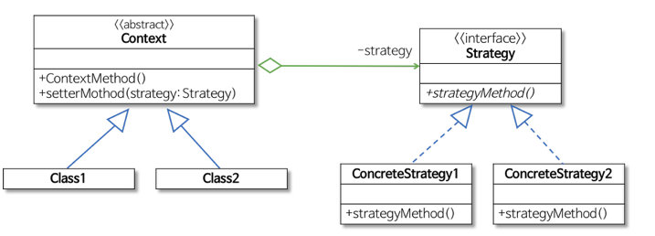

   - Strategy : 인터페이스나 추상 클래스로 외부에서 동일한 방식으로 알고리즘을 호출하는 방법을 명시

   - ConcreteStrategy : 스트래티지 패턴에서 명시한 알고리즘을 실제로 구현한 클래스

   - Context : 스트래티지 패턴을 이용하는 역할, 필요에 따라 동적으로 구체적인 전략을 바꿀 수 있도록 setter 메소드 제공

- 장점

   - 요구사항이 변경되었을 때 기존의 코드를 변경하지 않아도 된다.

   - 새로운 전략에 대해서는 새로운 클래스를 통해 관리하기 때문에 OCP(개방 폐쇄 원칙)를 준수할 수 있다.

- 단점

   - Strategy 객체와 Composition 클래스 객체 사이의 오버헤드가 발생할 수 있다. (서브 클래스에서 구현할 알고리즘이 복잡성과 상관 없이 모든 ConcreteStrategy 클래스는 Strategy 인터페이스를 공유한다. 따라서 Strategy의 특정 매개변수가 필요하지 않는데도 전달받아야 한다.)

   - 객체 수가 증가한다. (Strategy들로 생성하는 객체 수가 증가한다.

```swift
protocol AttackStrategy {
    func attack()
}

protocol MoveStrategy {
    func move()
}

class PunchStrategy: AttackStrategy {
    func attack() {
        print("Attack with punch")
    }
}

class MissileStrategy: AttackStrategy {
    func attack() {
        print("Attack with missile")
    }
}

class WalkStrategy: MoveStrategy {
    func move() {
        print("Move on the ground")
    }
}

class FlyStrategy: MoveStrategy {
    func move() {
        print("Fly in the sky")
    }
}

protocol Robot: AnyObject {
    var name: String { get }
    var attackStrategy: AttackStrategy { get set }
    var moveStrategy: MoveStrategy {get set }
    
    init(name: String, attackStrategy: AttackStrategy, moveStrategy: MoveStrategy)
}

extension Robot {
    func attack() {
        self.attackStrategy.attack()
    }
    
    func move() {
        self.moveStrategy.move()
    }
    
    func setAttack(attackStrategy: AttackStrategy) {
        self.attackStrategy = attackStrategy
    }
    
    func setMove(moveStrategy: MoveStrategy) {
        self.moveStrategy = moveStrategy
    }
}

class Autobot: Robot {
    var name: String
    var attackStrategy: AttackStrategy
    var moveStrategy: MoveStrategy
    
    required init(name: String, attackStrategy: AttackStrategy, moveStrategy: MoveStrategy) {
        self.name = name
        self.attackStrategy = attackStrategy
        self.moveStrategy = moveStrategy
    }
}

class Decepticon: Robot {
    var name: String
    var attackStrategy: AttackStrategy
    var moveStrategy: MoveStrategy
    
    required init(name: String, attackStrategy: AttackStrategy, moveStrategy: MoveStrategy) {
        self.name = name
        self.attackStrategy = attackStrategy
        self.moveStrategy = moveStrategy
    }
}

let autobot = Autobot(name: "오토봇", attackStrategy: PunchStrategy(), moveStrategy: WalkStrategy())
let decepticon = Decepticon(name: "디셉티콘", attackStrategy: MissileStrategy(), moveStrategy: FlyStrategy())

autobot.attack()
autobot.move()

decepticon.attack()
decepticon.move()

autobot.setAttack(attackStrategy: MissileStrategy())
autobot.attack()
```

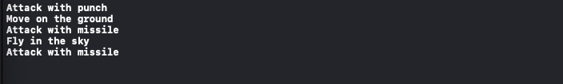

### Adapter

- 한 클래스의 인터페이스를 클라이언트에서 사용하고자 하는 다른 인터페이스로 변환한다. 

- 호환성이 없는 인터페이스 때문에 함께 동작할 수 없는 클래스들이 함께 동작하도록 해주는 패턴

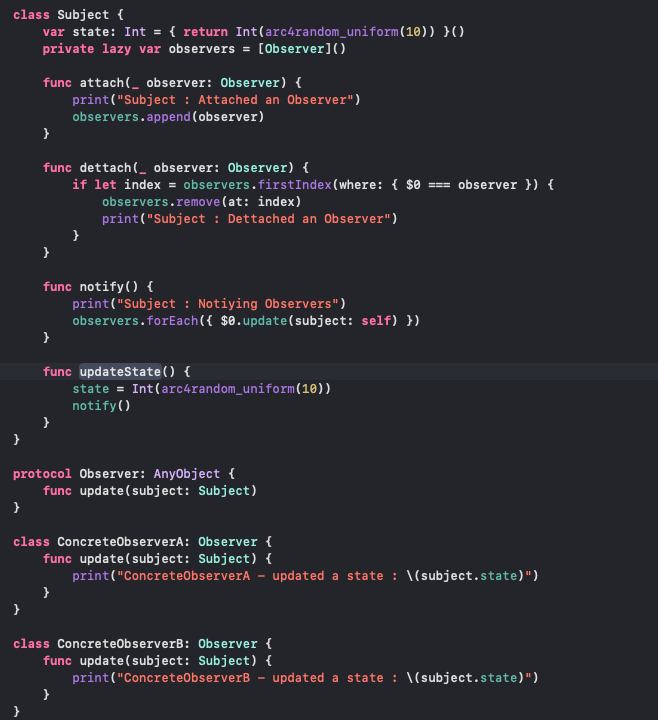

<br />

   - Client : 써드파티 라이브러리나 외부 시스템을 사용하려는 쪽

   - Adaptee : 써드파티 라이브러리나 외부 시스템

   - Target Interface : Adapter가 구현하는 인터페이스, 클라이언트는 Target Interface를 통해 Adaptee인 써드파티 라이브러리를 사용함

   - Adapter : 클라이언트와 Adaptee 중간에서 호환성이 없는 둘을 연결시켜주는 역할, Target Interface를 구현하며, 클라이언트는 Target Interface를 통해 어댑터 요청을 보낸다. 어댑터는 클라이언트의 요청을 Adaptee가 이해할 수 있는 방법으로 전달하고 처리는 Adaptee에서 이뤄진다.

   - 장점

      - 인터페이스 호환성 때문에 같이 쓸 수 없는 클래스를 연결해서 사용 가능

      - 기존 클라이언트 단의 코드 수정 최소화

   - 단점

      - 어댑터 클래스에서 통일 시켜주는 부분을 하나씩 구현해야 함

```swift
protocol Target {
    func request() -> String
}

class Adaptee {
    func specificRequest() -> String {
        return "Adaptee's specificRequest"
    }
}

class Adapter: Target {
    private var adaptee: Adaptee
    
    init(adaptee: Adaptee) {
        self.adaptee = adaptee
    }
    
    func request() -> String {
        return self.adaptee.specificRequest()
    }
}

class Client {
    func specificRequest(target: Target) {
        print("Call from adapter - \(target.request())")
    }
}

let adaptee = Adaptee()
let client = Client()

print(adaptee.specificRequest())
client.specificRequest(target: Adapter(adaptee: adaptee))
```

### Decorator

- 기본 객체에 추가적인 기능을 동적으로 유연하게 첨가하는 디자인 패턴

- Use When ? 객체가 상황에 따라 다양한 기능이 추가되거나 삭제되어야 할 때

   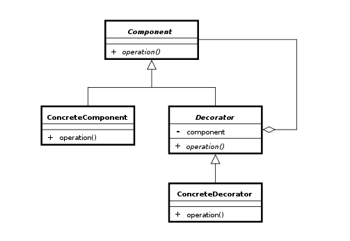

   - Component : ConcreteComponent와 Decorator가 구현할 인터페이스

   - ConcreteComponent : Decorate가 받을 객체 (즉, 기능 추가를 받을 기본 객체)

   - Decorator : Decorate를 할 객체의 추상 클래스

   - ConcreteDecorator : Decorator를 상속 받아 구현할 다양한 기능 객체

- 장점

   - 객체에 동적으로 기능 추가를 간단히 할 수 있다.

- 단점

   - 자잘한 데코레이터 클래스들이 계속 추가되어 클래스가 많아질 수 있다.

   - 겹겹이 애워싸고 있기 때문에 객체의 정체를 알기 힘들고 복잡해질 수 있다.

   <br />

```swift
protocol Display {
    func draw()
}

class RoadDisplay: Display {
    func draw() {
        print("기본 도로 표시")
    }
}

class DisplayDecorator: Display {
    var decoratedDisplay: Display
    
    init(display: Display) {
        self.decoratedDisplay = display
    }
    
    func draw() {
        self.decoratedDisplay.draw()
    }
}

class LaneDecorator: DisplayDecorator {
    override func draw() {
        super.draw()
        self.drawLane()
    }
    
    private func drawLane() {
        print("+ 차선 표시")
    }
}

class TrafficDecorator: DisplayDecorator {
    override func draw() {
        super.draw()
        self.drawTraffic()
    }
    
    private func drawTraffic() {
        print("+ 교통량 표시")
    }
}

let road = RoadDisplay()
road.draw()
// 기본 도로 표시

let roadWithLane = LaneDecorator(display: road)
roadWithLane.draw()
/*
 기본 도로 표시
 + 차선 표시
 */

let roadWithTraffic = TrafficDecorator(display: road)
roadWithTraffic.draw()
/*
 기본 도로 표시
 + 교통량 표시
 */

let roadWithLaneAndTraffic = TrafficDecorator(display: roadWithLane)
roadWithLaneAndTraffic.draw()
/*
 기본 도로 표시
 + 차선 표시
 + 교통량 표시
 */
```

### Delegation 패턴

- 어떤 "Helper" 객체를 이용해 데이터를 제공하거나 특정 작업을 수행하는 것을 위임하는 디자인 패턴

- iOS의 경우 UIKit 전반적으로 사용되고 그 중 UITableViewDelegate, UITableViewDataSource는 대표적인 에시 중 하나

   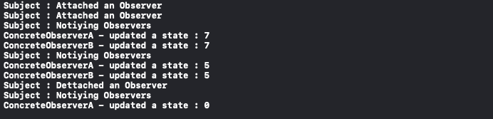

   - Object Needing a Delegate : delegate 를 가지는 객체, 이 때 delegate는 retain cycle을 피하기 위해 weak property로 선언

   - Delegate Protocol은 구현해야 하는 메서드 등을 정의

   - Delegate는 delegate protocol을 실행하는 객체

      <br />

```swift
protocol MessageBoxDelegate: AnyObject {
    func touchedButton()
}

class MessageBox: UIView {
    weak var delegate: MessageBoxDelegate?
    var button: UIButton?
    
    override init(frame: CGRect) {
        super.init(frame: frame)
        
        configure()
    }
    
    required init?(coder: NSCoder) {
        fatalError("init(coder:) has not been implemented")
    }
    
    func configure() {
        button = UIButton(type: .system)
        if let btn = button {
            btn.setTitle("SEND", for: .normal)
            btn.sizeToFit()
            btn.frame.origin = CGPoint(x: (self.bounds.width - btn.bounds.width) * 0.5, y: (self.bounds.height - btn.bounds.height) * 0.5)
            btn.addTarget(self, action: #selector(tapButton), for: .touchUpInside)
            self.addSubview(btn)
        }
    }
    
    @objc func tapButton() {
        self.delegate?.touchedButton()
        
    }
}

class ViewController: UIViewController {
    var messageBox: MessageBox?
    
    override func viewDidLoad() {
        super.viewDidLoad()
        
        messageBox = MessageBox(frame: CGRect(origin: .zero, size: CGSize(width: 300, height: 200)))
        
        if let msg = messageBox {
            msg.frame.origin = CGPoint(x: (UIScreen.main.bounds.width - msg.bounds.width) * 0.5, y: (UIScreen.main.bounds.height - msg.bounds.height) * 0.5)
            msg.backgroundColor = .lightGray
            msg.delegate = self
            self.view.addSubview(msg)
        }
    }
}

extension ViewController: MessageBoxDelegate {
    func touchedButton() {
        print("touched Button")
    }
}
```

- MessageBoxDelegate : 대신 처리하라고 시키는 객체

- ViewController : 대신 처리하는 객체

- MessageBox의 버튼을 tap하면 tapButton이 Call되고 delegate의 touchButton이 불리도록 한다. 그리고 delegate를 채택한 ViewController에서 버튼이 tap되고 난 이후의 일을 대신 한다.

### MVC 패턴

<br />

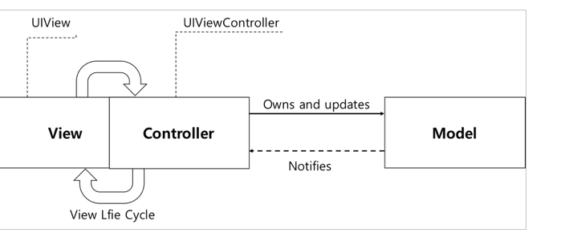

- Model : 애플리케이션에서 사용할 데이터를 관리

- View : 유저 인터페이스를 표현 및 관리

- Controller : View와 Model의 다리 역할을 해 View의 입력을 Model이 반영하고, Model의 변화를 View에 갱신하는 역할

- But 애플의 MVC 패턴의 경우 기존 MVC와 달리 View와 Controller가 강하게 연결되어 있어 View Controller가 거의 모든 일을 담당(View의 Life Cycle 또한 View Controller가 담당)

- iOS에서는 Model → Controller로 직접 전달하기 보다는 Notification(또는 KVO)를 사용해 해결한다.

- View → Controller : Delegate 또는 DataSource를 사용한다. 

- 장점

   - 빠르게 구현할 수 있어 생상선이 매우 좋음

- 단점

   - View의 Life Cycle 또한 Controller가 담당하기 때문에 Controller가 지나치게 비대해지는 경향이 있음

   <br />

### MVVM 패턴

<br />

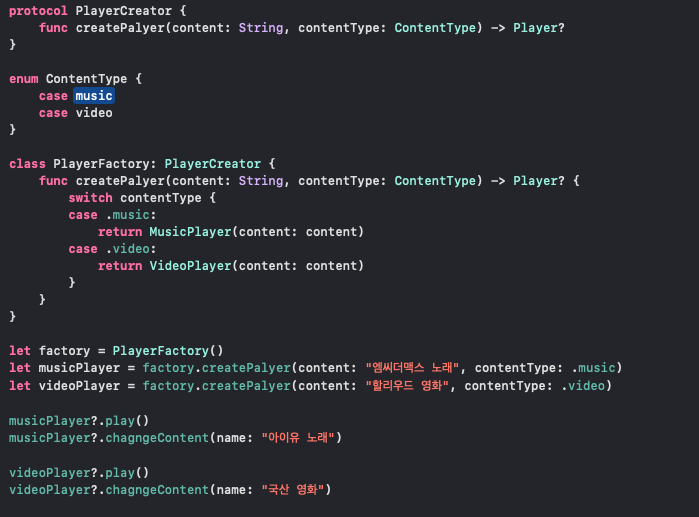

- Model - View - ViewModel로 이뤄지는 아키텍처 패턴

- Model : 데이터 및 비즈니스 로직이 포함되어 있음. 데이터를 얻거나 저장하거나 지우거나 업데이트에 대해 알고 있으며 이 작업들은 뷰모델에 의해 시작하고 모델이 데이터에 대한 작업을 마치면 뷰모델에게 결과를 알린다.

- View : 사용자 이벤트를 수신하고 데이터를 표시하는 유저 인터페이스를 책임짐 (ViewController도 View의 일부), 해당 이벤트들은 뷰모델에 전달되어 처리해야 할 책임이 있고 뷰는 뷰모델의 변경사항을 감지하고 뷰모델이 업데이트한 데이터를 보여준다.

- ViewModel : 로직을 담당하며 유저가 뷰에서 어떤 액션을 취할 때 모델을 변경하거나 되었을 때 해당 모델을 업데이트하고 뷰모델에게 결과를 알리고 뷰를 갱신하는 책임을 가지고 있다.

<br />

- 장점

   - 테스트가 용이하다. (뷰모델에서는 뷰에 대해 전혀 알지 못하기 때문에 UI로부터 독립적인 테스트가 가능)

   - 비즈니스 로직을 뷰와 분리할 수 있다.

- 단점

   - 뷰모델을 설계하는 것이 쉽지 않다.

   - 프로젝트가 커질 수록 뷰모델이 비대해지는 경향이 있다.

