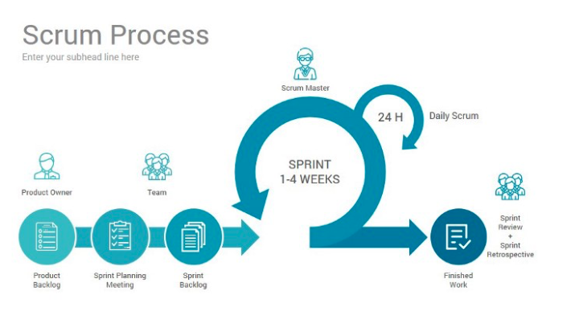

# Scrum

### Scrum이란?

- 프로젝트 관리를 위한 상호, 점진적인 개발 방법론, 애자일 소프트웨어 공학 중 하나

- 비즈니스 요구를 충족시키는 소프트웨어를 개발하는 데 초점을 맞추기 위해 복잡함을 제거하는 관리 및 제어 프로세스

- 기존의 엔지니어링 실천법, 개발 방법론 혹은 표준들을 아우르고 포괄

 

### Scrum의 특성

- 솔루션에 포함할 기능 / 개선점에 대한 우선 순위 부여

- 개발 주기는 30일 정도로 조절하고 개발 주기마다 실제 동작할 수 있는 결과 제공

- 개발 주기마다 적용할 기능이나 개선에 대한 목록 제공

- 날마다 15분 정도 회의

- 항상 팀 단위로 생각

- 원활한 의사소통을 위해 구분 없는 열린 공간 유지

 

### Scrum의 주요 개념

1. 스크럼 팀(Scrum Team)

   - 프로젝트 수행에 필요한 모든 역량을 갖춘 팀으로 이를 위해 관련된 모든 부서로부터 팀원이 구성되며, 팀원은 자신의 전문 영역에 고정되지 않고 다 같이 팀 과제 수행

   - 자율 관리 조직으로 제 3자의 명령을 받지 않고, 팀 스스로 업무 분량, 목표, 달성 방안을 결정하고 자신이 약속한 목표를 달성할 책임이 있음

   - 스프린트 후에 필요한 인력을 보충하거나 필요없는 팀원을 내보낼 수 있음

1. 제품 책임자(Product Owner)

   - 제품 백로그를 관리, 통제할 수 있는 권한을 가진 사람, 단 한 명이어야 함

   - 고객 및 조직 가치에 기반해 제품 백로그 항목들의 우선 순위를 결정하고, 매 스프린트의 결과를 검토해 우선 순위를 지속적으로 조정, 관리

1. 스크럼 마스터(Scrum Master)

   - 스크럼의 가치와 실천법에 대한 이해를 바탕으로 현장에 맞는 실천법을 정립해 실제로 프로젝트에서 실행될 수 있도록 이끔

   - 일일 스크럼 회의를 주관해 팀의 진척도를 모니터링하고, 팀의 생산성에 악영향을 끼치는 정책, 절차, 구조를 공론화해 처리

   - 기존의 프로젝트 관리자와 달리 업무를 지시, 통제하지 않고 팀의 성공적인 목표 달성을 위해 필요한 자원을 지원하거나 장애물을 제거하는 조력자 역할

1. 스프린트(Sprint)

   - 과제가 진행되는 주기를 지칭

   - 1 ~ 4주로 구성, 하나의 스프린트가 끝나면 곧바로 다음 스프린트 시작

   - 스프린트를 진행하는 동안 기간, 과제 가감 등의 변경 불가능

1. 제품 백로그(Product Backlog)

   - 제품 완성에 필요한 특성, 기능, 개선점 등 제품의 모든 요구사항을 우선 순위에 따라 나열한 목록

   - 제품 백로그는 확정, 고정된 것이 아니라 사업 환경이나 변화에 따라 지속적으로 업데이트

   - 우선 순위가 높은 백로그는 낮은 백로그보다 더 명확하게 상세하게 기술

1. 스프린트 백로그(Sprint Backlog)

   - 하나의 스프린트 동안 완료할 과제들의 목록

1. 증분(Increment)

   - 매 스프린트에서 팀이 개발한 제품 기능

   - 잠재적으로 출시가 가능하거나 제품 책임자의 이해관계자들에게 효용을 가짐\

1. 스프린트 계획 회의(Sprint Planning Meeting)

   - 스프린트 목표와 스프린트 백로그를 계획하는 회의

1. 일일 스크럼 회의(Daily Scrum Meeting)

   - 날마다 진행되는 미팅(어제 한 일, 오늘 할 일, 장애 현상 등 공유)

1. 실행 가능한 제품(Shippable Product)

   - 개발 스프린트의 결과로써 나오는 실행 가능한 제품

1. 번다운 차트(Burndown Chart)

   - 한 스프린트 동안 남아있는 작업량을 보여주는 그래프

 

 

### 스크럼 진행 과정

 

 

1. 제품 백로그 작성

   - 제품 책임자가 사용자 스토리를 기반으로 제품 백로그 작성

      - 사용자 스토리 : 고객이나 개발자가 모두 이해할 수 있도록 고객이 작성하는 것

         - 카드, 대화, 테스트 라는 세 측면을 이용해서 작성

            - 카드(Card)

               - 고객의 요구사항을 문서화하기 보다는 표현하기 위한 것으로 대화의 매개체 역할

               - '나는 ~로써 ~하기 위해 ~하고 싶다'라는 카드를 작성하며 who, why, what 정보를 모두 포함해야 함

            - 대화(Conversation)

               - 카드 내용의 세부 사항을 구체화시킴으로써 인수 기준이 정해지고, 이해의 공유를 촉진

            - 테스트(Confirmation)

               - 대화에서 논의한 인수 기준을 통해 스토리의 완료 여부 판단

               - 인수 기준이 만족되었는지 여부를 확인하기 위해 긍정적인 테스트, 부정적인 테스트를 모두 사용

   - 사용자 스토리에 대한 스토리 포인트를 추정하고 스토리 포인트를 이용해 개발 규모를 추정

      - 스토리 포인트 : 사용자 스토리를 구현하는데 걸리는 상대적인 노력이나 일의 양, 복잡도, 불확실성 등을 종합적으로 고려해 나타낸 값

   - 사용자 스토리를 제거하거나 새로 추가할 때, 또는 사용자 스토리의 크기가 클 때 백로그 정제 회의를 통해 스토리 포인트를 다시 산정

      - 백로그 정제 회의 : 다음 스프린트에서 완성할 사용자 스토리를 정제하는 작업을 함

1. 스프린트 계획 회의

   - 제품 책임자, 스크럼 마스터, 개발 팀이 참여해 제품 백로그를 기반하여 스프린트 목표와 스프린트 백로그를 계획하는 회의

   - 스프린트 게획 회의는 스프린트 계획 파트1과 스프린트 계획 파트2로 나뉨

   - 스프린트 계획 파트1에서는 스프린트 동안 무엇(What)을 할 지 우선 순위가 높은 아이템들을 검토하고 스프린트 목표를 정함

   - 스프린트 계획 파트2에서는 스프린트 계획 파트1에서 결정한 무엇을 어떻게(How) 실행할 지에 대해 정함

   - 스프린트 계획 회의가 끝날 때 쯤, 개발 팀은 각 스프린트가 끝날 때마다 어떤 결과물을 내놓을 것인지에 대한 현실적인 목표를 정함(스프린트 약속(Sprint Commitment))

1. 스프린트 백로그 작성

   - 스프린트 목표를 구현 가능하도록 각각의 요구 사항을 Task 단위로 나눠 개발자들이 나눠서 작업을 수행

   - 많은 팀들이 벽 크기의 업무 보드 형식의 스프린트 백로그를 만듬 (스크럼 보드(Scrum Board))

1. 일일 스크럼 미팅

   - 개발원들이 늘어지는 것을 방지하기 위해 스탠드업 미팅 형식으로 진행

   - 매일 정해진 시간에 정해진 장소에 모여 15 ~ 20분 동안 간단하고 빠르게 진행

   - 어제 했던 일과 오늘 할 일, 수행 중 문제점이나 장애 요인 등을 공유하며 문제가 있을 경우 미팅 후 바로 해결

   - 일일 스크럼 미팅을 함으로써 프로젝트 후반부에 문제점이 갑자기 발생하는 것을 예방

   - 매일 개발 팀원들은 스프린트 백로그에 있는 현재 작업을 완료하기 위해 작업이 얼마나 남았는지 번다운 차트를 통해 진척도를 추적

1. 실행 가능한 제품 개발

   - 각 스프린트마다 목표는 실행 가능한 제품을 만들어서 배포하는 것

   - 매 스프린트의 결과로써 나오는 산출물을 잠재적으로 출시 가능한 제품 증분이라고 부름

1. 스프린트 리뷰(Sprint Review)

   - 스프린트가 종료되었을 때 개발 팀이 스프린트 동안 개발한 증분의 기능을 고객을 포함한 이해 관리자들에게 보여주고 피드백을 받는 과정

   - 고객은 자신이 요청한 요구사항이 해당 스프린트 동안 제품이 잘 반영되었는 지 평가한 후 피드백을 하면 제품 관리자는 고객의 피드백이나 여러 사항들을 정리하여 다음 스프린트에 반영되도록 제품 백로그 갱신

   - 스프린트의 한주당 스프린트 리뷰 시간은 한 시간으로 제약되어있으며 스프린트 리뷰를 준비하는 데 30분을 넘지 않도록 해야 함

1. 스프린트 회고(Sprint Retrospective)

   - 스프린트 리뷰 후 프로젝트를 진행하며 좋았던 점이나 문제점, 미진한 점들을 도출함으로써 다음 스프린트를 보다 더 나은 방향으로 개선할 수 있도록 하는 과정

   - 이 과정 동안 스크럼 마스터는 중재 및 조정 역할을 하는 퍼실리테이터(Facilitator) 역할을 할 수 있다.

   - 이미 정해진 프로세스로만 프로젝트를 수행하는 것이 아니라 프로세스가 끊임 없이 개선되도록 하여 변화하고 있는 환경에 더 능동적으로 적응할 수 있도록 함

1. 다음 스프린트 시작

   - 스프린트는 제품 책임자가 제품을 출시할 준비가 되었다고 판단할 때까지 계속 됨

   - 스프린트 회고 후 휴식 기간 없이 다음 스프린트 진행

    

### Scrum의 추구 가치

- 용기 : 자신이 옳은 일을 할 수 있도록 팀원 간 갈등과 도전을 통해 작업할 수 있는 용기

- 존중 : 자신과 다른 사람에게 경의를 표하는 것

- 정직 : 어떤 것이 자신에게 불리해도 숨기지 않는 것

- 확약 : 약속한 것을 확실히 실현하는 것

- 전념 : 확약한 것을 실현에 전념하는 것

 

